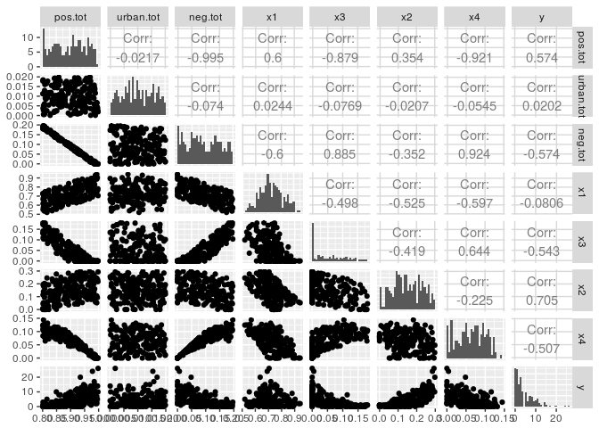
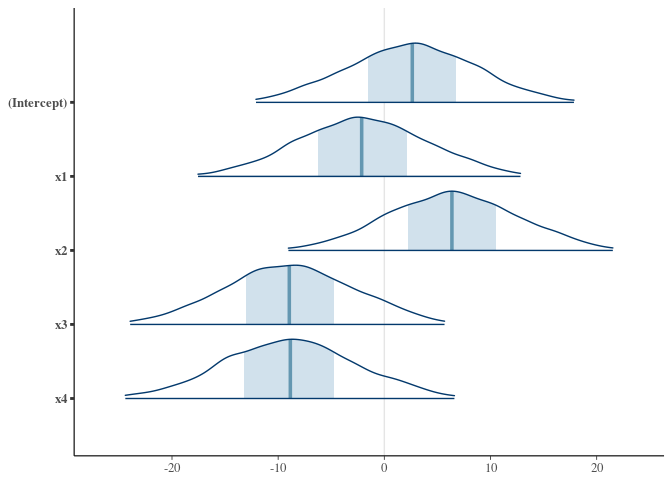
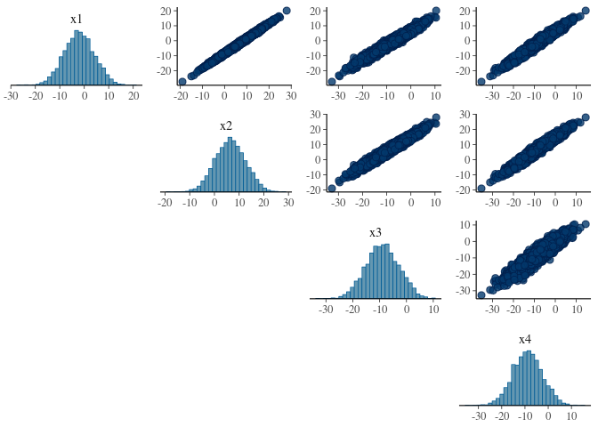
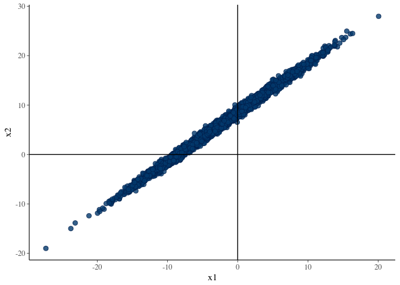
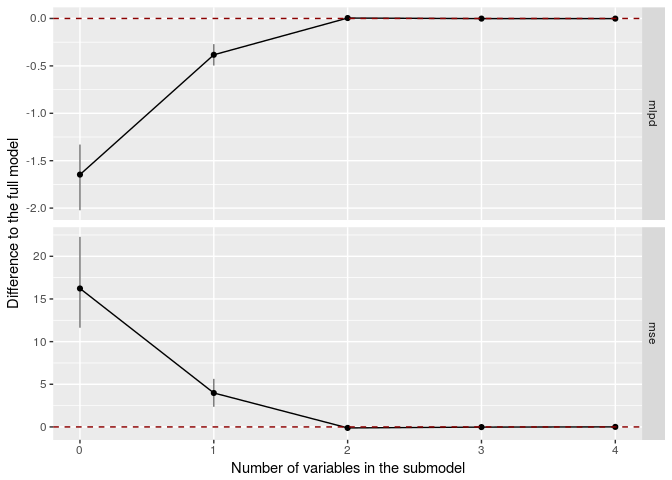
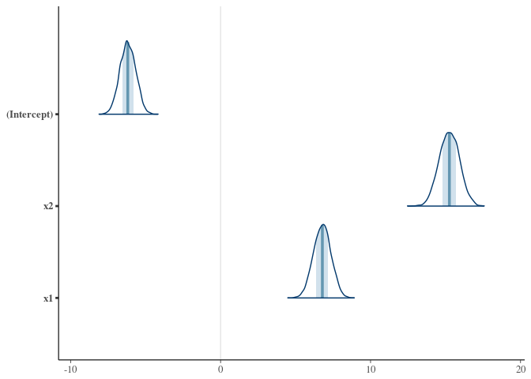

# Bayesian version of Andrew Tyre's Does model averaging make sense?
Bayesian version of Andrew Tyre's "Does model averaging make sense?"
https://atyre2.github.io/2017/06/16/rebutting_cade.html

Tyre discusses problems in current statistical practices in ecology, focusing in multi-colinearity, model averaging and measuring the relative importance of variables. Tyre's post is commenting a paper http://onlinelibrary.wiley.com/doi/10.1890/14-1639.1/full. In his blog post he uses maximum likelihood and AIC_c. Here we provide a Bayesian approach for handling multicolinearity, model averaging and measuring relative importance of variables using packages rstanarm, bayesplot, loo and projpred. 

Other packages are available in CRAN, but projpred package needs to be installed from github (it will be available in CRAN later).

```r
if (!require(devtools)) {
	install.packages("devtools")
	library(devtools)
}
```

```
## Loading required package: devtools
```

```r
if (!require(projpred)) {
  devtools::install_github('stan-dev/projpred', build_vignettes = TRUE)
  library(projpred)
}
```

```
## Loading required package: projpred
```

```
## Warning: replacing previous import by 'bayesplot::pairs_condition' when
## loading 'rstanarm'
```

```
## Warning: replacing previous import by 'bayesplot::pairs_style_np' when
## loading 'rstanarm'
```

```
## Warning: replacing previous import by 'stats::cov2cor' when loading
## 'rstanarm'
```

```
## This is projpred version 0.5.1
```

We generate the data used previously to illustrate multi-colinearity problems.
<!-- -->

Tyre: "So there is a near perfect negative correlation between the things sage grouse like and the things they don’t like, although it gets less bad when considering the individual covariates."

From this point onwards we switch to Bayesian approach. The rstanarm package provides stan_glm which accepts same arguments as glm, but makes full Bayesian inference using Stan (Hamiltonian Monte Carlo No-U-Turn-sampling). By default a weakly informative Gaussian prior is used for weights.

```r
library(rstanarm)
```

```
## Loading required package: Rcpp
```

```
## rstanarm (Version 2.15.3, packaged: 2017-04-29 06:18:44 UTC)
```

```
## - Do not expect the default priors to remain the same in future rstanarm versions.
```

```
## Thus, R scripts should specify priors explicitly, even if they are just the defaults.
```

```
## - For execution on a local, multicore CPU with excess RAM we recommend calling
```

```
## options(mc.cores = parallel::detectCores())
```

```r
options(mc.cores = 4)
fitg <- stan_glm(y ~ x1 + x2 + x3 + x4, data = df, na.action = na.fail, family=poisson(), seed=1)
```
Let's look at the summary:

```r
summary(fitg)
```

```
## 
## Model Info:
## 
##  function:  stan_glm
##  family:    poisson [log]
##  formula:   y ~ x1 + x2 + x3 + x4
##  algorithm: sampling
##  priors:    see help('prior_summary')
##  sample:    4000 (posterior sample size)
##  num obs:   200
## 
## Estimates:
##                 mean   sd     2.5%   25%    50%    75%    97.5%
## (Intercept)      2.2    5.6   -8.8   -1.5    2.4    6.0   13.1 
## x1              -1.7    5.6  -12.7   -5.5   -1.8    2.1    9.5 
## x2               6.8    5.6   -4.2    2.9    6.6   10.5   17.9 
## x3              -8.6    5.6  -19.5  -12.4   -8.7   -4.9    2.7 
## x4              -8.4    5.9  -19.7  -12.5   -8.6   -4.5    3.5 
## mean_PPD         4.3    0.2    3.9    4.2    4.3    4.5    4.7 
## log-posterior -387.4    1.5 -391.1 -388.3 -387.1 -386.3 -385.4 
## 
## Diagnostics:
##               mcse Rhat n_eff
## (Intercept)   0.2  1.0   903 
## x1            0.2  1.0   904 
## x2            0.2  1.0   902 
## x3            0.2  1.0   887 
## x4            0.2  1.0   976 
## mean_PPD      0.0  1.0  2913 
## log-posterior 0.0  1.0  1307 
## 
## For each parameter, mcse is Monte Carlo standard error, n_eff is a crude measure of effective sample size, and Rhat is the potential scale reduction factor on split chains (at convergence Rhat=1).
```

We didn't get divergences, Rhat's are less than 1.1 and n_eff's are useful (see, e.g., http://mc-stan.org/users/documentation/case-studies/rstan_workflow.html). However, when we know that covariats are correlating we can get even better performance by using QR decomposition (see, e.g. http://mc-stan.org/users/documentation/case-studies/qr_regression.html).


```r
library(rstanarm)
options(mc.cores = 4)
fitg <- stan_glm(y ~ x1 + x2 + x3 + x4, data = df, na.action = na.fail, family=poisson(), QR=TRUE, seed=1)
```
Let's look at the summary and plot:

```r
summary(fitg)
```

```
## 
## Model Info:
## 
##  function:  stan_glm
##  family:    poisson [log]
##  formula:   y ~ x1 + x2 + x3 + x4
##  algorithm: sampling
##  priors:    see help('prior_summary')
##  sample:    4000 (posterior sample size)
##  num obs:   200
## 
## Estimates:
##                 mean   sd     2.5%   25%    50%    75%    97.5%
## (Intercept)      2.6    6.0   -9.2   -1.5    2.6    6.7   14.4 
## x1              -2.1    6.1  -14.0   -6.3   -2.1    2.1    9.8 
## x2               6.4    6.1   -5.3    2.2    6.4   10.6   18.2 
## x3              -8.9    6.1  -20.7  -13.0   -9.0   -4.7    2.8 
## x4              -8.9    6.3  -21.0  -13.2   -8.9   -4.7    3.3 
## mean_PPD         4.3    0.2    3.9    4.2    4.3    4.5    4.8 
## log-posterior -387.5    1.6 -391.4 -388.4 -387.2 -386.4 -385.4 
## 
## Diagnostics:
##               mcse Rhat n_eff
## (Intercept)   0.1  1.0  3540 
## x1            0.1  1.0  3542 
## x2            0.1  1.0  3554 
## x3            0.1  1.0  3498 
## x4            0.1  1.0  3445 
## mean_PPD      0.0  1.0  4000 
## log-posterior 0.0  1.0  1736 
## 
## For each parameter, mcse is Monte Carlo standard error, n_eff is a crude measure of effective sample size, and Rhat is the potential scale reduction factor on split chains (at convergence Rhat=1).
```

Use of QR decomposition greatly improved sampling efficiency and we continue with this model.


```r
library(bayesplot)
```

```
## This is bayesplot version 1.2.0
```

```r
mcmc_areas(as.matrix(fitg),prob_outer = .99)
```

<!-- -->

All 95% posterior intervals are overlapping 0 and it seems we have the same colinearity problem as with maximum likelihood estimates.

Looking at the pairwise posteriors we can see high correlations

```r
mcmc_pairs(as.matrix(fitg),pars = c("x1","x2","x3","x4"))
```

```
## Warning in mcmc_pairs(as.matrix(fitg), pars = c("x1", "x2", "x3", "x4")):
## Only one chain in 'x'. This plot is more useful with multiple chains.
```

<!-- -->
If look more carefully on of the subplots, we see that although marginal posterior intervals overlap 0, the joint posterior is not overlapping 0.

```r
mcmc_scatter(as.matrix(fitg), pars = c("x1", "x2"))+geom_vline(xintercept=0)+geom_hline(yintercept=0)
```

<!-- -->

Based on the joint distributions all the variables would be relevant. To make predictions we don't need to make variable selection, we just integrate over the uncertainty (kind of continuous model averaging). 

We might want to choose some variables 1) because we don't want to observe all the variables in the future (e.g. due to the measurement cost), or 2) we want to most relevant variables which we define here as a minimal set of variables which can provide similar predictions to the full model.

Tyre used AIC_c to estimate the model performance. In Bayesian setting we could use Bayesian alternatives Bayesian cross-validation or WAIC, but we don't recommend them for variable selection as discussed in http://link.springer.com/article/10.1007/s11222-016-9649-y . The reason for not using Bayesian CV or WAIC is that the selection process uses the data twice, and in case of large number variable combinations the selection process overfits and can produce really bad models. Using the usual posterior inference given the selected variables ignores that the selected variables are conditonal on the selection process and simply setting some variables to 0 ignores the uncertainty related to their relevance.

The paper http://link.springer.com/article/10.1007/s11222-016-9649-y also shows that a projection predictive approach can be used to make a model reduction, that is, choosing a smaller model with some coefficients set to 0. The projection predictive approach solves the problem how to do inference after the selection. The solution is to project the full model posterior to the restricted subspace. See more in http://link.springer.com/article/10.1007/s11222-016-9649-y

We make the projective predictive variable selection using the previous full model. A fast leave-one-out cross-validation approach http://link.springer.com/article/10.1007/s11222-016-9696-4 is used to choose the model size.

```r
fitg_cv <- cv_varsel(fitg, method='forward', cv_method='LOO')
```

```
## [1] "Performing forward search for the full model."
## [1] "30% of variables selected."
## [1] "60% of variables selected."
## [1] "100% of variables selected."
## [1] "Start computing LOOs..."
## [1] "10% of LOOs done."
## [1] "20% of LOOs done."
## [1] "30% of LOOs done."
## [1] "40% of LOOs done."
## [1] "50% of LOOs done."
## [1] "60% of LOOs done."
## [1] "70% of LOOs done."
## [1] "80% of LOOs done."
## [1] "90% of LOOs done."
## [1] "100% of LOOs done."
```

```r
fitg_cv$varsel$vind
```

```
## x2 x1 x3 x4 
##  2  1  3  4
```
We can now look at the estimated predictive performance of smaller models compared to the full model.

```r
varsel_plot(fitg_cv, statistics = c('mlpd', 'mse'), deltas=T)
```

<!-- -->

And we get a loo-cv based recommendation for the model size to choose

```r
fitg_cv$varsel$ssize
```

```
## [1] 2
```
We see that 2 variables is enough to get the same as with all 4 variables.

Next we form the projected posterior for the chosen model.

```r
projg <- project(fitg_cv, nv = 2, ns = 4000)
round(colMeans(as.matrix(projg)),1)
```

```
## (Intercept)          x2          x1 
##        -6.2        15.3         6.8
```

```r
round(posterior_interval(as.matrix(projg)),1)
```

```
##               5%  95%
## (Intercept) -7.0 -5.3
## x2          14.1 16.3
## x1           5.8  7.7
```

```r
mcmc_areas(as.matrix(projg), 
           pars = c('(Intercept)', names(fitg_cv$varsel$vind[1:2])))
```

<!-- -->

Even if we started with a model which had due to a co-linearity difficult to interpret posterior, the projected posterior is able to match closely the true values. The necessary information was in the full model and with the projection we were able to form the projected posterior which we should use if x3 and x4 are seto 0.

Back to the Tyre's question "Does model averaging make sense?". If we are interested just in good predictions we can do continuous model averaging by using suitable priors and by integrating over the posterior. If we are intersted in predcitions, then we don't first average weights (ie posterior mean), but use all weight values to compute predictions and do the averaging of the predictions. All this is automatic in Bayesian framework. 

Tyre also commented on the problems of measuring variable importance. The projection predictive approach above is derived using decision theory and is very helpful for measuring relevancy and choosing relevant variables. Tyre did not comment about the inference after selection although it is also known problem in variable selection. The projection predictive approach above solves that problem, too.

<br />


### Appendix: Session information


```r
sessionInfo()
```

```
## R version 3.2.3 (2015-12-10)
## Platform: x86_64-pc-linux-gnu (64-bit)
## Running under: Ubuntu 16.04.3 LTS
## 
## locale:
##  [1] LC_CTYPE=en_US.UTF-8       LC_NUMERIC=C              
##  [3] LC_TIME=en_US.utf8         LC_COLLATE=en_US.UTF-8    
##  [5] LC_MONETARY=en_US.UTF-8    LC_MESSAGES=en_US.UTF-8   
##  [7] LC_PAPER=fi_FI.utf8        LC_NAME=C                 
##  [9] LC_ADDRESS=C               LC_TELEPHONE=C            
## [11] LC_MEASUREMENT=en_US.UTF-8 LC_IDENTIFICATION=C       
## 
## attached base packages:
## [1] stats     graphics  grDevices utils     datasets  methods   base     
## 
## other attached packages:
##  [1] bayesplot_1.2.0 rstanarm_2.15.3 Rcpp_0.12.13    GGally_1.3.1   
##  [5] dplyr_0.5.0     purrr_0.2.2     readr_1.0.0     tidyr_0.6.1    
##  [9] tibble_1.2      ggplot2_2.2.1   tidyverse_1.1.1 projpred_0.5.1 
## [13] devtools_1.12.0
## 
## loaded via a namespace (and not attached):
##  [1] httr_1.2.1           jsonlite_1.5         splines_3.2.3       
##  [4] modelr_0.1.0         gtools_3.5.0         StanHeaders_2.15.0-1
##  [7] threejs_0.2.2        shiny_1.0.1          assertthat_0.1      
## [10] stats4_3.2.3         yaml_2.1.14          backports_1.0.5     
## [13] lattice_0.20-34      digest_0.6.12        RColorBrewer_1.1-2  
## [16] rvest_0.3.2          minqa_1.2.4          colorspace_1.3-2    
## [19] htmltools_0.3.6      httpuv_1.3.3         Matrix_1.2-8        
## [22] plyr_1.8.4           psych_1.6.12         dygraphs_1.1.1.3    
## [25] rstan_2.15.1         broom_0.4.2          haven_1.0.0         
## [28] xtable_1.8-2         scales_0.5.0         lme4_1.1-13         
## [31] DT_0.2               withr_1.0.2          shinyjs_0.8         
## [34] lazyeval_0.2.0       mnormt_1.5-5         readxl_0.1.1        
## [37] magrittr_1.5         mime_0.5             memoise_1.0.0       
## [40] evaluate_0.10        nlme_3.1-131         MASS_7.3-45         
## [43] xml2_1.1.1           forcats_0.2.0        xts_0.9-7           
## [46] foreign_0.8-67       colourpicker_0.3     rsconnect_0.7       
## [49] tools_3.2.3          loo_1.1.0            hms_0.3             
## [52] matrixStats_0.52.2   stringr_1.2.0        munsell_0.4.3       
## [55] grid_3.2.3           nloptr_1.0.4         htmlwidgets_0.8     
## [58] miniUI_0.1.1         labeling_0.3         base64enc_0.1-3     
## [61] rmarkdown_1.6        gtable_0.2.0         codetools_0.2-15    
## [64] reshape_0.8.6        inline_0.3.14        DBI_0.6             
## [67] markdown_0.8         reshape2_1.4.2       R6_2.2.2            
## [70] gridExtra_2.2.1      rstantools_1.2.0     zoo_1.7-14          
## [73] lubridate_1.6.0      knitr_1.16           shinystan_2.3.0     
## [76] shinythemes_1.1.1    rprojroot_1.2        stringi_1.1.2       
## [79] parallel_3.2.3
```

<br />


### Appendix: Licenses

* Code &copy; 2017, Aki Vehtari, licensed under BSD-3.
* Code for generating the data by [Andrew Tyre](https://atyre2.github.io/2017/06/16/rebutting_cade.html)
* Text &copy; 2017, Aki Vehtari, licensed under CC-BY-NC 4.0.
