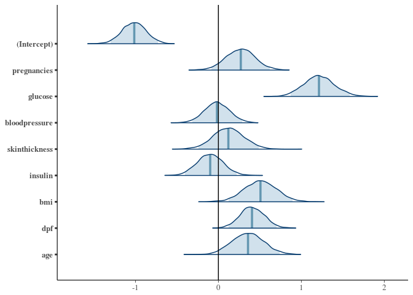
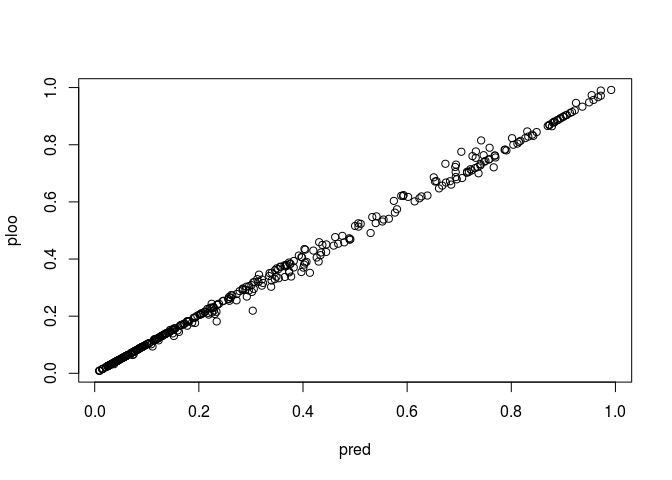
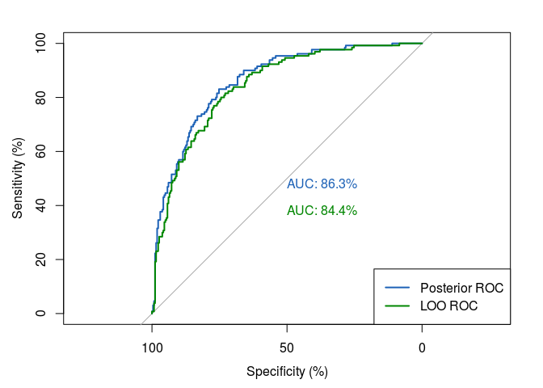
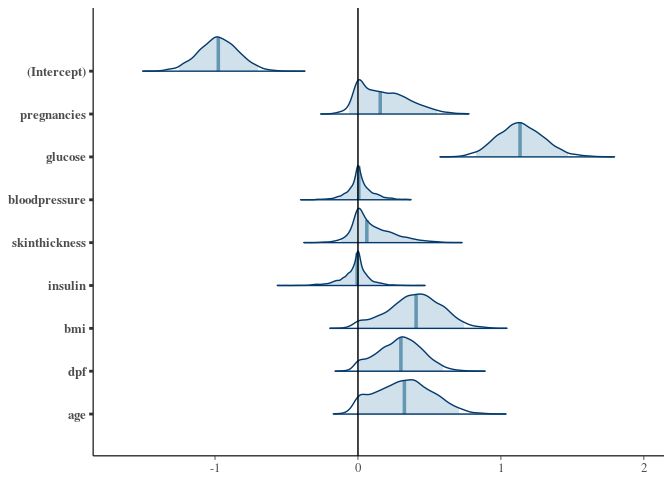
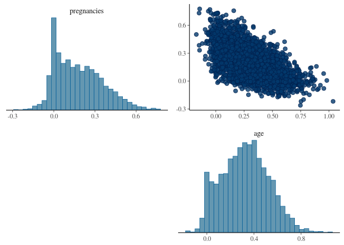
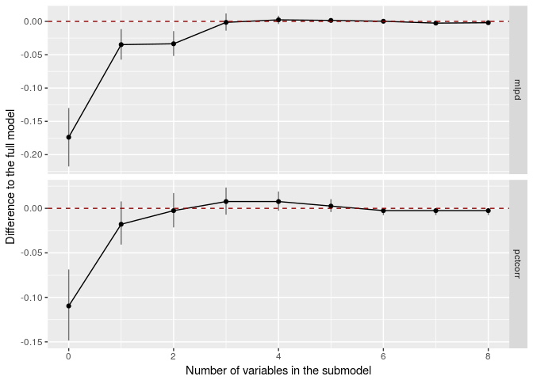
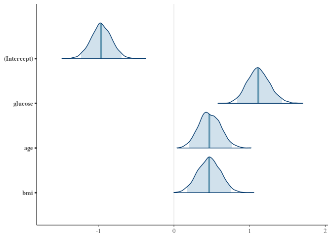

# Bayesian Logistic Regression with rstanarm

# Bayesian Logistic Regression with rstanarm 

Authors: Jonah Gabry, Ben Goodrich and Aki Vehtari.

The introduction to Bayesian logistic regression and **rstanarm** is from a 
[CRAN vignette][1] by Jonah Gabry and Ben Goodrich. [CRAN vignette][1] was modified to this notebook by [Aki Vehtari][2]. *Instead of wells data in CRAN vignette, Pima Indians data is used.* The end of this notebook differs significantly from the CRAN vignette. You can read more about how to use **rstanarm** in [several vignettes at CRAN][3].

Acknowledgements: Preprocessing of Pima Indian dataset is from a [noteebok][4] by [Lao Zhang][5]

  [1]: https://cran.r-project.org/web/packages/rstanarm/vignettes/binomial.html
  [2]: https://users.aalto.fi/~ave/
  [3]: https://cran.r-project.org/web/packages/rstanarm/
  [4]: https://www.kaggle.com/laozhang/d/uciml/pima-indians-diabetes-database/statistical-learning-with-r/run/445129
  [5]: https://www.kaggle.com/laozhang

---

# Introduction

This vignette explains how to estimate generalized linear models (GLMs) for 
binary (Bernoulli) and Binomial response variables using the `stan_glm`
function in the __rstanarm__ package.

The four steps of a Bayesian analysis are

1. Specify a joint distribution for the outcome(s) and all the unknowns, which
  typically takes the form of a marginal prior distribution for the unknowns
  multiplied by a likelihood for the outcome(s) conditional on the unknowns.
  This joint distribution is proportional to a posterior distribution of the
  unknowns conditional on the observed data
2. Draw from posterior distribution using Markov Chain Monte Carlo (MCMC).
3. Evaluate how well the model fits the data and possibly revise the model.
4. Draw from the posterior predictive distribution of the outcome(s) given
  interesting values of the predictors in order to visualize how a manipulation
  of a predictor affects (a function of) the outcome(s).

Steps 3 and 4 are covered in more depth by the vignette entitled ["How to Use the
__rstanarm__ Package"][2]. This vignette focuses on Step 1 when the likelihood is
the product of conditionally independent binomial distributions (possibly with
only one trial per observation).

# Likelihood

For a binomial GLM the likelihood for one observation $y$ can be written as a
conditionally binomial PMF
$$\binom{n}{y} \pi^{y} (1 - \pi)^{n - y},$$
where $n$ is the known number of trials, $\pi = g^{-1}(\eta)$ is the probability
of success and $\eta = \alpha + \mathbf{x}^\top \boldsymbol{\beta}$ is a linear
predictor. For a sample of size $N$, the likelihood of the entire sample is the
product of $N$ individual likelihood contributions.

Because $\pi$ is a probability, for a binomial model the _link_ function $g$
maps between the unit interval (the support of $\pi$) and the set of all real
numbers $\mathbb{R}$. When applied to a linear predictor $\eta$ with values in
$\mathbb{R}$, the inverse link function $g^{-1}(\eta)$ therefore returns a valid
probability between 0 and 1.

The two most common link functions used for binomial GLMs are the
[logit](https://en.wikipedia.org/wiki/Logit) and 
[probit](https://en.wikipedia.org/wiki/Probit)
functions. With the logit (or log-odds) link function $g(x) =
\ln{\left(\frac{x}{1-x}\right)}$, the likelihood for a single observation
becomes

$$\binom{n}{y}\left(\text{logit}^{-1}(\eta)\right)^y 
\left(1 - \text{logit}^{-1}(\eta)\right)^{n-y} = 
\binom{n}{y} \left(\frac{e^{\eta}}{1 + e^{\eta}}\right)^{y}
\left(\frac{1}{1 + e^{\eta}}\right)^{n - y}$$

and the probit link function $g(x) = \Phi^{-1}(x)$ yields the likelihood

$$\binom{n}{y} \left(\Phi(\eta)\right)^{y}
\left(1 - \Phi(\eta)\right)^{n - y},$$

where $\Phi$ is the CDF of the standard normal distribution. The differences 
between the logit and probit functions are minor and -- if, as __rstanarm__ does
by default, the probit is scaled so its slope at the origin matches the logit's 
-- the two link functions should yield similar results. With `stan_glm`, 
binomial models with a logit link function can typically be fit slightly faster 
than the identical model with a probit link because of how the two models are 
implemented in Stan. Unless the user has a specific reason to prefer the probit
link, we recommend the logit simply because it will be slightly faster and more
numerically stable.

In theory, there are infinitely many possible link functions, although in
practice only a few are typically used. Other common choices are the `cauchit`
and `cloglog` functions, which can also be used with `stan_glm` (every link 
function compatible with`glm` will work with `stan_glm`).

A full Bayesian analysis requires specifying prior distributions $f(\alpha)$ and
$f(\boldsymbol{\beta})$ for the intercept and vector of regression coefficients.
When using `stan_glm`, these distributions can be set using the 
`prior_intercept` and `prior` arguments. The `stan_glm` function supports a
variety of prior distributions, which are explained in the __rstanarm__
documentation (`help(priors, package = 'rstanarm')`).

As an example, suppose we have $K$ predictors and believe --- prior to seeing 
the data --- that $\alpha, \beta_1, \dots, \beta_K$ are as likely to be positive
as they are to be negative, but are highly unlikely to be far from zero. These
beliefs can be represented by normal distributions with mean zero and a small
scale (standard deviation). To give $\alpha$ and each of the $\beta$s this prior
(with a scale of 1, say), in the call to `stan_glm` we would include the
arguments `prior_intercept = normal(0,1)` and 
`prior = normal(0,1)`.

If, on the other hand, we have less a priori confidence that the parameters will
be close to zero then we could use a larger scale for the normal distribution 
and/or a distribution with heavier tails than the normal like the Student t 
distribution. __Step 1__ in the "How to Use the __rstanarm__ Package" vignette 
discusses one such example.

# Posterior

With independent prior distributions, the joint posterior distribution for
$\alpha$ and $\boldsymbol{\beta}$ is proportional to the product of the priors 
and the $N$ likelihood contributions:

$$f\left(\alpha,\boldsymbol{\beta} | \mathbf{y},\mathbf{X}\right) \propto
  f\left(\alpha\right) \times \prod_{k=1}^K f\left(\beta_k\right) \times
  \prod_{i=1}^N {
  g^{-1}\left(\eta_i\right)^{y_i} 
  \left(1 - g^{-1}\left(\eta_i\right)\right)^{n_i-y_i}}.$$
  
This is posterior distribution that `stan_glm` will draw from when using MCMC.
  
# Logistic Regression Example

When the logit link function is used the model is often referred to as a 
logistic regression model (the inverse logit function is the CDF of the standard
logistic distribution). As an example, here we will show how to carry out a 
analysis for Pima Indians data set similar to analysis from Chapter 5.4 of 
[Gelman and Hill (2007)](http://www.stat.columbia.edu/~gelman/arm/) 
using `stan_glm`.

[2]: https://cran.r-project.org/web/packages/rstanarm/vignettes/rstanarm.html


```r
# file preview shows a header row
diabetes <- read.csv("diabetes.csv", header = TRUE)

# first look at the data set using summary() and str() to understand what type of data are you working
# with
summary(diabetes)
```

```
##   Pregnancies        Glucose      BloodPressure    SkinThickness  
##  Min.   : 0.000   Min.   :  0.0   Min.   :  0.00   Min.   : 0.00  
##  1st Qu.: 1.000   1st Qu.: 99.0   1st Qu.: 62.00   1st Qu.: 0.00  
##  Median : 3.000   Median :117.0   Median : 72.00   Median :23.00  
##  Mean   : 3.845   Mean   :120.9   Mean   : 69.11   Mean   :20.54  
##  3rd Qu.: 6.000   3rd Qu.:140.2   3rd Qu.: 80.00   3rd Qu.:32.00  
##  Max.   :17.000   Max.   :199.0   Max.   :122.00   Max.   :99.00  
##     Insulin           BMI        DiabetesPedigreeFunction      Age       
##  Min.   :  0.0   Min.   : 0.00   Min.   :0.0780           Min.   :21.00  
##  1st Qu.:  0.0   1st Qu.:27.30   1st Qu.:0.2437           1st Qu.:24.00  
##  Median : 30.5   Median :32.00   Median :0.3725           Median :29.00  
##  Mean   : 79.8   Mean   :31.99   Mean   :0.4719           Mean   :33.24  
##  3rd Qu.:127.2   3rd Qu.:36.60   3rd Qu.:0.6262           3rd Qu.:41.00  
##  Max.   :846.0   Max.   :67.10   Max.   :2.4200           Max.   :81.00  
##     Outcome     
##  Min.   :0.000  
##  1st Qu.:0.000  
##  Median :0.000  
##  Mean   :0.349  
##  3rd Qu.:1.000  
##  Max.   :1.000
```

```r
str(diabetes)
```

```
## 'data.frame':	768 obs. of  9 variables:
##  $ Pregnancies             : int  6 1 8 1 0 5 3 10 2 8 ...
##  $ Glucose                 : int  148 85 183 89 137 116 78 115 197 125 ...
##  $ BloodPressure           : int  72 66 64 66 40 74 50 0 70 96 ...
##  $ SkinThickness           : int  35 29 0 23 35 0 32 0 45 0 ...
##  $ Insulin                 : int  0 0 0 94 168 0 88 0 543 0 ...
##  $ BMI                     : num  33.6 26.6 23.3 28.1 43.1 25.6 31 35.3 30.5 0 ...
##  $ DiabetesPedigreeFunction: num  0.627 0.351 0.672 0.167 2.288 ...
##  $ Age                     : int  50 31 32 21 33 30 26 29 53 54 ...
##  $ Outcome                 : int  1 0 1 0 1 0 1 0 1 1 ...
```


```r
diabetes$Outcome <- factor(diabetes$Outcome)

# removing those observation rows with 0 in any of the variables
for (i in 2:6) {
      diabetes <- diabetes[-which(diabetes[, i] == 0), ]
}
# scale the covariates for easier comparison of coefficient posteriors
for (i in 1:8) {
      diabetes[i] <- scale(diabetes[i])
}

# modify the data column names slightly for easier typing
names(diabetes)[7] <- "dpf"
names(diabetes) <- tolower(names(diabetes))

n=dim(diabetes)[1]
p=dim(diabetes)[2]
str(diabetes)
```

```
## 'data.frame':	392 obs. of  9 variables:
##  $ pregnancies  : num [1:392, 1] -0.7165 -1.0279 -0.0937 -0.4051 -0.7165 ...
##   ..- attr(*, "dimnames")=List of 2
##   .. ..$ : chr  "4" "5" "7" "9" ...
##   .. ..$ : chr "Pregnancies"
##   ..- attr(*, "scaled:center")= Named num 3.3
##   .. ..- attr(*, "names")= chr "Pregnancies"
##   ..- attr(*, "scaled:scale")= Named num 3.21
##   .. ..- attr(*, "names")= chr "Pregnancies"
##  $ glucose      : num [1:392, 1] -1.09 0.466 -1.446 2.41 2.151 ...
##   ..- attr(*, "dimnames")=List of 2
##   .. ..$ : chr  "4" "5" "7" "9" ...
##   .. ..$ : chr "Glucose"
##   ..- attr(*, "scaled:center")= Named num 123
##   .. ..- attr(*, "names")= chr "Glucose"
##   ..- attr(*, "scaled:scale")= Named num 30.9
##   .. ..- attr(*, "names")= chr "Glucose"
##  $ bloodpressure: num [1:392, 1] -0.3732 -2.4538 -1.6536 -0.0531 -0.8533 ...
##   ..- attr(*, "dimnames")=List of 2
##   .. ..$ : chr  "4" "5" "7" "9" ...
##   .. ..$ : chr "BloodPressure"
##   ..- attr(*, "scaled:center")= Named num 70.7
##   .. ..- attr(*, "names")= chr "BloodPressure"
##   ..- attr(*, "scaled:scale")= Named num 12.5
##   .. ..- attr(*, "names")= chr "BloodPressure"
##  $ skinthickness: num [1:392, 1] -0.584 0.557 0.271 1.508 -0.584 ...
##   ..- attr(*, "dimnames")=List of 2
##   .. ..$ : chr  "4" "5" "7" "9" ...
##   .. ..$ : chr "SkinThickness"
##   ..- attr(*, "scaled:center")= Named num 29.1
##   .. ..- attr(*, "names")= chr "SkinThickness"
##   ..- attr(*, "scaled:scale")= Named num 10.5
##   .. ..- attr(*, "names")= chr "SkinThickness"
##  $ insulin      : num [1:392, 1] -0.522 0.101 -0.573 3.256 5.806 ...
##   ..- attr(*, "dimnames")=List of 2
##   .. ..$ : chr  "4" "5" "7" "9" ...
##   .. ..$ : chr "Insulin"
##   ..- attr(*, "scaled:center")= Named num 156
##   .. ..- attr(*, "names")= chr "Insulin"
##   ..- attr(*, "scaled:scale")= Named num 119
##   .. ..- attr(*, "names")= chr "Insulin"
##  $ bmi          : num [1:392, 1] -0.71 1.425 -0.297 -0.368 -0.425 ...
##   ..- attr(*, "dimnames")=List of 2
##   .. ..$ : chr  "4" "5" "7" "9" ...
##   .. ..$ : chr "BMI"
##   ..- attr(*, "scaled:center")= Named num 33.1
##   .. ..- attr(*, "names")= chr "BMI"
##   ..- attr(*, "scaled:scale")= Named num 7.03
##   .. ..- attr(*, "names")= chr "BMI"
##  $ dpf          : num [1:392, 1] -1.031 5.109 -0.796 -1.057 -0.362 ...
##   ..- attr(*, "dimnames")=List of 2
##   .. ..$ : chr  "4" "5" "7" "9" ...
##   .. ..$ : chr "DiabetesPedigreeFunction"
##   ..- attr(*, "scaled:center")= Named num 0.523
##   .. ..- attr(*, "names")= chr "DiabetesPedigreeFunction"
##   ..- attr(*, "scaled:scale")= Named num 0.345
##   .. ..- attr(*, "names")= chr "DiabetesPedigreeFunction"
##  $ age          : num [1:392, 1] -0.967 0.209 -0.477 2.17 2.758 ...
##   ..- attr(*, "dimnames")=List of 2
##   .. ..$ : chr  "4" "5" "7" "9" ...
##   .. ..$ : chr "Age"
##   ..- attr(*, "scaled:center")= Named num 30.9
##   .. ..- attr(*, "names")= chr "Age"
##   ..- attr(*, "scaled:scale")= Named num 10.2
##   .. ..- attr(*, "names")= chr "Age"
##  $ outcome      : Factor w/ 2 levels "0","1": 1 2 2 2 2 2 2 1 2 1 ...
```

```r
print(paste0("number of observations = ", n))
```

```
## [1] "number of observations = 392"
```

```r
print(paste0("number of predictors = ", p))
```

```
## [1] "number of predictors = 9"
```


```r
# preparing the inputs
x <- model.matrix(outcome ~ . - 1, data = diabetes)
y <- diabetes$outcome
```

A Bayesian version of logistic regression model
can be estimated using the `stan_glm` function. Here we'll use a Student t 
prior with 7 degrees of freedom and a scale of 2.5, which, as discussed above,
is a reasonable default prior when coefficients should be close to zero but 
have some chance of being large. 

The `formula`, `data` and `family` arguments to `stan_glm` are specified in
exactly the same way as for `glm`. We've also added the `seed` 
(for reproducibility). You can read about other possible arguments in the
`stan_glm` documentation (`help(stan_glm, package = 'rstanarm')`).


```r
library(rstanarm)
```

```
## Loading required package: Rcpp
```

```
## Warning: replacing previous import by 'bayesplot::pairs_condition' when
## loading 'rstanarm'
```

```
## Warning: replacing previous import by 'bayesplot::pairs_style_np' when
## loading 'rstanarm'
```

```
## Warning: replacing previous import by 'stats::cov2cor' when loading
## 'rstanarm'
```

```
## rstanarm (Version 2.15.3, packaged: 2017-04-29 06:18:44 UTC)
```

```
## - Do not expect the default priors to remain the same in future rstanarm versions.
```

```
## Thus, R scripts should specify priors explicitly, even if they are just the defaults.
```

```
## - For execution on a local, multicore CPU with excess RAM we recommend calling
```

```
## options(mc.cores = parallel::detectCores())
```

```r
options(mc.cores = parallel::detectCores())
t_prior <- student_t(df = 7, location = 0, scale = 2.5)
post1 <- stan_glm(outcome ~ ., data = diabetes,
                 family = binomial(link = "logit"), 
                 prior = t_prior, prior_intercept = t_prior,
                 seed = 1)
```

**stan_glm** returns the posterior distribution for the parameters describing the uncertainty related to unknown parameter values:


```r
library(ggplot2)
library(bayesplot)
```

```
## This is bayesplot version 1.2.0
```

```r
pplot<-plot(post1, "areas", prob = 0.95, prob_outer = 1)
pplot+ geom_vline(xintercept = 0)
```

<!-- -->

We can extract corresponding posterior median estimates using 'coef' function and  to get a sense for the uncertainty in our estimates we can use the `posterior_interval` function to get Bayesian uncertainty intervals. The uncertainty intervals are computed by finding the relevant quantiles of the
draws from the posterior distribution. For example, to compute median and 90% intervals we
use:


```r
round(coef(post1), 2)
```

```
##   (Intercept)   pregnancies       glucose bloodpressure skinthickness 
##         -1.01          0.27          1.21         -0.02          0.12 
##       insulin           bmi           dpf           age 
##         -0.10          0.51          0.41          0.36
```

```r
round(posterior_interval(post1, prob = 0.9), 2)
```

```
##                  5%   95%
## (Intercept)   -1.26 -0.77
## pregnancies   -0.02  0.56
## glucose        0.92  1.53
## bloodpressure -0.26  0.24
## skinthickness -0.18  0.43
## insulin       -0.36  0.17
## bmi            0.18  0.83
## dpf            0.17  0.65
## age            0.05  0.67
```

For more on `posterior_interval` and interpreting the parameter estimates from a Bayesian
model see Step 2 in the ["How to Use the __rstanarm__ Package"][1] vignette.

[1]: https://cran.r-project.org/web/packages/rstanarm/vignettes/rstanarm.html

__rstanarm__ supports __loo__ package which implements fast [Pareto smoothed leave-one-out cross-validation (PSIS-LOO)][1] to compute expected log predictive density (elpd):

[1]: https://arxiv.org/abs/1507.04544


```r
library(loo)
```

```
## This is loo version 1.1.0
```

```r
(loo1 <- loo(post1))
```

```
## Computed from 4000 by 392 log-likelihood matrix
## 
##          Estimate   SE
## elpd_loo   -182.3 12.0
## p_loo        10.9  1.4
## looic       364.6 24.0
## 
## All Pareto k estimates are good (k < 0.5)
## See help('pareto-k-diagnostic') for details.
```

Above we see that PSIS-LOO result is reliable as all Pareto k estimates are small (k< 0.5)

For more easily interpretable predictive performance measures, we next compute posterior predictive probabilities and use them to compute classification errors, ROC and AUC (some of these will be later included in loo package).


```r
# Predicted probabilities
linpred <- posterior_linpred(post1)
preds <- posterior_linpred(post1, transform=TRUE)
pred <- colMeans(preds)
pr <- as.integer(pred >= 0.5)
   
library(caret)
```

```
## Loading required package: lattice
```

```
## 
## Attaching package: 'caret'
```

```
## The following object is masked from 'package:rstanarm':
## 
##     compare_models
```

```r
# confusion matrix
confusionMatrix(pr, y)[2:3]
```

```
## $table
##           Reference
## Prediction   0   1
##          0 232  56
##          1  30  74
## 
## $overall
##       Accuracy          Kappa  AccuracyLower  AccuracyUpper   AccuracyNull 
##   7.806122e-01   4.788523e-01   7.363270e-01   8.206017e-01   6.683673e-01 
## AccuracyPValue  McnemarPValue 
##   6.917372e-07   7.021574e-03
```

```r
# posterior classification accuracy
round(mean(xor(pr,as.integer(y))),3)
```

```
## [1] 0.735
```

```r
# posterior balanced classification accuracy
round((mean(xor(pr[y==0]>0.5,as.integer(y[y==0])))+mean(xor(pr[y==1]>0.5,as.integer(y[y==1]))))/2,3)
```

```
## [1] 0.658
```

The predictive performance above is overoptimistic. To better estimate the predictive performance for new not yet seen data we next use leave-one-out cross-validation:


```r
# PSIS-LOO weights
log_lik=log_lik(post1, parameter_name = "log_lik")
psis=psislw(-log_lik)
#plot(psis$pareto_k)
#plot(psis$lw_smooth[,1],linpred[,1])
# LOO predictive probabilities
ploo=E_loo(preds,psis$lw_smooth)
# LOO classification accuracy
round(mean(xor(ploo>0.5,as.integer(y))),3)
```

```
## [1] 0.737
```

```r
# LOO balanced classification accuracy
round((mean(xor(ploo[y==0]>0.5,as.integer(y[y==0])))+mean(xor(ploo[y==1]>0.5,as.integer(y[y==1]))))/2,2)
```

```
## [1] 0.66
```

In this case it happens that all predicted classes are same as with posterior predictions. We can see the small difference in posterior predictive probabilities and LOO proabilities:


```r
plot(pred,ploo)
```

<!-- -->

We can also sompute ROC and AUC using posterior or LOO probabilities.


```r
# compute AUCs
library(pROC)
```

```
## Type 'citation("pROC")' for a citation.
```

```
## 
## Attaching package: 'pROC'
```

```
## The following objects are masked from 'package:stats':
## 
##     cov, smooth, var
```

```r
plot.roc(y,pred,percent=TRUE,col="#1c61b6",  print.auc=TRUE)
plot.roc(y,ploo,percent=TRUE,col="#008600",  print.auc=TRUE, print.auc.y=40, add=TRUE)

legend("bottomright", legend=c("Posterior ROC", "LOO ROC"), col=c("#1c61b6", "#008600"), lwd=2)
```

<!-- -->

Alternative horseshoe prior on weights. In this example, with n&gt;&gt;p the difference is small, and thus we don't expect much difference with a different prior and horseshoe prior is usually more useful for n&lt;p. 

The global scale parameter for horseshoe prior is chosen as recommended by Juho Piironen and Aki Vehtari (2017). On the Hyperprior Choice for the Global Shrinkage Parameter in the Horseshoe Prior. *Journal of Machine Learning Research: Workshop and Conference Proceedings (AISTATS 2017 Proceedings)*, accepted for publication. [arXiv preprint arXiv:1610.05559][1] .

 [1]: http://arxiv.org/abs/1610.05559


```r
p0 <- 2 # prior guess for the number of relevant variables
tau0 <- p0/(p-p0) * 1/sqrt(n)
hs_prior <- hs(df=1, global_df=1, global_scale=tau0)
t_prior <- student_t(df = 7, location = 0, scale = 2.5)
post2 <- stan_glm(outcome ~ ., data = diabetes,
                 family = binomial(link = "logit"), 
                 prior = hs_prior, prior_intercept = t_prior,
                 seed = 1, adapt_delta = 0.999)
```

```
## Warning: There were 2 divergent transitions after warmup. Increasing adapt_delta above 0.999 may help. See
## http://mc-stan.org/misc/warnings.html#divergent-transitions-after-warmup
```

```
## Warning: Examine the pairs() plot to diagnose sampling problems
```

We see that the horseshoe prior has shrunk the posterior distribution of irrelevant features closer to zero, without affecting the posterior distribution of the relevant features.


```r
pplot<-plot(post2, "areas", prob = 0.95, prob_outer = 1)
pplot+ geom_vline(xintercept = 0)
```

<!-- -->


```r
round(coef(post2), 2)
```

```
##   (Intercept)   pregnancies       glucose bloodpressure skinthickness 
##         -0.98          0.16          1.13          0.01          0.06 
##       insulin           bmi           dpf           age 
##         -0.01          0.41          0.30          0.32
```

```r
round(posterior_interval(post2, prob = 0.9), 2)
```

```
##                  5%   95%
## (Intercept)   -1.21 -0.74
## pregnancies   -0.03  0.50
## glucose        0.88  1.41
## bloodpressure -0.13  0.17
## skinthickness -0.08  0.39
## insulin       -0.19  0.13
## bmi            0.05  0.69
## dpf            0.02  0.55
## age            0.00  0.65
```

We compute LOO also for the model with Horseshoe prior. Expected log predictive density is higher, but not significantly. This is not surprising as this is a easy data with n&gt;&gt;p.


```r
(loo2 <- loo(post2))
```

```
## Computed from 4000 by 392 log-likelihood matrix
## 
##          Estimate   SE
## elpd_loo   -181.6 11.1
## p_loo         9.2  1.2
## looic       363.1 22.3
## 
## All Pareto k estimates are good (k < 0.5)
## See help('pareto-k-diagnostic') for details.
```


```r
compare(loo1,loo2)
```

```
## elpd_diff        se 
##       0.7       1.5
```

Looking at the pairwise posteriors we can see that, for example, posteriors for age and pregnancies effects are correlating and thus we can't relay on infering variable relevance by looking at the marginal distributions.

```r
bayesplot::mcmc_pairs(as.matrix(post2),pars = c("pregnancies","age"))
```

```
## Warning in bayesplot::mcmc_pairs(as.matrix(post2), pars =
## c("pregnancies", : Only one chain in 'x'. This plot is more useful with
## multiple chains.
```

<!-- -->


If projpred package is installed, we can do variable selection.

```r
library(projpred)
```

```
## This is projpred version 0.5.1
```

```r
varsel2 <- cv_varsel(post2, method='forward')
```

```
## [1] "Performing forward search for the full model."
## [1] "10% of variables selected."
## [1] "20% of variables selected."
## [1] "40% of variables selected."
## [1] "50% of variables selected."
## [1] "70% of variables selected."
## [1] "80% of variables selected."
## [1] "100% of variables selected."
## [1] "Start computing LOOs..."
## [1] "10% of LOOs done."
## [1] "20% of LOOs done."
## [1] "30% of LOOs done."
## [1] "40% of LOOs done."
## [1] "50% of LOOs done."
## [1] "60% of LOOs done."
## [1] "70% of LOOs done."
## [1] "80% of LOOs done."
## [1] "90% of LOOs done."
## [1] "100% of LOOs done."
```

```r
varsel2$varsel$vind
```

```
##       glucose           age           bmi           dpf   pregnancies 
##             2             8             6             7             1 
## skinthickness       insulin bloodpressure 
##             4             5             3
```

We can now look at the estimated predictive performance of smaller models compared to the full model.

```r
varsel_plot(varsel2, statistics = c('mlpd', 'pctcorr'), deltas=T)
```

<!-- -->

And we get a LOO based recommendation for the model size to choose

```r
varsel2$varsel$ssize
```

```
## [1] 3
```
Next we form the projected posterior for the chosen model.

```r
proj2 <- project(varsel2, nv = varsel2$varsel$ssize, ns = 4000)
round(colMeans(as.matrix(proj2)),1)
```

```
## (Intercept)     glucose         age         bmi 
##        -1.0         1.1         0.5         0.5
```

```r
round(posterior_interval(as.matrix(proj2)),1)
```

```
##               5%  95%
## (Intercept) -1.2 -0.7
## glucose      0.9  1.4
## age          0.2  0.7
## bmi          0.2  0.7
```

```r
mcmc_areas(as.matrix(proj2), , prob = 0.95, prob_outer = 1,
           pars = c('(Intercept)', names(varsel2$varsel$vind[1:varsel2$varsel$ssize])))
```

<!-- -->

The projected posterior can be made predictions in the future (with no need to measure the left out variables).

<br />

### Appendix: Session information


```r
sessionInfo()
```

```
## R version 3.2.3 (2015-12-10)
## Platform: x86_64-pc-linux-gnu (64-bit)
## Running under: Ubuntu 16.04.3 LTS
## 
## locale:
##  [1] LC_CTYPE=en_US.UTF-8       LC_NUMERIC=C              
##  [3] LC_TIME=en_US.utf8         LC_COLLATE=en_US.UTF-8    
##  [5] LC_MONETARY=en_US.UTF-8    LC_MESSAGES=en_US.UTF-8   
##  [7] LC_PAPER=fi_FI.utf8        LC_NAME=C                 
##  [9] LC_ADDRESS=C               LC_TELEPHONE=C            
## [11] LC_MEASUREMENT=en_US.UTF-8 LC_IDENTIFICATION=C       
## 
## attached base packages:
## [1] stats     graphics  grDevices utils     datasets  methods   base     
## 
## other attached packages:
## [1] projpred_0.5.1  pROC_1.9.1      caret_6.0-73    lattice_0.20-34
## [5] loo_1.1.0       bayesplot_1.2.0 ggplot2_2.2.1   rstanarm_2.15.3
## [9] Rcpp_0.12.13   
## 
## loaded via a namespace (and not attached):
##  [1] class_7.3-14         zoo_1.7-14           gtools_3.5.0        
##  [4] assertthat_0.1       rprojroot_1.2        digest_0.6.12       
##  [7] foreach_1.4.3        mime_0.5             R6_2.2.2            
## [10] plyr_1.8.4           MatrixModels_0.4-1   backports_1.0.5     
## [13] stats4_3.2.3         e1071_1.6-8          evaluate_0.10       
## [16] colourpicker_0.3     lazyeval_0.2.0       SparseM_1.76        
## [19] minqa_1.2.4          miniUI_0.1.1         car_2.1-4           
## [22] nloptr_1.0.4         Matrix_1.2-8         DT_0.2              
## [25] rmarkdown_1.6        shinythemes_1.1.1    labeling_0.3        
## [28] splines_3.2.3        shinyjs_0.8          lme4_1.1-13         
## [31] stringr_1.2.0        htmlwidgets_0.8      munsell_0.4.3       
## [34] shiny_1.0.1          httpuv_1.3.3         rstan_2.15.1        
## [37] base64enc_0.1-3      mgcv_1.8-17          rstantools_1.2.0    
## [40] htmltools_0.3.6      nnet_7.3-12          tibble_1.2          
## [43] gridExtra_2.2.1      threejs_0.2.2        codetools_0.2-15    
## [46] matrixStats_0.52.2   dplyr_0.5.0          ModelMetrics_1.1.0  
## [49] MASS_7.3-45          grid_3.2.3           nlme_3.1-131        
## [52] jsonlite_1.5         xtable_1.8-2         gtable_0.2.0        
## [55] DBI_0.6              magrittr_1.5         StanHeaders_2.15.0-1
## [58] scales_0.5.0         stringi_1.1.2        reshape2_1.4.2      
## [61] dygraphs_1.1.1.3     xts_0.9-7            iterators_1.0.8     
## [64] tools_3.2.3          shinystan_2.3.0      markdown_0.8        
## [67] pbkrtest_0.4-7       rsconnect_0.7        parallel_3.2.3      
## [70] yaml_2.1.14          inline_0.3.14        colorspace_1.3-2    
## [73] knitr_1.16           quantreg_5.29
```

<br />


### Appendix: Licenses

* Code &copy; 2017, Aki Vehtari, licensed under BSD-3.
* Text &copy; 2017, Aki Vehtari, licensed under CC-BY-NC 4.0.
* Introduction Text &copy; 2017, Jonah Gabry and Ben Goodrich [source](https://cran.r-project.org/web/packages/rstanarm/vignettes/binomial.html), licensed under GPL 3>
