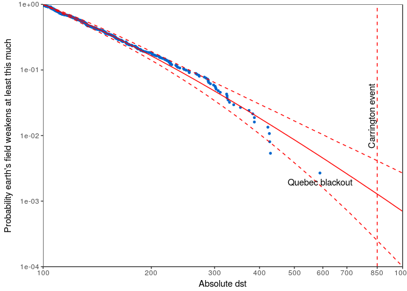
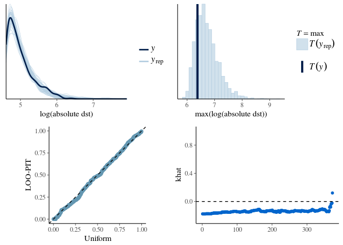

# Extreme value analysis and user defined probability functions in Stan
Aki Vehtari  
`r format(Sys.Date())`  

This notebook demonstrates how to implement user defined probability functions in Stan language. As an example I use the generalized Pareto distribution (GPD) to model geomagnetic storm data from the World Data Center for Geomagnetism.

## Setting up the environment

Load some libraries:

```r
library(extraDistr)
library(ggplot2)
library(tidyr)
library(dplyr)
library(gridExtra)
library(rstan)
library(bayesplot)
library(loo)
rstan_options(auto_write = TRUE)
options(mc.cores = parallel::detectCores())
source("stan_utility.R")
```

## Data

Read the data. This file has magnitudes of 373 geomagnetic storms which lasted longer than 48h with absolute magnitude larger than 100 in 1957-2014.

```r
# file preview shows a header row
d <- read.csv("geomagnetic_tail_data.csv", header = FALSE)
# dst are the absolute magnitudes
colnames(d) <- "dst"
d <- d %>% mutate(dst = abs(dst)) %>% arrange(dst)
```

Compute the empirical complementary cumulative distribution function

```r
n <- dim(d)[1]
d$ccdf <- seq(n,1,-1)/n
head(d)
```

```
##   dst      ccdf
## 1 100 1.0000000
## 2 100 0.9973190
## 3 100 0.9946381
## 4 100 0.9919571
## 5 100 0.9892761
## 6 100 0.9865952
```

Plot just empirical ccdf against the measured magnitudes

```r
ggplot() + 
  geom_point(aes(dst, ccdf), data = d, size = 1, colour = "blue") +
  coord_trans(x="log10", y="log10", limx=c(100,1000), limy=c(1e-4,1)) +
  scale_y_continuous(breaks=c(1e-5,1e-4,1e-3,1e-2,1e-1,1), limits=c(1e-4,1)) +
  scale_x_continuous(breaks=c(100,200,300,400,500,600,700,850,1000), limits=c(100,1000)) +
  labs(y = "Probability earth's field weakens at least this much", x= "Absolute dst") +
  geom_text(aes(x = d$dst[n], y = d$ccdf[n]), 
            label = "Quebec blackout", vjust="top", nudge_y=-0.0005) +
  guides(linetype = F) + 
  theme_bw()
```

<!-- -->

The largest event in the data is the March 1989 geomagnetic storm, also known as Quebec blackout event (https://en.wikipedia.org/wiki/March_1989_geomagnetic_storm). Now we are interested in estimating the probability of observing a same magnitude event in the future which would be helpful, for example, for insurance companies (for a short term geomagnetic storm predictions there are very elaborate models using observations closer to sun, too). Extreme value theory says that many distributions have a tail which is well modelled with generalized Pareto distribution given the cutoff point is far enough in the tail. For a more detailed model we could also take into account that geomagnetic storms are temporally correlated and tend to appear in bursts.

## Generalized Pareto distribution

The Generalized Pareto distribution is defined as
$$ 
  p(y|u,\sigma,k)=
  \begin{cases}
    \frac{1}{\sigma}\left(1+k\left(\frac{y-u}{\sigma}\right)\right)^{-\frac{1}{k}-1}, & k\neq 0 \\
    \frac{1}{\sigma}\exp\left(\frac{y-u}{\sigma}\right), & k = 0,
  \end{cases}
$$
where $u$ is a lower bound parameter, $\sigma$ is a scale parameter, $k$ is a shape parameter, and $y$ is the data restricted to the range $(u, \inf)$ (see, e.g., https://en.wikipedia.org/wiki/Generalized_Pareto_distribution for cdf and random number generation).

For probability distributions implemented in the Stan math library there are functions

* _lpdf (or _lpmf): log probability density (mass) function
* _cdf: cumulative distribution function
* _lcdf: log cumulative distribution function
* _lccdf: log complementary cumulative distribution function
* _rng: generate random variables from the distribution

Unlike the functions implemented in the C++ Stan math library, the user defined functions can have only signature. In this example, I have chosen the function signatures so that the behavior is as close as possible to most usual ways to call these functions. The main feature is that all these function return a scalar real value (except _rng would return scalar integer for a discrete integer valued distribution).

For the Generalized Pareto distribution we implement

* real **gpareto_lpdf**(vector *y* | real *ymin*, real *k*, real *sigma*)
* real **gpareto_cdf**(vector *y* | real *ymin*, real *k*, real *sigma*)
* real **gpareto_lcdf**(vector *y* | real *ymin*, real *k*, real *sigma*)
* real **gpareto_lccdf**(vector *y* | real *ymin*, real *k*, real *sigma*)
* real **gpareto_rng**(real *ymin*, real *k*, real *sigma*)

As we can define only one function signature for user defined functions, I have chosen to have vector type for *y* and real types for the parameters, while builtin functions can handle vectors, arrays and scalars (denoted by generic type `reals`).  For vector valued *y*, _lpdf, _lcdf, and _lccdf return sum of log values computed with each element of *y*. For vector valued *y*, _cdf returns product of values computed with each element of *y*. _rng returns a single random number generated from the generalized Pareto distribution.

## Stan code with user defined functions

The whole code for functions, the basic model and the generated quantities for posterior predictive checking (ppc), leave-one-out cross-validation (loo), and prediction of rare events is shown below. I will next go through some practical details.


```r
writeLines(readLines("gpareto.stan"))
```

```
functions {
  real gpareto_lpdf(vector y, real ymin, real k, real sigma) {
    // generalised Pareto log pdf 
    int N = rows(y);
    real inv_k = inv(k);
    if (k<0 && max(y-ymin)/sigma > -inv_k)
      reject("k<0 and max(y-ymin)/sigma > -1/k; found k, sigma =", k, sigma)
    if (sigma<=0)
      reject("sigma<=0; found sigma =", sigma)
    if (fabs(k) > 1e-15)
      return -(1+inv_k)*sum(log1p((y-ymin) * (k/sigma))) -N*log(sigma);
    else
      return -sum(y-ymin)/sigma -N*log(sigma); // limit k->0
  }
  real gpareto_cdf(vector y, real ymin, real k, real sigma) {
    // generalised Pareto cdf
    real inv_k = inv(k);
    if (k<0 && max(y-ymin)/sigma > -inv_k)
      reject("k<0 and max(y-ymin)/sigma > -1/k; found k, sigma =", k, sigma)
    if (sigma<=0)
      reject("sigma<=0; found sigma =", sigma)
    if (fabs(k) > 1e-15)
      return exp(sum(log1m_exp((-inv_k)*(log1p((y-ymin) * (k/sigma))))));
    else
      return exp(sum(log1m_exp(-(y-ymin)/sigma))); // limit k->0
  }
  real gpareto_lcdf(vector y, real ymin, real k, real sigma) {
    // generalised Pareto log cdf
    real inv_k = inv(k);
    if (k<0 && max(y-ymin)/sigma > -inv_k)
      reject("k<0 and max(y-ymin)/sigma > -1/k; found k, sigma =", k, sigma)
    if (sigma<=0)
      reject("sigma<=0; found sigma =", sigma)
    if (fabs(k) > 1e-15)
      return sum(log1m_exp((-inv_k)*(log1p((y-ymin) * (k/sigma)))));
    else
      return sum(log1m_exp(-(y-ymin)/sigma)); // limit k->0
  }
  real gpareto_lccdf(vector y, real ymin, real k, real sigma) {
    // generalised Pareto log ccdf
    real inv_k = inv(k);
    if (k<0 && max(y-ymin)/sigma > -inv_k)
      reject("k<0 and max(y-ymin)/sigma > -1/k; found k, sigma =", k, sigma)
    if (sigma<=0)
      reject("sigma<=0; found sigma =", sigma)
    if (fabs(k) > 1e-15)
      return (-inv_k)*sum(log1p((y-ymin) * (k/sigma)));
    else
      return -sum(y-ymin)/sigma; // limit k->0
  }
  real gpareto_rng(real ymin, real k, real sigma) {
    // generalised Pareto rng
    if (sigma<=0)
      reject("sigma<=0; found sigma =", sigma)
    if (fabs(k) > 1e-15)
      return (ymin + (pow(uniform_rng(0,1),-k)-1)*sigma/k);
    else
      return (ymin - sigma*log(1/uniform_rng(0,1)-1)); // limit k->0
  }
}
data {
  real ymin;
  int<lower=0> N;
  vector<lower=ymin>[N] y;
  int<lower=0> Nt;
  vector<lower=ymin>[Nt] yt;
}
transformed data {
  real ymax;
  ymax = max(y);
}
parameters {
  real<lower=0> sigma; 
  real<lower=-sigma/(ymax-ymin)> k; 
}
model {
  y ~ gpareto(ymin, k, sigma);
}
generated quantities {
  vector[N] log_lik;
  vector[N] yrep;
  vector[Nt] predccdf;
  for (n in 1:N) {
    log_lik[n] = gpareto_lpdf(rep_vector(y[n],1) | ymin, k, sigma);
    yrep[n] = gpareto_rng(ymin, k, sigma);
  }
  for (nt in 1:Nt)
    predccdf[nt] = exp(gpareto_lccdf(rep_vector(yt[nt],1) | ymin, k, sigma));
}
```

For each function we do basic argument checking. In addition of invalid values due to user errors, due to the limited accuracy of the floating point presentation of the values, sometimes we may get invalid parameters. For example, due to the underflow, we may get sigma equal to 0, even if we have declared it as `real<lower=0> sigma;`. For these latter cases, it is useful to use `reject` statement so the corresponding MCMC proposal will be rejected and the sampling can continue.
```
    if (k<0 && max(y-ymin)/sigma > -inv_k)
      reject("k<0 and max(y-ymin)/sigma > -1/k; found k, sigma =", k, sigma)
    if (sigma<=0)
      reject("sigma<=0; found sigma =", sigma)
```

Stan documentation warns about use of `fabs` and conditional evaluation as they may lead to discontinuous energy or gradient. In GPD we need to handle a special case of $k \rightarrow 0$. The following will cause discontinuity in theory, but the magnitude of the discontinuity is smaller than the accuracy of the floating point presentation, and thus this should not cause any additional numerical instability.
```
    if (fabs(k) > 1e-15)
      return -(1+inv_k)*sum(log1p((y-ymin) * (k/sigma))) -N*log(sigma);
    else
      return -sum(y-ymin)/sigma -N*log(sigma); // limit k->0
```

In data block we need to define the minimum threshold *ymin*. We also define test points *yt*.
```
data {
  real ymin;
  int<lower=0> N;
  vector<lower=ymin>[N] y;
  int<lower=0> Nt;
  vector<lower=ymin>[Nt] yt;
}
```

*sigma* has to be positive and *k* has a lower limit which depends on *sigma* and the maximum value.
```
transformed data {
  real ymax;
  ymax = max(y);
}
parameters {
  real<lower=0> sigma; 
  real<lower=-sigma/(ymax-ymin)> k; 
}
```

By defining `gpareto_lpdf` we can use also the common `~` notation in Stan to write familiar looking model code.
```
model {
  y ~ gpareto(ymin, k, sigma);
}
```

In generated quantities we compute `log_lik` values for LOO and `yrep` values for posterior predictive checking. We had defined the first argument of `pareto_lpdf` to be a vector. Now a single element of vector `y[n]` has a type `real`, and as Stan has strong typing and we can't overload the user defined functions, we need to cast `y[n]` to be a vector by making a 1 element vector `rep_vector(y[n],1)`. Alternatively we could write another function with a different name which could accept scalar `y[n]`, but here I wanted to demonstrate the minimal approach.
```
  for (n in 1:N) {
    log_lik[n] = gpareto_lpdf(rep_vector(y[n],1) | ymin, k, sigma);
    yrep[n] = gpareto_rng(ymin, k, sigma);
  }
```

Finally we compute predictive probabilities for observing events with certain magnitudes.
```
  for (nt in 1:Nt)
    predccdf[nt] = exp(gpareto_lccdf(rep_vector(yt[nt],1) | ymin, k, sigma));
```

Before running the Stan model, it's a good idea to check that we have not made mistakes in the implementation of the user defined functions. RStan makes it easy to call the user defined functions in R, and thus easy to make some checks.

Expose the user defined functions to R

```r
expose_stan_functions("gpareto.stan")
# check that integral of exp(gpareto_lpdf) (from ymin to ymax) matches with gpareto_cdf
gpareto_pdf <- function(y, ymin, k, sigma) {
  exp(sapply(y, FUN = gpareto_lpdf, ymin = ymin, k = k, sigma = sigma))
}
```

## Testing the user defined functions

Run some tests for the user defined functions

```r
# generate random parameter values for the test
# by repeating the tests with different parameter values is a good thing to do
ymin <- rexp(1)
k <- rexp(1,5)
sigma <- rexp(1)
# check that exp(gpareto_lpdf)) integrates to 1
integrate(gpareto_pdf, lower = ymin, upper = Inf,  ymin = ymin, k = k, sigma = sigma)
```

```
## 1 with absolute error < 8.8e-05
```

```r
# check that integral of exp(gpareto_lpdf)) from ymin to yr matches gpareto_cdf
yr <- gpareto_rng(ymin, k, sigma)
all.equal(integrate(gpareto_pdf, lower = ymin, upper = yr,  ymin = ymin, k = k, sigma = sigma)$value,
          gpareto_cdf(yr, ymin, k, sigma))
```

```
## [1] TRUE
```

```r
# check that exp(gpareto_lcdf) and gpareto_cdf return the same value
all.equal(exp(gpareto_lcdf(yr, ymin, k, sigma)),gpareto_cdf(yr, ymin, k, sigma))
```

```
## [1] TRUE
```

```r
# check that exp(gpareto_lcdf) and 1-exp(gpareto_lccdf) return the same value
all.equal(exp(gpareto_lcdf(yr, ymin, k, sigma)),1-exp(gpareto_lccdf(yr, ymin, k, sigma)))
```

```
## [1] TRUE
```

```r
# check that gparetp_lpdf matches dgpd() in extraDistr
all.equal(gpareto_lpdf(yr, ymin, k, sigma),dgpd(yr, mu = ymin, sigma = sigma, xi = k, log = TRUE))
```

```
## [1] TRUE
```

```r
# check that gparetp_cdf matches pgpd() in extraDistr
all.equal(gpareto_cdf(yr, ymin, k, sigma),pgpd(yr, mu = ymin, sigma = sigma, xi = k, log = FALSE))
```

```
## [1] TRUE
```

```r
# test that values generated by gpareto_rng have approximately correct sigma and k
yrs <- replicate(1e6, gpareto_rng(ymin, k, sigma))
# estimate sigma and k using method by Zhang & Stephens (2009)
th <- loo::gpdfit(yrs-ymin)
sprintf('True sigma=%.2f, k=%.2f, estimated sigmahat=%.2f, khat=%.2f', sigma, k, th$sigma, th$k)
```

```
## [1] "True sigma=1.02, k=0.00, estimated sigmahat=1.02, khat=0.00"
```

## Run Stan

Next we use the defined Stan model to analyse the distribution of the largest geomagnetic storms.

Fit the Stan model

```r
yt<-append(10^seq(2,3,.01),850)
ds<-list(ymin=100, N=n, y=d$dst, Nt=length(yt), yt=yt)
fit_gpd <- stan(file='gpareto.stan', data=ds, refresh=0,
                     chains=4, seed=100)
```

## MCMC diagnostics

Run the usual diagnostics (see [Robust Statistical Workflow with RStan](http://mc-stan.org/users/documentation/case-studies/rstan_workflow.html))

```r
check_treedepth(fit_gpd)
```

```
## [1] "0 of 4000 iterations saturated the maximum tree depth of 10 (0%)"
```

```r
check_energy(fit_gpd)
check_div(fit_gpd)
```

```
## [1] "0 of 4000 iterations ended with a divergence (0%)"
```
The diagnostics do not reveal anything alarming.

## Predictions

Plot the model fit with 90% posterior interval. The largest observed magnitude in the data corresponds to Quebec blackout in 1989 (https://en.wikipedia.org/wiki/March_1989_geomagnetic_storm). The vertical dashed line at 850 shows the estimated magnitude of the Carrington event in 1859 (https://en.wikipedia.org/wiki/Solar_storm_of_1859).

```r
gpd_params <- rstan::extract(fit_gpd)
mu <- apply(t(gpd_params$predccdf), 1, quantile, c(0.05, 0.5, 0.95)) %>%
  t() %>% data.frame(x = yt, .) %>% gather(pct, y, -x)
clrs <- color_scheme_get("brightblue")
ggplot() + 
  geom_point(aes(dst, ccdf), data = d, size = 1, color = clrs[[5]]) +
  geom_line(aes(x=c(850,850),y=c(1e-4,1)),linetype="dashed",color="red") +
  geom_line(aes(x, y, linetype = pct), data = mu, color = 'red') +
  scale_linetype_manual(values = c(2,1,2)) +
  coord_trans(x="log10", y="log10", limx=c(100,1000), limy=c(1e-4,1)) +
  scale_y_continuous(breaks=c(1e-5,1e-4,1e-3,1e-2,1e-1,1), limits=c(1e-4,1)) +
  scale_x_continuous(breaks=c(100,200,300,400,500,600,700,850,1000), limits=c(100,1000)) +
  geom_text(aes(x = d$dst[n], y = d$ccdf[n]), label = "Quebec blackout", vjust="top", nudge_y=-0.0005) +
  geom_text(aes(x = 820, y = 0.02), label = "Carrington event", angle=90) +
  labs(y = "Probability earth's field weakens at least this much", x= "Absolute dst") +
  guides(linetype = F) + 
  theme_bw()
```

<!-- -->

## Posterior and LOO predictive checking

For additional model checking plot 1) kernel density estimate of log(dst) and posterior predictive replicates, 2) max log magnitude (Quebec event) and histogram of maximums of posterior predictive replicates, 3) leave-one-out cross-validation probability-integral-transformation, and 4) khat values from the PSIS-LOO. None of these diagnostics reveal problems in the model fit.

```r
ppc1 <- ppc_dens_overlay(log(d$dst),log(gpd_params$yrep[1:50,])) + labs(x="log(absolute dst)")
ppc2 <- ppc_stat(log(d$dst), log(gpd_params$yrep), stat = "max") + labs(x="max(log(absolute dst))")
psis <- psislw(-gpd_params$log_lik)
clrs <- color_scheme_get("brightblue")
pkhats <- ggplot() + geom_point(aes(x=seq(1,n),y=psis$pareto_k), color=clrs[[5]]) + labs(y="khat", x="") +
  geom_hline(yintercept=0, linetype="dashed") + ylim(-0.25,1) + theme_default()
ppc3 <- ppc_loo_pit(log(d$dst), log(gpd_params$yrep), lw=psis$lw_smooth)
grid.arrange(ppc1,ppc2,ppc3,pkhats,ncol=2)
```

```
## `stat_bin()` using `bins = 30`. Pick better value with `binwidth`.
```

<!-- -->

We compute also PSIS-LOO estimate, although this is not much use without an alternative model to compare against.

```r
(loo_gpd<-loo(gpd_params$log_lik))
```

```
## Computed from 4000 by 373 log-likelihood matrix
## 
##          Estimate   SE
## elpd_loo  -1874.7 23.7
## p_loo         1.7  0.2
## looic      3749.3 47.3
## 
## All Pareto k estimates are good (k < 0.5)
## See help('pareto-k-diagnostic') for details.
```

## Conclusion on the data analysis

Here the analysis was simplified by assuming the geomagnetic storm events to be independent in time although they appear in bursts. The Generalized Pareto distribution can be used for correlated data, but we should really take the correlation into account for predicting the magnitude of storms in the future . Based on the simplified independence assumption though, and assuming same number of events larger than 100 in the next 57 years, we can compute

```r
round(mean(1-(1-gpd_params$predccdf[,78])^(373)),2)
```

```
## [1] 0.8
```

```r
round(mean(1-(1-gpd_params$predccdf[,102])^(373)),2)
```

```
## [1] 0.4
```
That is, the probability that we would observe Quebec blackout magnitude event in the next 57 years is 80% and the probability of observing Carrington level event in the next 57 years is 40%.

Now go read about the effects of these geomagnetic storms!

<br />

### Appendix: Session information


```r
sessionInfo()
```

```
## R version 3.2.3 (2015-12-10)
## Platform: x86_64-pc-linux-gnu (64-bit)
## Running under: Ubuntu 16.04.3 LTS
## 
## locale:
##  [1] LC_CTYPE=en_US.UTF-8       LC_NUMERIC=C              
##  [3] LC_TIME=en_US.utf8         LC_COLLATE=en_US.UTF-8    
##  [5] LC_MONETARY=en_US.UTF-8    LC_MESSAGES=en_US.UTF-8   
##  [7] LC_PAPER=fi_FI.utf8        LC_NAME=C                 
##  [9] LC_ADDRESS=C               LC_TELEPHONE=C            
## [11] LC_MEASUREMENT=en_US.UTF-8 LC_IDENTIFICATION=C       
## 
## attached base packages:
## [1] stats     graphics  grDevices utils     datasets  methods   base     
## 
## other attached packages:
##  [1] bindrcpp_0.2         loo_1.1.0            bayesplot_1.4.0     
##  [4] rstan_2.16.2         StanHeaders_2.16.0-1 gridExtra_2.3       
##  [7] dplyr_0.7.4          tidyr_0.7.2          ggplot2_2.2.1       
## [10] extraDistr_1.8.7    
## 
## loaded via a namespace (and not attached):
##  [1] Rcpp_0.12.13       plyr_1.8.4         bindr_0.1         
##  [4] tools_3.2.3        digest_0.6.12      evaluate_0.10.1   
##  [7] tibble_1.3.4       gtable_0.2.0       pkgconfig_2.0.1   
## [10] rlang_0.1.4        yaml_2.1.14        parallel_3.2.3    
## [13] stringr_1.2.0      knitr_1.17         tidyselect_0.2.2  
## [16] stats4_3.2.3       rprojroot_1.2      grid_3.2.3        
## [19] glue_1.2.0         inline_0.3.14      R6_2.2.2          
## [22] rmarkdown_1.6      reshape2_1.4.2     purrr_0.2.4       
## [25] magrittr_1.5       rstantools_1.3.0   backports_1.1.1   
## [28] scales_0.5.0       codetools_0.2-15   htmltools_0.3.6   
## [31] matrixStats_0.52.2 assertthat_0.2.0   colorspace_1.3-2  
## [34] labeling_0.3       stringi_1.1.5      lazyeval_0.2.1    
## [37] munsell_0.4.3
```

<br />

### Appendix: Acknowledgments

I thank Ben Goodrich and Ben Bales for useful comments on the draft of this notebook.

### Appendix: Licenses

* Code &copy; 2017, Aki Vehtari, licensed under BSD-3.
* Text &copy; 2017, Aki Vehtari, licensed under CC-BY-NC 4.0.
