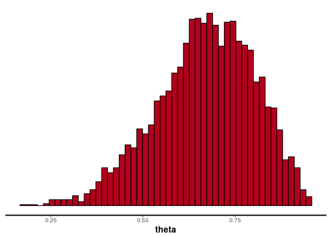
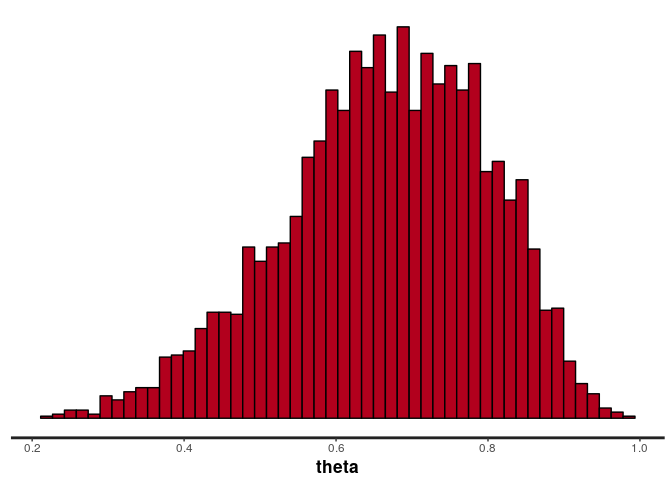
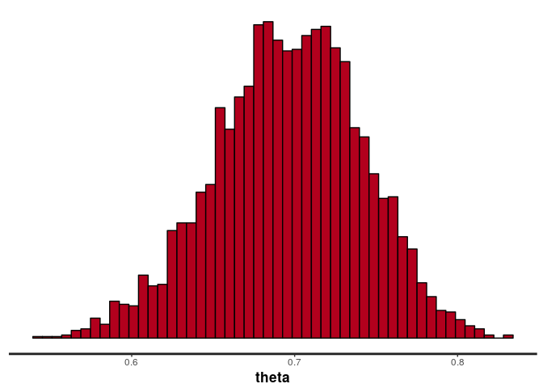
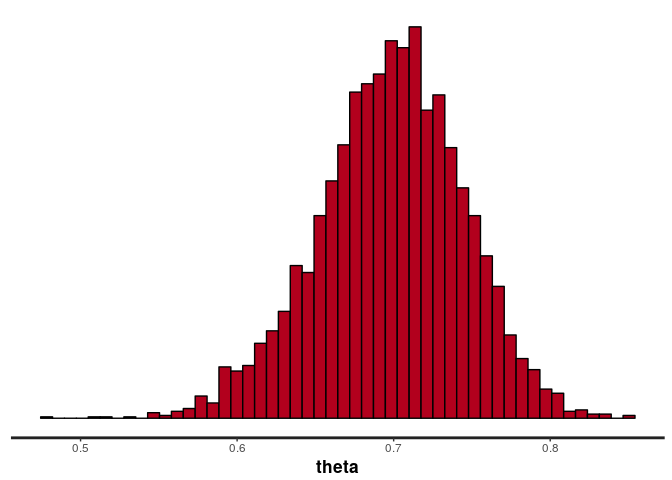
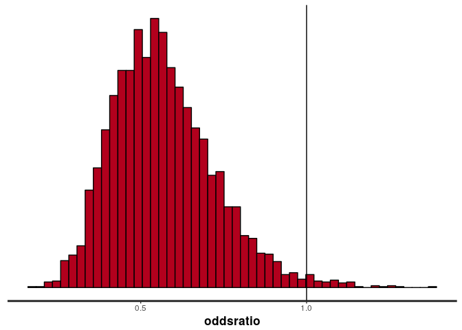
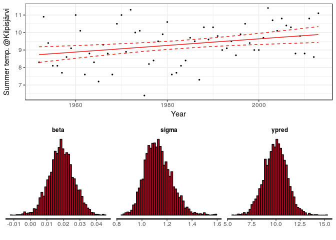
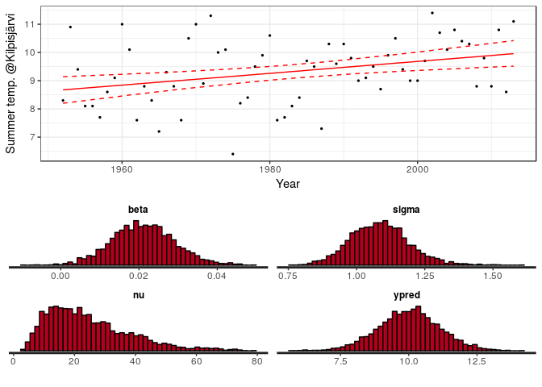
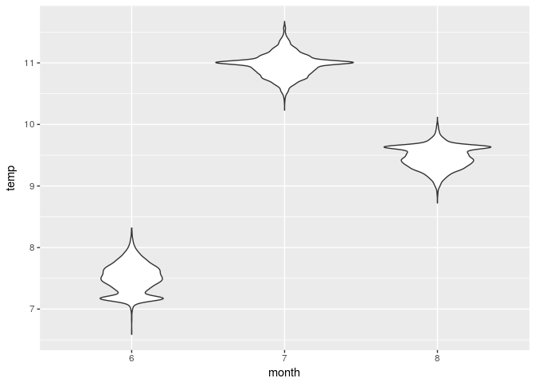

# Bayesian data analysis - rstan demos
Aki Vehtari, Markus Paasiniemi  

Examples how to use Stan in R with rstan. This notebook assumes basic knowledge of Bayesian inference and MCMC. The Stan models are stored in separate .stan-files.

Note that you can easily analyse Stan fit objects returned by ```stan()``` with a ShinyStan package by calling ```launch_shinystan(fit)```.

___

Load libraries

```r
library(tidyr) #
library(rstan) # version >= 2.11
```

```
## Loading required package: ggplot2
```

```
## Loading required package: StanHeaders
```

```
## rstan (Version 2.15.1, packaged: 2017-04-19 05:03:57 UTC, GitRev: 2e1f913d3ca3)
```

```
## For execution on a local, multicore CPU with excess RAM we recommend calling
## rstan_options(auto_write = TRUE)
## options(mc.cores = parallel::detectCores())
```

```
## 
## Attaching package: 'rstan'
```

```
## The following object is masked from 'package:tidyr':
## 
##     extract
```

```r
rstan_options(auto_write = TRUE)
options(mc.cores = parallel::detectCores())
library(loo)
```

```
## This is loo version 1.1.0
```

```r
library(ggplot2)
library(gridExtra)
library(shinystan)
```

```
## Loading required package: shiny
```

```
## 
## This is shinystan version 2.3.0
```

```r
source('stan_utility.R')
```


## Bernoulli model

Toy data with sequence of failures (0) and successes (1). We would like to learn about the unknown probability of success.

```r
d_bern <- list(N = 10, y = c(1, 1, 1, 0, 1, 1, 1, 0, 1, 0))
```

Bernoulli model with a Beta(1,1) (uniform) prior

```r
writeLines(readLines("bern.stan"))
```

```
## // Bernoulli model
## data {
##   int<lower=0> N;
##   int<lower=0,upper=1> y[N];
## }
## parameters {
##   real<lower=0,upper=1> theta;
## }
## model {
##   theta ~ beta(1,1);
##   y ~ bernoulli(theta);
## }
```

Sample form the posterior and show the summary

```r
(fit_bern <- stan(file = 'bern.stan', data = d_bern))
```

```
## Inference for Stan model: bern.
## 4 chains, each with iter=2000; warmup=1000; thin=1; 
## post-warmup draws per chain=1000, total post-warmup draws=4000.
## 
##        mean se_mean   sd   2.5%   25%   50%   75% 97.5% n_eff Rhat
## theta  0.67    0.00 0.13   0.39  0.59  0.68  0.77  0.90  1410    1
## lp__  -8.18    0.02 0.76 -10.43 -8.38 -7.88 -7.69 -7.64  1510    1
## 
## Samples were drawn using NUTS(diag_e) at Tue Oct 17 16:50:25 2017.
## For each parameter, n_eff is a crude measure of effective sample size,
## and Rhat is the potential scale reduction factor on split chains (at 
## convergence, Rhat=1).
```
Plot the histogram of the posterior draws

```r
stan_hist(fit_bern, bins = 50)
```

<!-- -->

```r
# or extract the samples for plotting manually:
# samples_bern <- extract(fit_bern, permuted = T)
# hist(samples_bern$theta)
```

## Binomial model

Instead of sequence of 0's and 1's, we can summarize the data with the number of experiments and the number successes:

```r
d_bin <- list(N = 10, y = 7)
```

And then we use Binomial model with Beta(1,1) prior for the probability of success.

```r
writeLines(readLines("binom.stan"))
```

```
## // Binomial model with beta(1,1,) prior
## data {
##   int<lower=0> N;
##   int<lower=0> y;
## }
## parameters {
##   real<lower=0,upper=1> theta;
## }
## model {
##   theta ~ beta(1,1);
##   y ~ binomial(N,theta);
## }
```

Sample from the posterior and plot the posterior. The histogram should look similar as in the Bernoulli case.

```r
(fit_bin <- stan(file = 'binom.stan', data = d_bin))
```

```
## Inference for Stan model: binom.
## 4 chains, each with iter=2000; warmup=1000; thin=1; 
## post-warmup draws per chain=1000, total post-warmup draws=4000.
## 
##        mean se_mean   sd   2.5%   25%   50%   75% 97.5% n_eff Rhat
## theta  0.66    0.00 0.13   0.38  0.58  0.67  0.76  0.89  1321    1
## lp__  -8.18    0.02 0.76 -10.30 -8.37 -7.88 -7.69 -7.64  1658    1
## 
## Samples were drawn using NUTS(diag_e) at Tue Oct 17 16:50:28 2017.
## For each parameter, n_eff is a crude measure of effective sample size,
## and Rhat is the potential scale reduction factor on split chains (at 
## convergence, Rhat=1).
```

```r
stan_hist(fit_bin, pars = 'theta', bins = 50)
```

<!-- -->

Re-run the model with a new data. The compiled Stan program is re-used making the re-use faster.

```r
d_bin <- list(N = 100, y = 70)
(fit_bin <- stan(file = 'binom.stan', data = d_bin))
```

```
## Inference for Stan model: binom.
## 4 chains, each with iter=2000; warmup=1000; thin=1; 
## post-warmup draws per chain=1000, total post-warmup draws=4000.
## 
##         mean se_mean   sd   2.5%    25%    50%    75%  97.5% n_eff Rhat
## theta   0.70    0.00 0.05   0.60   0.67   0.70   0.73   0.78  1465    1
## lp__  -63.14    0.02 0.69 -65.12 -63.31 -62.88 -62.70 -62.64  1759    1
## 
## Samples were drawn using NUTS(diag_e) at Tue Oct 17 16:50:32 2017.
## For each parameter, n_eff is a crude measure of effective sample size,
## and Rhat is the potential scale reduction factor on split chains (at 
## convergence, Rhat=1).
```

```r
stan_hist(fit_bin, pars = 'theta', bins = 50)
```

<!-- -->
## Explicit transformation of variables

In the above examples the probability of success $\theta$ was declared as

```real<lower=0,upper=1> theta;```

Stan makes automatic transformation of the variable to the unconstrained space using logit transofrmation for interval constrained and log transformation for half constraints.

The following example shows how we can also make an explicit transformation and use binomial_logit function which takes the unconstrained parameter as an argument and uses logit transformation internally. This form can be useful for better numerical stability.


```r
writeLines(readLines("binomb.stan"))
```

```
## // Binomial model with a roughly uniform prior for
## // the probability of success (theta)
## data {
##   int<lower=0> N;
##   int<lower=0> y;
## }
## parameters {
##   real alpha;
## }
## transformed parameters {
##   real theta;
##   theta = inv_logit(alpha);
## }
## model {
##   // roughly auniform prior for the number of successes
##   alpha ~ normal(0,1.5);
##   y ~ binomial_logit(N,alpha);
## }
```
Here we have used Gaussian prior in the unconstrained space, which produces close to uniform prior for theta.

Sample from the posterior and plot the posterior. The histogram should look similar as with the previous models.


```r
d_bin <- list(N = 100, y = 70)
(fit_bin <- stan(file = 'binomb.stan', data = d_bin))
```

```
## Inference for Stan model: binomb.
## 4 chains, each with iter=2000; warmup=1000; thin=1; 
## post-warmup draws per chain=1000, total post-warmup draws=4000.
## 
##         mean se_mean   sd   2.5%    25%    50%    75%  97.5% n_eff Rhat
## alpha   0.85    0.01 0.22   0.40   0.71   0.85   0.99   1.29  1472    1
## theta   0.70    0.00 0.05   0.60   0.67   0.70   0.73   0.78  1477    1
## lp__  -61.77    0.02 0.79 -63.95 -61.94 -61.47 -61.29 -61.24  1148    1
## 
## Samples were drawn using NUTS(diag_e) at Tue Oct 17 16:50:35 2017.
## For each parameter, n_eff is a crude measure of effective sample size,
## and Rhat is the potential scale reduction factor on split chains (at 
## convergence, Rhat=1).
```

```r
stan_hist(fit_bin, pars = 'theta', bins = 50)
```

<!-- -->


## Comparison of two groups with Binomial

An experiment was performed to estimate the effect of beta-blockers on mortality of cardiac patients. A group of patients were randomly assigned to treatment and control groups:

- out of 674 patients receiving the control, 39 died
- out of 680 receiving the treatment, 22 died

Data:


```r
d_bin2 <- list(N1 = 674, y1 = 39, N2 = 680, y2 = 22)
```

To analyse whether the treatment is useful, we can use Binomial model for both groups and compute odds-ratio:

```r
writeLines(readLines("binom2.stan"))
```

```
## //  Comparison of two groups with Binomial
## data {
##   int<lower=0> N1;
##   int<lower=0> y1;
##   int<lower=0> N2;
##   int<lower=0> y2;
## }
## parameters {
##   real<lower=0,upper=1> theta1;
##   real<lower=0,upper=1> theta2;
## }
## model {
##   theta1 ~ beta(1,1);
##   theta2 ~ beta(1,1);
##   y1 ~ binomial(N1,theta1);
##   y2 ~ binomial(N2,theta2);
## }
## generated quantities {
##   real oddsratio;
##   oddsratio = (theta2/(1-theta2))/(theta1/(1-theta1));
## }
```

Sample from the posterior and plot the posterior

```r
(fit_bin2 <- stan(file = 'binom2.stan', data = d_bin2))
```

```
## Inference for Stan model: binom2.
## 4 chains, each with iter=2000; warmup=1000; thin=1; 
## post-warmup draws per chain=1000, total post-warmup draws=4000.
## 
##              mean se_mean   sd    2.5%     25%     50%     75%   97.5%
## theta1       0.06    0.00 0.01    0.04    0.05    0.06    0.07    0.08
## theta2       0.03    0.00 0.01    0.02    0.03    0.03    0.04    0.05
## oddsratio    0.57    0.00 0.15    0.32    0.46    0.55    0.66    0.92
## lp__      -253.45    0.02 1.06 -256.25 -253.83 -253.12 -252.72 -252.47
##           n_eff Rhat
## theta1     4000    1
## theta2     3582    1
## oddsratio  3816    1
## lp__       1810    1
## 
## Samples were drawn using NUTS(diag_e) at Tue Oct 17 16:50:38 2017.
## For each parameter, n_eff is a crude measure of effective sample size,
## and Rhat is the potential scale reduction factor on split chains (at 
## convergence, Rhat=1).
```

```r
stan_hist(fit_bin2, pars = 'oddsratio', bins = 50)+geom_vline(xintercept = 1)
```

<!-- -->

## Linear Gaussian model

The following file has Kilpisjärvi summer month temperatures 1952-2013:

```r
d_kilpis <- read.delim('kilpisjarvi-summer-temp.csv', sep = ';')
d_lin <-list(N = nrow(d_kilpis),
             x = d_kilpis$year,
             xpred = 2016,
             y = d_kilpis[,5])
```

Plot the data

```r
ggplot() +
  geom_point(aes(x, y), data = data.frame(d_lin), size = 0.5) +
  labs(y = 'Summer temp. @Kilpisjärvi', x= "Year") +
  guides(linetype = F) +
  theme_bw()
```

<!-- -->

To analyse whether the average summer month temperature is rising, we use a linear model with Gaussian model for the unexplained variation. 

### Gaussian linear model with adjustable priors

The folloing Stan code allows also setting hyperparameter values as data allowing easier way to use different priors in different analyses:

```r
writeLines(readLines("lin.stan"))
```

```
## // Gaussian linear model with adjustable priors
## data {
##   int<lower=0> N; // number of data points
##   vector[N] x; //
##   vector[N] y; //
##   real xpred; // input location for prediction
##   real pmualpha; // prior mean for alpha
##   real psalpha;  // prior std for alpha
##   real pmubeta;  // prior mean for beta
##   real psbeta;   // prior std for beta
## }
## parameters {
##   real alpha;
##   real beta;
##   real<lower=0> sigma;
## }
## transformed parameters {
##   vector[N] mu;
##   mu = alpha + beta*x;
## }
## model {
##   alpha ~ normal(pmualpha, psalpha);
##   beta ~ normal(pmubeta, psbeta);
##   y ~ normal(mu, sigma);
## }
## generated quantities {
##   real ypred;
##   vector[N] log_lik;
##   ypred = normal_rng(alpha + beta*xpred, sigma);
##   for (i in 1:N)
##     log_lik[i] = normal_lpdf(y[i] | mu[i], sigma);
## }
```

Create another list with data and priors

```r
d_lin_priors <- c(list(
    pmualpha = mean(unlist(d_kilpis[,5])), # centered
    psalpha = 100, # weakly informative
    pmubeta = 0, # a priori incr. and decr. as likely
    psbeta = (.1--.1)/6), # avg temp prob does does not incr. more than a degree per 10 years
  d_lin)
```

Run Stan

```r
fit_lin <- stan(file = 'lin.stan', data = d_lin_priors)
```

```
## Warning: There were 103 transitions after warmup that exceeded the maximum treedepth. Increase max_treedepth above 10. See
## http://mc-stan.org/misc/warnings.html#maximum-treedepth-exceeded
```

```
## Warning: Examine the pairs() plot to diagnose sampling problems
```
Stan gives a warning that "There were 91 transitions after warmup that exceeded the maximum treedepth". You can use ShinyStan (```launch_shinystan(fit_lin)```) to look at the treedepth info and joint posterior of alpha and beta, to get a hint for the reason. ShinyStan helps also checking divergences, energy diagnostic, n_eff's and Rhats.

Instead of interactive ShinyStan, we can also check the diagnostics as follows

```r
print(fit_lin)
```

```
## Inference for Stan model: lin.
## 4 chains, each with iter=2000; warmup=1000; thin=1; 
## post-warmup draws per chain=1000, total post-warmup draws=4000.
## 
##               mean se_mean    sd   2.5%    25%    50%    75%  97.5% n_eff
## alpha       -27.92    0.46 15.04 -56.98 -37.65 -27.94 -18.37   1.80  1071
## beta          0.02    0.00  0.01   0.00   0.01   0.02   0.02   0.03  1071
## sigma         1.13    0.00  0.11   0.95   1.06   1.12   1.20   1.36  1144
## mu[1]         8.74    0.01  0.27   8.21   8.56   8.74   8.91   9.29  1339
## mu[2]         8.76    0.01  0.27   8.24   8.58   8.76   8.93   9.30  1356
## mu[3]         8.78    0.01  0.26   8.27   8.60   8.78   8.94   9.30  1375
## mu[4]         8.79    0.01  0.25   8.30   8.63   8.79   8.96   9.31  1395
## mu[5]         8.81    0.01  0.25   8.33   8.65   8.81   8.97   9.31  1418
## mu[6]         8.83    0.01  0.24   8.36   8.67   8.83   8.99   9.32  1443
## mu[7]         8.85    0.01  0.23   8.39   8.69   8.85   9.00   9.33  1470
## mu[8]         8.87    0.01  0.23   8.42   8.72   8.87   9.02   9.33  1501
## mu[9]         8.89    0.01  0.22   8.46   8.74   8.89   9.03   9.34  1534
## mu[10]        8.91    0.01  0.22   8.49   8.76   8.91   9.05   9.35  1572
## mu[11]        8.93    0.01  0.21   8.52   8.79   8.92   9.07   9.36  1615
## mu[12]        8.94    0.01  0.21   8.54   8.81   8.94   9.08   9.36  1662
## mu[13]        8.96    0.00  0.20   8.57   8.83   8.96   9.10   9.37  1716
## mu[14]        8.98    0.00  0.19   8.60   8.85   8.98   9.11   9.37  1776
## mu[15]        9.00    0.00  0.19   8.63   8.87   9.00   9.12   9.38  1844
## mu[16]        9.02    0.00  0.18   8.67   8.90   9.02   9.14   9.39  1922
## mu[17]        9.04    0.00  0.18   8.69   8.92   9.03   9.16   9.40  2011
## mu[18]        9.06    0.00  0.17   8.72   8.94   9.05   9.17   9.41  2112
## mu[19]        9.08    0.00  0.17   8.75   8.96   9.07   9.19   9.42  2227
## mu[20]        9.09    0.00  0.17   8.77   8.98   9.09   9.20   9.43  2648
## mu[21]        9.11    0.00  0.16   8.80   9.01   9.11   9.22   9.44  2790
## mu[22]        9.13    0.00  0.16   8.83   9.03   9.13   9.24   9.45  2948
## mu[23]        9.15    0.00  0.16   8.85   9.05   9.15   9.25   9.46  3123
## mu[24]        9.17    0.00  0.15   8.87   9.07   9.17   9.27   9.48  3314
## mu[25]        9.19    0.00  0.15   8.89   9.09   9.19   9.29   9.49  3513
## mu[26]        9.21    0.00  0.15   8.92   9.11   9.21   9.31   9.50  3683
## mu[27]        9.23    0.00  0.14   8.94   9.13   9.22   9.32   9.52  4000
## mu[28]        9.24    0.00  0.14   8.96   9.15   9.24   9.34   9.53  4000
## mu[29]        9.26    0.00  0.14   8.99   9.17   9.26   9.36   9.55  4000
## mu[30]        9.28    0.00  0.14   9.01   9.19   9.28   9.38   9.56  4000
## mu[31]        9.30    0.00  0.14   9.03   9.21   9.30   9.40   9.58  4000
## mu[32]        9.32    0.00  0.14   9.05   9.23   9.32   9.41   9.60  4000
## mu[33]        9.34    0.00  0.14   9.06   9.25   9.34   9.43   9.61  4000
## mu[34]        9.36    0.00  0.14   9.08   9.26   9.36   9.45   9.64  4000
## mu[35]        9.38    0.00  0.14   9.10   9.28   9.37   9.47   9.66  4000
## mu[36]        9.39    0.00  0.14   9.11   9.30   9.39   9.49   9.68  4000
## mu[37]        9.41    0.00  0.15   9.13   9.32   9.41   9.51   9.70  3757
## mu[38]        9.43    0.00  0.15   9.14   9.33   9.43   9.53   9.72  3588
## mu[39]        9.45    0.00  0.15   9.16   9.35   9.45   9.56   9.75  3419
## mu[40]        9.47    0.00  0.15   9.17   9.37   9.47   9.58   9.77  3223
## mu[41]        9.49    0.00  0.16   9.18   9.38   9.49   9.60   9.80  3041
## mu[42]        9.51    0.00  0.16   9.19   9.40   9.51   9.62   9.82  2572
## mu[43]        9.53    0.00  0.16   9.20   9.42   9.53   9.64   9.85  2420
## mu[44]        9.54    0.00  0.17   9.21   9.43   9.55   9.66   9.88  2285
## mu[45]        9.56    0.00  0.17   9.23   9.45   9.56   9.68   9.90  2167
## mu[46]        9.58    0.00  0.18   9.24   9.46   9.58   9.70   9.93  2063
## mu[47]        9.60    0.00  0.18   9.24   9.48   9.60   9.72   9.96  1972
## mu[48]        9.62    0.00  0.19   9.25   9.49   9.62   9.75   9.99  1892
## mu[49]        9.64    0.00  0.19   9.26   9.51   9.64   9.77  10.02  1821
## mu[50]        9.66    0.00  0.20   9.27   9.53   9.66   9.79  10.04  1759
## mu[51]        9.68    0.00  0.20   9.27   9.54   9.68   9.81  10.07  1703
## mu[52]        9.70    0.01  0.21   9.28   9.56   9.70   9.84  10.10  1654
## mu[53]        9.71    0.01  0.21   9.29   9.57   9.72   9.86  10.13  1610
## mu[54]        9.73    0.01  0.22   9.30   9.59   9.73   9.88  10.16  1571
## mu[55]        9.75    0.01  0.23   9.30   9.60   9.75   9.90  10.19  1536
## mu[56]        9.77    0.01  0.23   9.31   9.62   9.77   9.93  10.22  1504
## mu[57]        9.79    0.01  0.24   9.32   9.63   9.79   9.95  10.25  1474
## mu[58]        9.81    0.01  0.24   9.32   9.65   9.81   9.97  10.28  1448
## mu[59]        9.83    0.01  0.25   9.33   9.66   9.83  10.00  10.32  1424
## mu[60]        9.85    0.01  0.26   9.33   9.68   9.85  10.02  10.35  1402
## mu[61]        9.86    0.01  0.26   9.34   9.69   9.86  10.04  10.38  1382
## mu[62]        9.88    0.01  0.27   9.35   9.71   9.88  10.06  10.41  1363
## ypred         9.95    0.02  1.18   7.61   9.16   9.98  10.73  12.28  3793
## log_lik[1]   -1.14    0.00  0.13  -1.45  -1.22  -1.13  -1.05  -0.93  1271
## log_lik[2]   -2.92    0.01  0.53  -4.11  -3.25  -2.87  -2.54  -2.01  1331
## log_lik[3]   -1.22    0.00  0.15  -1.55  -1.31  -1.21  -1.12  -0.99  1304
## log_lik[4]   -1.25    0.00  0.16  -1.62  -1.34  -1.23  -1.14  -0.99  1357
## log_lik[5]   -1.26    0.00  0.16  -1.62  -1.35  -1.24  -1.15  -1.00  1375
## log_lik[6]   -1.57    0.01  0.22  -2.06  -1.70  -1.55  -1.42  -1.20  1446
## log_lik[7]   -1.08    0.00  0.11  -1.32  -1.15  -1.07  -1.01  -0.90  1234
## log_lik[8]   -1.08    0.00  0.10  -1.28  -1.14  -1.07  -1.01  -0.89  1205
## log_lik[9]   -2.85    0.01  0.45  -3.86  -3.14  -2.82  -2.53  -2.06  1431
## log_lik[10]  -1.63    0.01  0.21  -2.10  -1.75  -1.61  -1.48  -1.28  1553
## log_lik[11]  -1.76    0.01  0.22  -2.25  -1.89  -1.74  -1.60  -1.37  1602
## log_lik[12]  -1.06    0.00  0.10  -1.27  -1.13  -1.06  -0.99  -0.89  1201
## log_lik[13]  -1.23    0.00  0.13  -1.51  -1.31  -1.22  -1.14  -1.00  1509
## log_lik[14]  -2.32    0.01  0.30  -2.98  -2.51  -2.31  -2.10  -1.81  1614
## log_lik[15]  -1.09    0.00  0.10  -1.28  -1.15  -1.08  -1.02  -0.91  1254
## log_lik[16]  -1.07    0.00  0.10  -1.28  -1.13  -1.06  -1.00  -0.89  1231
## log_lik[17]  -1.88    0.00  0.21  -2.33  -2.01  -1.86  -1.73  -1.52  1909
## log_lik[18]  -1.89    0.00  0.21  -2.35  -2.02  -1.87  -1.74  -1.52  1949
## log_lik[19]  -2.54    0.01  0.32  -3.25  -2.74  -2.51  -2.31  -1.97  1739
## log_lik[20]  -1.06    0.00  0.10  -1.26  -1.13  -1.06  -1.00  -0.89  1221
## log_lik[21]  -2.97    0.01  0.39  -3.83  -3.22  -2.94  -2.69  -2.28  1679
## log_lik[22]  -1.35    0.00  0.11  -1.59  -1.42  -1.34  -1.27  -1.15  2266
## log_lik[23]  -1.41    0.00  0.12  -1.66  -1.49  -1.40  -1.33  -1.19  2817
## log_lik[24]  -4.13    0.01  0.57  -5.34  -4.48  -4.10  -3.73  -3.12  1514
## log_lik[25]  -1.44    0.00  0.12  -1.70  -1.51  -1.43  -1.35  -1.22  3203
## log_lik[26]  -1.31    0.00  0.11  -1.54  -1.37  -1.30  -1.23  -1.11  2732
## log_lik[27]  -1.08    0.00  0.09  -1.26  -1.13  -1.07  -1.01  -0.91  1260
## log_lik[28]  -1.22    0.00  0.10  -1.42  -1.28  -1.21  -1.15  -1.04  1949
## log_lik[29]  -1.76    0.00  0.16  -2.09  -1.87  -1.75  -1.65  -1.49  3589
## log_lik[30]  -2.18    0.00  0.22  -2.65  -2.32  -2.16  -2.03  -1.81  2558
## log_lik[31]  -2.07    0.00  0.20  -2.49  -2.20  -2.06  -1.93  -1.73  3017
## log_lik[32]  -1.64    0.00  0.14  -1.93  -1.73  -1.63  -1.55  -1.40  4000
## log_lik[33]  -1.40    0.00  0.11  -1.63  -1.47  -1.39  -1.32  -1.20  3711
## log_lik[34]  -1.09    0.00  0.09  -1.28  -1.15  -1.09  -1.03  -0.92  1322
## log_lik[35]  -1.05    0.00  0.09  -1.24  -1.11  -1.05  -0.98  -0.88  1100
## log_lik[36]  -2.81    0.01  0.33  -3.49  -3.02  -2.79  -2.57  -2.22  1885
## log_lik[37]  -1.36    0.00  0.11  -1.59  -1.43  -1.35  -1.28  -1.17  2952
## log_lik[38]  -1.06    0.00  0.09  -1.25  -1.12  -1.05  -0.99  -0.89  1116
## log_lik[39]  -1.33    0.00  0.11  -1.57  -1.41  -1.33  -1.26  -1.14  2408
## log_lik[40]  -1.09    0.00  0.10  -1.29  -1.15  -1.09  -1.02  -0.92  1303
## log_lik[41]  -1.14    0.00  0.10  -1.34  -1.21  -1.14  -1.08  -0.96  1520
## log_lik[42]  -1.11    0.00  0.10  -1.31  -1.18  -1.11  -1.05  -0.93  1394
## log_lik[43]  -1.05    0.00  0.09  -1.24  -1.11  -1.04  -0.98  -0.88  1087
## log_lik[44]  -1.34    0.00  0.12  -1.59  -1.41  -1.33  -1.26  -1.12  2058
## log_lik[45]  -1.09    0.00  0.10  -1.30  -1.16  -1.09  -1.02  -0.92  1297
## log_lik[46]  -1.39    0.00  0.13  -1.67  -1.47  -1.38  -1.29  -1.16  1929
## log_lik[47]  -1.07    0.00  0.10  -1.26  -1.13  -1.06  -1.00  -0.89  1218
## log_lik[48]  -1.21    0.00  0.11  -1.44  -1.27  -1.20  -1.13  -1.01  1584
## log_lik[49]  -1.22    0.00  0.11  -1.46  -1.28  -1.21  -1.14  -1.01  1577
## log_lik[50]  -1.05    0.00  0.10  -1.25  -1.11  -1.05  -0.99  -0.88  1097
## log_lik[51]  -2.24    0.01  0.30  -2.91  -2.43  -2.21  -2.04  -1.73  1642
## log_lik[52]  -1.46    0.00  0.17  -1.83  -1.56  -1.44  -1.34  -1.17  1641
## log_lik[53]  -1.11    0.00  0.11  -1.35  -1.18  -1.11  -1.04  -0.92  1298
## log_lik[54]  -1.51    0.00  0.19  -1.93  -1.63  -1.50  -1.38  -1.19  1576
## log_lik[55]  -1.22    0.00  0.14  -1.53  -1.31  -1.21  -1.13  -0.99  1417
## log_lik[56]  -1.17    0.00  0.13  -1.45  -1.25  -1.16  -1.08  -0.96  1350
## log_lik[57]  -1.45    0.00  0.19  -1.88  -1.57  -1.43  -1.32  -1.14  1482
## log_lik[58]  -1.06    0.00  0.10  -1.27  -1.12  -1.05  -0.99  -0.88  1177
## log_lik[59]  -1.49    0.01  0.21  -1.96  -1.61  -1.46  -1.34  -1.15  1437
## log_lik[60]  -1.43    0.01  0.20  -1.89  -1.54  -1.40  -1.28  -1.10  1404
## log_lik[61]  -1.71    0.01  0.27  -2.32  -1.87  -1.68  -1.52  -1.26  1400
## log_lik[62]  -1.66    0.01  0.26  -2.26  -1.81  -1.63  -1.47  -1.22  1385
## lp__        -37.99    0.04  1.23 -41.27 -38.53 -37.68 -37.10 -36.60  1181
##             Rhat
## alpha          1
## beta           1
## sigma          1
## mu[1]          1
## mu[2]          1
## mu[3]          1
## mu[4]          1
## mu[5]          1
## mu[6]          1
## mu[7]          1
## mu[8]          1
## mu[9]          1
## mu[10]         1
## mu[11]         1
## mu[12]         1
## mu[13]         1
## mu[14]         1
## mu[15]         1
## mu[16]         1
## mu[17]         1
## mu[18]         1
## mu[19]         1
## mu[20]         1
## mu[21]         1
## mu[22]         1
## mu[23]         1
## mu[24]         1
## mu[25]         1
## mu[26]         1
## mu[27]         1
## mu[28]         1
## mu[29]         1
## mu[30]         1
## mu[31]         1
## mu[32]         1
## mu[33]         1
## mu[34]         1
## mu[35]         1
## mu[36]         1
## mu[37]         1
## mu[38]         1
## mu[39]         1
## mu[40]         1
## mu[41]         1
## mu[42]         1
## mu[43]         1
## mu[44]         1
## mu[45]         1
## mu[46]         1
## mu[47]         1
## mu[48]         1
## mu[49]         1
## mu[50]         1
## mu[51]         1
## mu[52]         1
## mu[53]         1
## mu[54]         1
## mu[55]         1
## mu[56]         1
## mu[57]         1
## mu[58]         1
## mu[59]         1
## mu[60]         1
## mu[61]         1
## mu[62]         1
## ypred          1
## log_lik[1]     1
## log_lik[2]     1
## log_lik[3]     1
## log_lik[4]     1
## log_lik[5]     1
## log_lik[6]     1
## log_lik[7]     1
## log_lik[8]     1
## log_lik[9]     1
## log_lik[10]    1
## log_lik[11]    1
## log_lik[12]    1
## log_lik[13]    1
## log_lik[14]    1
## log_lik[15]    1
## log_lik[16]    1
## log_lik[17]    1
## log_lik[18]    1
## log_lik[19]    1
## log_lik[20]    1
## log_lik[21]    1
## log_lik[22]    1
## log_lik[23]    1
## log_lik[24]    1
## log_lik[25]    1
## log_lik[26]    1
## log_lik[27]    1
## log_lik[28]    1
## log_lik[29]    1
## log_lik[30]    1
## log_lik[31]    1
## log_lik[32]    1
## log_lik[33]    1
## log_lik[34]    1
## log_lik[35]    1
## log_lik[36]    1
## log_lik[37]    1
## log_lik[38]    1
## log_lik[39]    1
## log_lik[40]    1
## log_lik[41]    1
## log_lik[42]    1
## log_lik[43]    1
## log_lik[44]    1
## log_lik[45]    1
## log_lik[46]    1
## log_lik[47]    1
## log_lik[48]    1
## log_lik[49]    1
## log_lik[50]    1
## log_lik[51]    1
## log_lik[52]    1
## log_lik[53]    1
## log_lik[54]    1
## log_lik[55]    1
## log_lik[56]    1
## log_lik[57]    1
## log_lik[58]    1
## log_lik[59]    1
## log_lik[60]    1
## log_lik[61]    1
## log_lik[62]    1
## lp__           1
## 
## Samples were drawn using NUTS(diag_e) at Tue Oct 17 16:50:50 2017.
## For each parameter, n_eff is a crude measure of effective sample size,
## and Rhat is the potential scale reduction factor on split chains (at 
## convergence, Rhat=1).
```

The following diagnostics are explained in [Robust Statistical Workflow with RStan Case Study](http://mc-stan.org/users/documentation/case-studies/rstan_workflow.html) by Michael Betancourt.

```r
check_treedepth(fit_lin)
```

```
## [1] "103 of 4000 iterations saturated the maximum tree depth of 10 (2.575%)"
## [1] "Run again with max_depth set to a larger value to avoid saturation"
```

```r
check_energy(fit_lin)
check_div(fit_lin)
```

```
## [1] "0 of 4000 iterations ended with a divergence (0%)"
```


Compute the probability that the summer temperature is increasing.

```r
samples_lin <- rstan::extract(fit_lin, permuted = T)
mean(samples_lin$beta>0) # probability that beta > 0
```

```
## [1] 0.98875
```

Plot the data, the model fit and prediction for year 2016.

```r
mu <- apply(samples_lin$mu, 2, quantile, c(0.05, 0.5, 0.95)) %>%
  t() %>% data.frame(x = d_lin$x, .)  %>% gather(pct, y, -x)

pfit <- ggplot() +
  geom_point(aes(x, y), data = data.frame(d_lin), size = 0.5) +
  geom_line(aes(x, y, linetype = pct), data = mu, color = 'red') +
  scale_linetype_manual(values = c(2,1,2)) +
  labs(y = 'Summer temp. @Kilpisjärvi', x= "Year") +
  guides(linetype = F) +
  theme_bw()
pars <- intersect(names(samples_lin), c('beta','sigma','ypred'))
phist <- stan_hist(fit_lin, pars = pars, bins = 50)
grid.arrange(pfit, phist, nrow = 2)
```

<!-- -->

### Gaussian linear model with standardized data

In the above we used the unnormalized data and as x values are far away from zero, this will cause very strong posterior dependency between alpha and beta (did you use ShinyStan for the above model?). The strong posterior dependency can be removed by normalizing the data to have zero mean. The following Stan code makes it in Stan. In generated quantities we do correspnding transformation back to the original scale.


```r
writeLines(readLines("lin_std.stan"))
```

```
## // Gaussian linear model with standardized data
## data {
##   int<lower=0> N; // number of data points
##   vector[N] x; //
##   vector[N] y; //
##   real xpred; // input location for prediction
## }
## transformed data {
##   vector[N] x_std;
##   vector[N] y_std;
##   x_std = (x - mean(x)) / sd(x);
##   y_std = (y - mean(y)) / sd(y);
## }
## parameters {
##   real alpha;
##   real beta;
##   real<lower=0> sigma_std;
## }
## transformed parameters {
##   vector[N] mu_std;
##   mu_std = alpha + beta*x_std;
## }
## model {
##   alpha ~ normal(0, 1);
##   beta ~ normal(0, 1);
##   y_std ~ normal(mu_std, sigma_std);
## }
## generated quantities {
##   vector[N] mu;
##   real<lower=0> sigma;
##   real ypred;
##   vector[N] log_lik;
##   mu = mu_std*sd(y) + mean(y);
##   sigma = sigma_std*sd(y);
##   ypred = normal_rng((alpha + beta*xpred)*sd(y)+mean(y), sigma*sd(y));
##   for (i in 1:N)
##     log_lik[i] = normal_lpdf(y[i] | mu[i], sigma);
## }
```


```r
# with standardized data
# this is alternative to above
fit_lin_std <- stan(file = 'lin_std.stan', data = d_lin)
```
Now there were no warnings. You can use ShinyStan (```launch_shinystan(fit_lin)```) to look at the posterior and diagnostics and compare to the previous model results. We can also check diagnostics with the following commands.


```r
print(fit_lin_std)
```

```
## Inference for Stan model: lin_std.
## 4 chains, each with iter=2000; warmup=1000; thin=1; 
## post-warmup draws per chain=1000, total post-warmup draws=4000.
## 
##               mean se_mean     sd   2.5%    25%    50%    75%   97.5%
## alpha         0.00    0.00   0.12  -0.24  -0.08   0.00   0.08    0.23
## beta          0.31    0.00   0.12   0.06   0.23   0.31   0.40    0.55
## sigma_std     0.97    0.00   0.09   0.81   0.91   0.97   1.03    1.17
## mu_std[1]    -0.53    0.00   0.24  -1.02  -0.69  -0.53  -0.37   -0.06
## mu_std[2]    -0.51    0.00   0.24  -0.99  -0.67  -0.51  -0.35   -0.05
## mu_std[3]    -0.49    0.00   0.23  -0.96  -0.64  -0.49  -0.34   -0.05
## mu_std[4]    -0.48    0.00   0.23  -0.93  -0.62  -0.48  -0.33   -0.04
## mu_std[5]    -0.46    0.00   0.22  -0.90  -0.60  -0.46  -0.31   -0.03
## mu_std[6]    -0.44    0.00   0.22  -0.87  -0.58  -0.44  -0.30   -0.03
## mu_std[7]    -0.43    0.00   0.21  -0.84  -0.56  -0.42  -0.29   -0.02
## mu_std[8]    -0.41    0.00   0.20  -0.81  -0.54  -0.41  -0.27   -0.02
## mu_std[9]    -0.39    0.00   0.20  -0.78  -0.52  -0.39  -0.26   -0.01
## mu_std[10]   -0.37    0.00   0.19  -0.76  -0.50  -0.37  -0.25    0.00
## mu_std[11]   -0.36    0.00   0.19  -0.73  -0.48  -0.36  -0.23    0.01
## mu_std[12]   -0.34    0.00   0.18  -0.70  -0.46  -0.34  -0.22    0.01
## mu_std[13]   -0.32    0.00   0.18  -0.68  -0.44  -0.32  -0.20    0.02
## mu_std[14]   -0.30    0.00   0.17  -0.65  -0.42  -0.30  -0.19    0.03
## mu_std[15]   -0.29    0.00   0.17  -0.62  -0.40  -0.29  -0.18    0.04
## mu_std[16]   -0.27    0.00   0.16  -0.60  -0.38  -0.27  -0.16    0.04
## mu_std[17]   -0.25    0.00   0.16  -0.57  -0.36  -0.25  -0.15    0.05
## mu_std[18]   -0.24    0.00   0.15  -0.55  -0.34  -0.23  -0.13    0.06
## mu_std[19]   -0.22    0.00   0.15  -0.52  -0.32  -0.22  -0.12    0.07
## mu_std[20]   -0.20    0.00   0.15  -0.50  -0.30  -0.20  -0.10    0.08
## mu_std[21]   -0.18    0.00   0.14  -0.47  -0.28  -0.18  -0.09    0.09
## mu_std[22]   -0.17    0.00   0.14  -0.45  -0.26  -0.16  -0.07    0.10
## mu_std[23]   -0.15    0.00   0.14  -0.42  -0.24  -0.15  -0.06    0.11
## mu_std[24]   -0.13    0.00   0.13  -0.40  -0.22  -0.13  -0.04    0.12
## mu_std[25]   -0.11    0.00   0.13  -0.38  -0.20  -0.11  -0.02    0.13
## mu_std[26]   -0.10    0.00   0.13  -0.35  -0.18  -0.10  -0.01    0.15
## mu_std[27]   -0.08    0.00   0.13  -0.33  -0.17  -0.08   0.01    0.16
## mu_std[28]   -0.06    0.00   0.13  -0.31  -0.15  -0.06   0.02    0.18
## mu_std[29]   -0.04    0.00   0.12  -0.29  -0.13  -0.04   0.04    0.19
## mu_std[30]   -0.03    0.00   0.12  -0.27  -0.11  -0.03   0.06    0.21
## mu_std[31]   -0.01    0.00   0.12  -0.25  -0.09  -0.01   0.08    0.23
## mu_std[32]    0.01    0.00   0.12  -0.23  -0.08   0.01   0.09    0.24
## mu_std[33]    0.02    0.00   0.12  -0.22  -0.06   0.02   0.11    0.26
## mu_std[34]    0.04    0.00   0.12  -0.20  -0.04   0.04   0.13    0.28
## mu_std[35]    0.06    0.00   0.13  -0.19  -0.03   0.06   0.15    0.30
## mu_std[36]    0.08    0.00   0.13  -0.17  -0.01   0.08   0.16    0.32
## mu_std[37]    0.09    0.00   0.13  -0.16   0.00   0.09   0.18    0.34
## mu_std[38]    0.11    0.00   0.13  -0.14   0.02   0.11   0.20    0.36
## mu_std[39]    0.13    0.00   0.13  -0.13   0.04   0.13   0.22    0.38
## mu_std[40]    0.15    0.00   0.14  -0.12   0.05   0.15   0.24    0.40
## mu_std[41]    0.16    0.00   0.14  -0.11   0.07   0.16   0.26    0.43
## mu_std[42]    0.18    0.00   0.14  -0.10   0.08   0.18   0.28    0.46
## mu_std[43]    0.20    0.00   0.15  -0.09   0.10   0.20   0.30    0.48
## mu_std[44]    0.21    0.00   0.15  -0.08   0.11   0.22   0.32    0.51
## mu_std[45]    0.23    0.00   0.15  -0.07   0.13   0.23   0.34    0.53
## mu_std[46]    0.25    0.00   0.16  -0.06   0.14   0.25   0.36    0.56
## mu_std[47]    0.27    0.00   0.16  -0.05   0.16   0.27   0.38    0.58
## mu_std[48]    0.28    0.00   0.17  -0.04   0.17   0.29   0.40    0.61
## mu_std[49]    0.30    0.00   0.17  -0.04   0.18   0.30   0.42    0.64
## mu_std[50]    0.32    0.00   0.18  -0.03   0.20   0.32   0.44    0.67
## mu_std[51]    0.34    0.00   0.18  -0.02   0.21   0.34   0.46    0.69
## mu_std[52]    0.35    0.00   0.19  -0.01   0.23   0.35   0.48    0.72
## mu_std[53]    0.37    0.00   0.19   0.00   0.24   0.37   0.50    0.75
## mu_std[54]    0.39    0.00   0.20   0.01   0.25   0.39   0.52    0.78
## mu_std[55]    0.40    0.00   0.20   0.02   0.26   0.41   0.54    0.81
## mu_std[56]    0.42    0.00   0.21   0.02   0.28   0.42   0.56    0.83
## mu_std[57]    0.44    0.00   0.21   0.03   0.29   0.44   0.58    0.86
## mu_std[58]    0.46    0.00   0.22   0.03   0.31   0.46   0.60    0.89
## mu_std[59]    0.47    0.00   0.23   0.03   0.32   0.48   0.63    0.92
## mu_std[60]    0.49    0.00   0.23   0.04   0.33   0.49   0.65    0.95
## mu_std[61]    0.51    0.00   0.24   0.04   0.35   0.51   0.67    0.98
## mu_std[62]    0.53    0.00   0.24   0.05   0.36   0.53   0.69    1.01
## mu[1]         8.70    0.01   0.28   8.13   8.52   8.70   8.89    9.25
## mu[2]         8.72    0.01   0.28   8.17   8.54   8.72   8.90    9.25
## mu[3]         8.74    0.00   0.27   8.20   8.57   8.74   8.92    9.26
## mu[4]         8.76    0.00   0.26   8.24   8.59   8.76   8.93    9.27
## mu[5]         8.78    0.00   0.26   8.27   8.61   8.78   8.95    9.28
## mu[6]         8.80    0.00   0.25   8.31   8.64   8.80   8.97    9.28
## mu[7]         8.82    0.00   0.24   8.34   8.66   8.82   8.98    9.29
## mu[8]         8.84    0.00   0.24   8.37   8.68   8.84   9.00    9.30
## mu[9]         8.86    0.00   0.23   8.40   8.71   8.86   9.01    9.30
## mu[10]        8.88    0.00   0.22   8.43   8.73   8.88   9.03    9.31
## mu[11]        8.90    0.00   0.22   8.47   8.76   8.90   9.05    9.32
## mu[12]        8.92    0.00   0.21   8.50   8.78   8.92   9.06    9.33
## mu[13]        8.94    0.00   0.21   8.53   8.81   8.94   9.08    9.33
## mu[14]        8.96    0.00   0.20   8.56   8.83   8.96   9.09    9.34
## mu[15]        8.98    0.00   0.20   8.59   8.85   8.98   9.11    9.36
## mu[16]        9.00    0.00   0.19   8.62   8.87   9.00   9.12    9.36
## mu[17]        9.02    0.00   0.18   8.65   8.90   9.02   9.14    9.37
## mu[18]        9.04    0.00   0.18   8.68   8.92   9.04   9.16    9.39
## mu[19]        9.06    0.00   0.17   8.71   8.94   9.06   9.18    9.39
## mu[20]        9.08    0.00   0.17   8.74   8.96   9.08   9.20    9.41
## mu[21]        9.10    0.00   0.17   8.76   8.99   9.10   9.21    9.42
## mu[22]        9.12    0.00   0.16   8.79   9.01   9.12   9.23    9.43
## mu[23]        9.14    0.00   0.16   8.82   9.03   9.14   9.25    9.44
## mu[24]        9.16    0.00   0.16   8.85   9.06   9.16   9.26    9.46
## mu[25]        9.18    0.00   0.15   8.88   9.08   9.18   9.28    9.47
## mu[26]        9.20    0.00   0.15   8.90   9.10   9.20   9.30    9.49
## mu[27]        9.22    0.00   0.15   8.93   9.12   9.22   9.32    9.50
## mu[28]        9.24    0.00   0.15   8.95   9.14   9.24   9.34    9.52
## mu[29]        9.26    0.00   0.14   8.98   9.16   9.26   9.36    9.54
## mu[30]        9.28    0.00   0.14   9.00   9.18   9.28   9.38    9.56
## mu[31]        9.30    0.00   0.14   9.02   9.20   9.30   9.40    9.58
## mu[32]        9.32    0.00   0.14   9.04   9.23   9.32   9.42    9.59
## mu[33]        9.34    0.00   0.14   9.06   9.24   9.34   9.44    9.61
## mu[34]        9.36    0.00   0.14   9.08   9.26   9.36   9.46    9.63
## mu[35]        9.38    0.00   0.15   9.09   9.28   9.38   9.48    9.66
## mu[36]        9.40    0.00   0.15   9.12   9.30   9.40   9.50    9.68
## mu[37]        9.42    0.00   0.15   9.13   9.32   9.42   9.52    9.71
## mu[38]        9.44    0.00   0.15   9.15   9.34   9.44   9.54    9.73
## mu[39]        9.46    0.00   0.15   9.16   9.35   9.46   9.57    9.76
## mu[40]        9.48    0.00   0.16   9.18   9.37   9.48   9.59    9.78
## mu[41]        9.50    0.00   0.16   9.19   9.39   9.50   9.61    9.81
## mu[42]        9.52    0.00   0.17   9.20   9.41   9.52   9.63    9.84
## mu[43]        9.54    0.00   0.17   9.21   9.42   9.54   9.66    9.87
## mu[44]        9.56    0.00   0.17   9.22   9.44   9.56   9.68    9.90
## mu[45]        9.58    0.00   0.18   9.23   9.46   9.58   9.71    9.93
## mu[46]        9.60    0.00   0.18   9.24   9.48   9.60   9.73    9.96
## mu[47]        9.62    0.00   0.19   9.25   9.50   9.62   9.75    9.99
## mu[48]        9.64    0.00   0.19   9.26   9.51   9.64   9.78   10.02
## mu[49]        9.66    0.00   0.20   9.27   9.53   9.66   9.80   10.05
## mu[50]        9.68    0.00   0.20   9.28   9.54   9.68   9.82   10.08
## mu[51]        9.70    0.00   0.21   9.29   9.56   9.70   9.84   10.12
## mu[52]        9.72    0.00   0.22   9.31   9.57   9.72   9.87   10.15
## mu[53]        9.74    0.00   0.22   9.31   9.59   9.74   9.89   10.18
## mu[54]        9.76    0.00   0.23   9.32   9.60   9.77   9.92   10.21
## mu[55]        9.78    0.00   0.24   9.33   9.62   9.79   9.94   10.25
## mu[56]        9.80    0.00   0.24   9.34   9.64   9.81   9.97   10.28
## mu[57]        9.82    0.00   0.25   9.34   9.65   9.82   9.99   10.31
## mu[58]        9.84    0.00   0.25   9.35   9.67   9.85  10.01   10.35
## mu[59]        9.86    0.00   0.26   9.35   9.69   9.87  10.04   10.38
## mu[60]        9.88    0.00   0.27   9.36   9.70   9.89  10.06   10.41
## mu[61]        9.90    0.00   0.27   9.36   9.72   9.91  10.09   10.45
## mu[62]        9.92    0.00   0.28   9.37   9.73   9.93  10.11   10.48
## sigma         1.13    0.00   0.11   0.94   1.05   1.12   1.19    1.36
## ypred       738.74    4.92 290.56 157.39 545.62 739.17 933.35 1305.47
## log_lik[1]   -1.13    0.00   0.13  -1.42  -1.21  -1.11  -1.04   -0.91
## log_lik[2]   -2.98    0.01   0.55  -4.17  -3.33  -2.93  -2.58   -2.05
## log_lik[3]   -1.24    0.00   0.16  -1.61  -1.32  -1.22  -1.13   -0.99
## log_lik[4]   -1.24    0.00   0.16  -1.59  -1.33  -1.22  -1.13   -0.98
## log_lik[5]   -1.25    0.00   0.15  -1.59  -1.34  -1.23  -1.14   -1.00
## log_lik[6]   -1.54    0.00   0.22  -2.03  -1.68  -1.52  -1.39   -1.19
## log_lik[7]   -1.08    0.00   0.11  -1.30  -1.15  -1.07  -1.00   -0.89
## log_lik[8]   -1.09    0.00   0.11  -1.31  -1.15  -1.08  -1.01   -0.90
## log_lik[9]   -2.90    0.01   0.47  -3.91  -3.20  -2.87  -2.56   -2.10
## log_lik[10]  -1.66    0.00   0.22  -2.13  -1.79  -1.64  -1.50   -1.29
## log_lik[11]  -1.73    0.00   0.22  -2.22  -1.87  -1.71  -1.57   -1.35
## log_lik[12]  -1.06    0.00   0.10  -1.26  -1.12  -1.06  -0.99   -0.88
## log_lik[13]  -1.22    0.00   0.13  -1.48  -1.30  -1.21  -1.13   -1.00
## log_lik[14]  -2.30    0.01   0.30  -2.94  -2.49  -2.28  -2.09   -1.75
## log_lik[15]  -1.09    0.00   0.10  -1.30  -1.15  -1.09  -1.02   -0.91
## log_lik[16]  -1.07    0.00   0.10  -1.27  -1.13  -1.06  -1.00   -0.88
## log_lik[17]  -1.86    0.00   0.21  -2.31  -1.99  -1.84  -1.71   -1.49
## log_lik[18]  -1.91    0.00   0.22  -2.37  -2.05  -1.89  -1.75   -1.54
## log_lik[19]  -2.56    0.01   0.33  -3.28  -2.77  -2.54  -2.32   -2.00
## log_lik[20]  -1.06    0.00   0.10  -1.26  -1.12  -1.06  -0.99   -0.88
## log_lik[21]  -3.00    0.01   0.40  -3.86  -3.25  -2.97  -2.70   -2.31
## log_lik[22]  -1.36    0.00   0.12  -1.62  -1.44  -1.35  -1.28   -1.15
## log_lik[23]  -1.42    0.00   0.12  -1.68  -1.50  -1.41  -1.33   -1.20
## log_lik[24]  -4.11    0.01   0.57  -5.34  -4.48  -4.07  -3.71   -3.11
## log_lik[25]  -1.43    0.00   0.12  -1.68  -1.51  -1.42  -1.35   -1.21
## log_lik[26]  -1.30    0.00   0.11  -1.52  -1.37  -1.30  -1.23   -1.10
## log_lik[27]  -1.08    0.00   0.09  -1.27  -1.14  -1.07  -1.01   -0.90
## log_lik[28]  -1.22    0.00   0.10  -1.43  -1.28  -1.22  -1.15   -1.04
## log_lik[29]  -1.77    0.00   0.16  -2.12  -1.87  -1.75  -1.65   -1.49
## log_lik[30]  -2.18    0.00   0.22  -2.65  -2.32  -2.17  -2.02   -1.79
## log_lik[31]  -2.07    0.00   0.20  -2.51  -2.20  -2.06  -1.93   -1.72
## log_lik[32]  -1.64    0.00   0.14  -1.94  -1.73  -1.63  -1.55   -1.40
## log_lik[33]  -1.40    0.00   0.11  -1.63  -1.47  -1.39  -1.32   -1.20
## log_lik[34]  -1.09    0.00   0.09  -1.28  -1.15  -1.09  -1.03   -0.92
## log_lik[35]  -1.05    0.00   0.09  -1.24  -1.11  -1.05  -0.99   -0.87
## log_lik[36]  -2.82    0.01   0.34  -3.55  -3.03  -2.80  -2.58   -2.24
## log_lik[37]  -1.36    0.00   0.11  -1.58  -1.43  -1.35  -1.28   -1.15
## log_lik[38]  -1.06    0.00   0.09  -1.25  -1.12  -1.05  -0.99   -0.88
## log_lik[39]  -1.33    0.00   0.11  -1.56  -1.40  -1.32  -1.25   -1.12
## log_lik[40]  -1.09    0.00   0.09  -1.28  -1.15  -1.08  -1.02   -0.91
## log_lik[41]  -1.15    0.00   0.10  -1.35  -1.21  -1.15  -1.08   -0.96
## log_lik[42]  -1.12    0.00   0.10  -1.32  -1.18  -1.12  -1.05   -0.93
## log_lik[43]  -1.05    0.00   0.09  -1.24  -1.11  -1.05  -0.98   -0.87
## log_lik[44]  -1.35    0.00   0.13  -1.61  -1.43  -1.34  -1.26   -1.12
## log_lik[45]  -1.09    0.00   0.10  -1.29  -1.15  -1.09  -1.02   -0.91
## log_lik[46]  -1.37    0.00   0.14  -1.66  -1.46  -1.36  -1.28   -1.13
## log_lik[47]  -1.07    0.00   0.10  -1.27  -1.13  -1.07  -1.00   -0.89
## log_lik[48]  -1.22    0.00   0.12  -1.47  -1.29  -1.21  -1.13   -1.00
## log_lik[49]  -1.23    0.00   0.12  -1.49  -1.30  -1.22  -1.14   -1.01
## log_lik[50]  -1.05    0.00   0.10  -1.25  -1.12  -1.05  -0.99   -0.87
## log_lik[51]  -2.21    0.01   0.31  -2.90  -2.41  -2.18  -1.99   -1.68
## log_lik[52]  -1.44    0.00   0.17  -1.82  -1.55  -1.42  -1.32   -1.15
## log_lik[53]  -1.11    0.00   0.11  -1.33  -1.18  -1.10  -1.03   -0.91
## log_lik[54]  -1.49    0.00   0.19  -1.92  -1.61  -1.47  -1.35   -1.17
## log_lik[55]  -1.21    0.00   0.14  -1.51  -1.30  -1.20  -1.12   -0.98
## log_lik[56]  -1.16    0.00   0.12  -1.43  -1.24  -1.15  -1.07   -0.94
## log_lik[57]  -1.48    0.00   0.21  -1.94  -1.61  -1.46  -1.33   -1.14
## log_lik[58]  -1.06    0.00   0.10  -1.27  -1.13  -1.06  -0.99   -0.88
## log_lik[59]  -1.52    0.00   0.22  -2.02  -1.65  -1.49  -1.35   -1.15
## log_lik[60]  -1.40    0.00   0.20  -1.88  -1.52  -1.38  -1.26   -1.07
## log_lik[61]  -1.75    0.00   0.29  -2.40  -1.92  -1.72  -1.54   -1.27
## log_lik[62]  -1.62    0.00   0.27  -2.24  -1.79  -1.59  -1.43   -1.19
## lp__        -28.81    0.03   1.25 -32.09 -29.39 -28.49 -27.90  -27.39
##             n_eff Rhat
## alpha        3237    1
## beta         3487    1
## sigma_std    3283    1
## mu_std[1]    3037    1
## mu_std[2]    3028    1
## mu_std[3]    3020    1
## mu_std[4]    3011    1
## mu_std[5]    3003    1
## mu_std[6]    2994    1
## mu_std[7]    2986    1
## mu_std[8]    2977    1
## mu_std[9]    2969    1
## mu_std[10]   2961    1
## mu_std[11]   2953    1
## mu_std[12]   2946    1
## mu_std[13]   2939    1
## mu_std[14]   2934    1
## mu_std[15]   2929    1
## mu_std[16]   2925    1
## mu_std[17]   2922    1
## mu_std[18]   2922    1
## mu_std[19]   2923    1
## mu_std[20]   2926    1
## mu_std[21]   2932    1
## mu_std[22]   2941    1
## mu_std[23]   2953    1
## mu_std[24]   2969    1
## mu_std[25]   2987    1
## mu_std[26]   3007    1
## mu_std[27]   3142    1
## mu_std[28]   3160    1
## mu_std[29]   3180    1
## mu_std[30]   3204    1
## mu_std[31]   3225    1
## mu_std[32]   3248    1
## mu_std[33]   3273    1
## mu_std[34]   3299    1
## mu_std[35]   3326    1
## mu_std[36]   3353    1
## mu_std[37]   3380    1
## mu_std[38]   3407    1
## mu_std[39]   3432    1
## mu_std[40]   3456    1
## mu_std[41]   3478    1
## mu_std[42]   3499    1
## mu_std[43]   3518    1
## mu_std[44]   3536    1
## mu_std[45]   3551    1
## mu_std[46]   3565    1
## mu_std[47]   3577    1
## mu_std[48]   3588    1
## mu_std[49]   3597    1
## mu_std[50]   3600    1
## mu_std[51]   3602    1
## mu_std[52]   3604    1
## mu_std[53]   3606    1
## mu_std[54]   3607    1
## mu_std[55]   3608    1
## mu_std[56]   3609    1
## mu_std[57]   3609    1
## mu_std[58]   3609    1
## mu_std[59]   3610    1
## mu_std[60]   3610    1
## mu_std[61]   3610    1
## mu_std[62]   3609    1
## mu[1]        3037    1
## mu[2]        3028    1
## mu[3]        3020    1
## mu[4]        3011    1
## mu[5]        3003    1
## mu[6]        2994    1
## mu[7]        2986    1
## mu[8]        2977    1
## mu[9]        2969    1
## mu[10]       2961    1
## mu[11]       2953    1
## mu[12]       2946    1
## mu[13]       2939    1
## mu[14]       2934    1
## mu[15]       2929    1
## mu[16]       2925    1
## mu[17]       2922    1
## mu[18]       2922    1
## mu[19]       2923    1
## mu[20]       2926    1
## mu[21]       2932    1
## mu[22]       2941    1
## mu[23]       2953    1
## mu[24]       2969    1
## mu[25]       2987    1
## mu[26]       3007    1
## mu[27]       3142    1
## mu[28]       3160    1
## mu[29]       3180    1
## mu[30]       3204    1
## mu[31]       3225    1
## mu[32]       3248    1
## mu[33]       3273    1
## mu[34]       3299    1
## mu[35]       3326    1
## mu[36]       3353    1
## mu[37]       3380    1
## mu[38]       3407    1
## mu[39]       3432    1
## mu[40]       3456    1
## mu[41]       3478    1
## mu[42]       3499    1
## mu[43]       3518    1
## mu[44]       3536    1
## mu[45]       3551    1
## mu[46]       3565    1
## mu[47]       3577    1
## mu[48]       3588    1
## mu[49]       3597    1
## mu[50]       3600    1
## mu[51]       3602    1
## mu[52]       3604    1
## mu[53]       3606    1
## mu[54]       3607    1
## mu[55]       3608    1
## mu[56]       3609    1
## mu[57]       3609    1
## mu[58]       3609    1
## mu[59]       3610    1
## mu[60]       3610    1
## mu[61]       3610    1
## mu[62]       3609    1
## sigma        3283    1
## ypred        3487    1
## log_lik[1]   2623    1
## log_lik[2]   3257    1
## log_lik[3]   3103    1
## log_lik[4]   2821    1
## log_lik[5]   2838    1
## log_lik[6]   3040    1
## log_lik[7]   2640    1
## log_lik[8]   2895    1
## log_lik[9]   3231    1
## log_lik[10]  3214    1
## log_lik[11]  3104    1
## log_lik[12]  2761    1
## log_lik[13]  2875    1
## log_lik[14]  3361    1
## log_lik[15]  3022    1
## log_lik[16]  2844    1
## log_lik[17]  3155    1
## log_lik[18]  3223    1
## log_lik[19]  3245    1
## log_lik[20]  2927    1
## log_lik[21]  3266    1
## log_lik[22]  3255    1
## log_lik[23]  3290    1
## log_lik[24]  3305    1
## log_lik[25]  3206    1
## log_lik[26]  3179    1
## log_lik[27]  3040    1
## log_lik[28]  3131    1
## log_lik[29]  3448    1
## log_lik[30]  3336    1
## log_lik[31]  3359    1
## log_lik[32]  3476    1
## log_lik[33]  3515    1
## log_lik[34]  3119    1
## log_lik[35]  3035    1
## log_lik[36]  3345    1
## log_lik[37]  3341    1
## log_lik[38]  3023    1
## log_lik[39]  3343    1
## log_lik[40]  3120    1
## log_lik[41]  3526    1
## log_lik[42]  3472    1
## log_lik[43]  3232    1
## log_lik[44]  3737    1
## log_lik[45]  3107    1
## log_lik[46]  3505    1
## log_lik[47]  3318    1
## log_lik[48]  3657    1
## log_lik[49]  3672    1
## log_lik[50]  2895    1
## log_lik[51]  3756    1
## log_lik[52]  3613    1
## log_lik[53]  3080    1
## log_lik[54]  3644    1
## log_lik[55]  3303    1
## log_lik[56]  3182    1
## log_lik[57]  3765    1
## log_lik[58]  2594    1
## log_lik[59]  3764    1
## log_lik[60]  3580    1
## log_lik[61]  3748    1
## log_lik[62]  3686    1
## lp__         1688    1
## 
## Samples were drawn using NUTS(diag_e) at Tue Oct 17 16:50:55 2017.
## For each parameter, n_eff is a crude measure of effective sample size,
## and Rhat is the potential scale reduction factor on split chains (at 
## convergence, Rhat=1).
```

```r
check_treedepth(fit_lin_std)
```

```
## [1] "0 of 4000 iterations saturated the maximum tree depth of 10 (0%)"
```

```r
check_energy(fit_lin_std)
check_div(fit_lin_std)
```

```
## [1] "0 of 4000 iterations ended with a divergence (0%)"
```

We see that there are no warnings by diagnostics and n_eff's are higher than with the previous case with non-standardized data.

Next we check that we get similar probability for beta>0.

```r
samples_lin_std <- rstan::extract(fit_lin_std, permuted = T)
mean(samples_lin_std$beta>0) # probability that beta > 0
```

```
## [1] 0.9925
```

## Linear Student's t model.

The temperatures used in the above analyses are averages over three months, which makes it more likely that they are normally distributed, but there can be extreme events in the feather and we can check whether more robust Student's t observation model woul give different results.


```r
writeLines(readLines("lin_t.stan"))
```

```
## // Linear student-t model
## data {
##   int<lower=0> N; // number of data points
##   vector[N] x; //
##   vector[N] y; //
##   real xpred; // input location for prediction
## }
## parameters {
##   real alpha;
##   real beta;
##   real<lower=0> sigma;
##   real<lower=1, upper=80> nu;
## }
## transformed parameters {
##   vector[N] mu;
##   mu = alpha + beta*x;
## }
## model {
##   nu ~ gamma(2, 0.1); // Juárez and Steel(2010)
##   y ~ student_t(nu, mu, sigma);
## }
## generated quantities {
##   real ypred;
##   vector[N] log_lik;
##   ypred = normal_rng(alpha + beta*xpred, sigma);
##   for (i in 1:N)
##     log_lik[i] = student_t_lpdf(y[i] | nu, mu[i], sigma);
## }
```


```r
fit_lin_t <- stan(file = 'lin_t.stan', data = d_lin)
```

```
## Warning: There were 122 transitions after warmup that exceeded the maximum treedepth. Increase max_treedepth above 10. See
## http://mc-stan.org/misc/warnings.html#maximum-treedepth-exceeded
```

```
## Warning: Examine the pairs() plot to diagnose sampling problems
```
We get some warnings, but these specific warnings are not critical if counts are small as here.

Let's examine further diagnostics.

```r
print(fit_lin_t)
```

```
## Inference for Stan model: lin_t.
## 4 chains, each with iter=2000; warmup=1000; thin=1; 
## post-warmup draws per chain=1000, total post-warmup draws=4000.
## 
##               mean se_mean    sd   2.5%    25%    50%    75%  97.5% n_eff
## alpha       -32.54    0.46 15.88 -64.81 -42.88 -32.26 -21.73  -2.17  1205
## beta          0.02    0.00  0.01   0.01   0.02   0.02   0.03   0.04  1206
## sigma         1.09    0.00  0.11   0.89   1.01   1.08   1.15   1.31  1901
## nu           24.74    0.34 13.62   6.47  14.26  21.96  32.31  59.60  1652
## mu[1]         8.67    0.01  0.29   8.09   8.48   8.67   8.86   9.23  1123
## mu[2]         8.69    0.01  0.28   8.13   8.51   8.70   8.88   9.24  1131
## mu[3]         8.71    0.01  0.27   8.16   8.53   8.72   8.90   9.25  1140
## mu[4]         8.73    0.01  0.27   8.20   8.56   8.74   8.91   9.25  1150
## mu[5]         8.76    0.01  0.26   8.24   8.58   8.76   8.93   9.26  1161
## mu[6]         8.78    0.01  0.25   8.27   8.61   8.78   8.94   9.27  1173
## mu[7]         8.80    0.01  0.25   8.31   8.63   8.80   8.96   9.28  1187
## mu[8]         8.82    0.01  0.24   8.35   8.66   8.82   8.98   9.29  1202
## mu[9]         8.84    0.01  0.24   8.38   8.68   8.84   9.00   9.30  1219
## mu[10]        8.86    0.01  0.23   8.42   8.71   8.86   9.01   9.31  1239
## mu[11]        8.88    0.01  0.22   8.45   8.73   8.89   9.03   9.31  1261
## mu[12]        8.90    0.01  0.22   8.48   8.76   8.91   9.05   9.32  1285
## mu[13]        8.92    0.01  0.21   8.51   8.78   8.93   9.07   9.33  1298
## mu[14]        8.95    0.01  0.21   8.54   8.81   8.95   9.08   9.34  1343
## mu[15]        8.97    0.01  0.20   8.57   8.83   8.97   9.10   9.36  1380
## mu[16]        8.99    0.01  0.19   8.60   8.86   8.99   9.12   9.37  1422
## mu[17]        9.01    0.00  0.19   8.63   8.88   9.01   9.13   9.38  1470
## mu[18]        9.03    0.00  0.18   8.67   8.91   9.03   9.15   9.39  1525
## mu[19]        9.05    0.00  0.18   8.69   8.93   9.05   9.17   9.40  2218
## mu[20]        9.07    0.00  0.17   8.72   8.96   9.07   9.19   9.41  2314
## mu[21]        9.09    0.00  0.17   8.75   8.98   9.09   9.21   9.42  2422
## mu[22]        9.11    0.00  0.17   8.78   9.01   9.11   9.22   9.44  2543
## mu[23]        9.14    0.00  0.16   8.81   9.03   9.13   9.24   9.45  2677
## mu[24]        9.16    0.00  0.16   8.83   9.05   9.15   9.26   9.47  2824
## mu[25]        9.18    0.00  0.16   8.86   9.08   9.17   9.28   9.48  2983
## mu[26]        9.20    0.00  0.15   8.89   9.10   9.20   9.30   9.50  3151
## mu[27]        9.22    0.00  0.15   8.91   9.12   9.22   9.32   9.52  3481
## mu[28]        9.24    0.00  0.15   8.94   9.14   9.24   9.34   9.53  3610
## mu[29]        9.26    0.00  0.15   8.97   9.17   9.26   9.36   9.56  3727
## mu[30]        9.28    0.00  0.15   8.99   9.19   9.28   9.38   9.58  3826
## mu[31]        9.30    0.00  0.15   9.01   9.21   9.30   9.40   9.60  3900
## mu[32]        9.33    0.00  0.15   9.04   9.23   9.32   9.42   9.61  3932
## mu[33]        9.35    0.00  0.15   9.06   9.25   9.34   9.44   9.63  3932
## mu[34]        9.37    0.00  0.15   9.08   9.27   9.37   9.46   9.65  3909
## mu[35]        9.39    0.00  0.15   9.10   9.30   9.39   9.48   9.67  3866
## mu[36]        9.41    0.00  0.15   9.12   9.31   9.41   9.51   9.70  3786
## mu[37]        9.43    0.00  0.15   9.14   9.33   9.43   9.53   9.73  3682
## mu[38]        9.45    0.00  0.15   9.15   9.35   9.45   9.55   9.75  3563
## mu[39]        9.47    0.00  0.16   9.17   9.37   9.47   9.57   9.78  3437
## mu[40]        9.49    0.00  0.16   9.18   9.39   9.49   9.60   9.81  3310
## mu[41]        9.52    0.00  0.16   9.20   9.41   9.51   9.62   9.84  3184
## mu[42]        9.54    0.00  0.17   9.21   9.43   9.54   9.64   9.87  2808
## mu[43]        9.56    0.00  0.17   9.23   9.45   9.56   9.67   9.90  2673
## mu[44]        9.58    0.00  0.17   9.24   9.47   9.58   9.69   9.92  2550
## mu[45]        9.60    0.00  0.18   9.25   9.49   9.60   9.72   9.96  2438
## mu[46]        9.62    0.00  0.18   9.26   9.50   9.62   9.74   9.99  2338
## mu[47]        9.64    0.00  0.19   9.28   9.52   9.64   9.76  10.03  2248
## mu[48]        9.66    0.00  0.19   9.28   9.54   9.66   9.79  10.06  2168
## mu[49]        9.68    0.00  0.20   9.30   9.56   9.68   9.81  10.09  2096
## mu[50]        9.71    0.00  0.20   9.31   9.57   9.70   9.84  10.12  2032
## mu[51]        9.73    0.00  0.21   9.32   9.59   9.72   9.86  10.15  1974
## mu[52]        9.75    0.00  0.22   9.32   9.61   9.75   9.88  10.18  1881
## mu[53]        9.77    0.01  0.22   9.33   9.63   9.77   9.91  10.22  1832
## mu[54]        9.79    0.01  0.23   9.34   9.64   9.79   9.93  10.25  1788
## mu[55]        9.81    0.01  0.23   9.35   9.66   9.81   9.96  10.29  1749
## mu[56]        9.83    0.01  0.24   9.36   9.68   9.83   9.99  10.32  1713
## mu[57]        9.85    0.01  0.25   9.37   9.69   9.85  10.01  10.36  1681
## mu[58]        9.87    0.01  0.25   9.38   9.71   9.87  10.04  10.39  1651
## mu[59]        9.90    0.01  0.26   9.39   9.73   9.89  10.06  10.42  1625
## mu[60]        9.92    0.01  0.27   9.40   9.74   9.91  10.09  10.46  1600
## mu[61]        9.94    0.01  0.27   9.41   9.76   9.94  10.11  10.50  1578
## mu[62]        9.96    0.01  0.28   9.42   9.78   9.96  10.14  10.53  1557
## ypred        10.02    0.02  1.14   7.75   9.28  10.04  10.76  12.32  3718
## log_lik[1]   -1.11    0.00  0.14  -1.42  -1.19  -1.10  -1.02  -0.88  1245
## log_lik[2]   -3.04    0.01  0.52  -4.12  -3.38  -3.01  -2.67  -2.13  1201
## log_lik[3]   -1.26    0.00  0.18  -1.67  -1.36  -1.23  -1.13  -0.97  1677
## log_lik[4]   -1.22    0.00  0.17  -1.60  -1.32  -1.20  -1.10  -0.95  1190
## log_lik[5]   -1.23    0.00  0.17  -1.61  -1.33  -1.21  -1.12  -0.96  1199
## log_lik[6]   -1.55    0.01  0.23  -2.07  -1.70  -1.53  -1.38  -1.16  1260
## log_lik[7]   -1.06    0.00  0.11  -1.29  -1.12  -1.05  -0.98  -0.85  1720
## log_lik[8]   -1.07    0.00  0.11  -1.32  -1.14  -1.07  -1.00  -0.86  1870
## log_lik[9]   -2.95    0.01  0.44  -3.89  -3.25  -2.93  -2.64  -2.18  1301
## log_lik[10]  -1.71    0.01  0.24  -2.25  -1.86  -1.69  -1.54  -1.30  1233
## log_lik[11]  -1.75    0.01  0.24  -2.27  -1.90  -1.74  -1.58  -1.34  1411
## log_lik[12]  -1.04    0.00  0.10  -1.25  -1.10  -1.04  -0.97  -0.83  1805
## log_lik[13]  -1.21    0.00  0.13  -1.50  -1.29  -1.20  -1.11  -0.97  1336
## log_lik[14]  -2.33    0.01  0.31  -2.98  -2.53  -2.31  -2.11  -1.77  2036
## log_lik[15]  -1.08    0.00  0.11  -1.30  -1.15  -1.07  -1.01  -0.88  1953
## log_lik[16]  -1.04    0.00  0.10  -1.26  -1.11  -1.04  -0.97  -0.85  1840
## log_lik[17]  -1.89    0.00  0.23  -2.39  -2.03  -1.88  -1.73  -1.49  2185
## log_lik[18]  -1.97    0.01  0.24  -2.48  -2.12  -1.95  -1.80  -1.56  2154
## log_lik[19]  -2.62    0.01  0.32  -3.31  -2.83  -2.60  -2.39  -2.04  2216
## log_lik[20]  -1.04    0.00  0.10  -1.24  -1.10  -1.04  -0.97  -0.84  1886
## log_lik[21]  -3.02    0.01  0.37  -3.80  -3.26  -3.00  -2.76  -2.37  2329
## log_lik[22]  -1.38    0.00  0.13  -1.67  -1.46  -1.37  -1.28  -1.14  2520
## log_lik[23]  -1.44    0.00  0.14  -1.74  -1.52  -1.43  -1.34  -1.20  2664
## log_lik[24]  -3.98    0.01  0.49  -5.00  -4.30  -3.96  -3.63  -3.12  2332
## log_lik[25]  -1.45    0.00  0.13  -1.73  -1.53  -1.44  -1.36  -1.21  3263
## log_lik[26]  -1.31    0.00  0.12  -1.55  -1.38  -1.30  -1.23  -1.10  3179
## log_lik[27]  -1.06    0.00  0.10  -1.25  -1.12  -1.06  -0.99  -0.87  1958
## log_lik[28]  -1.22    0.00  0.11  -1.44  -1.28  -1.21  -1.15  -1.02  2619
## log_lik[29]  -1.81    0.00  0.17  -2.18  -1.92  -1.80  -1.68  -1.50  3454
## log_lik[30]  -2.24    0.00  0.23  -2.72  -2.38  -2.22  -2.07  -1.83  2826
## log_lik[31]  -2.13    0.00  0.22  -2.58  -2.27  -2.12  -1.98  -1.75  2933
## log_lik[32]  -1.69    0.00  0.15  -2.00  -1.78  -1.67  -1.58  -1.41  3791
## log_lik[33]  -1.42    0.00  0.12  -1.68  -1.50  -1.41  -1.34  -1.20  3868
## log_lik[34]  -1.07    0.00  0.10  -1.27  -1.14  -1.07  -1.00  -0.88  1949
## log_lik[35]  -1.03    0.00  0.10  -1.22  -1.09  -1.03  -0.96  -0.83  1846
## log_lik[36]  -2.87    0.01  0.32  -3.55  -3.07  -2.85  -2.64  -2.29  2393
## log_lik[37]  -1.36    0.00  0.12  -1.62  -1.44  -1.35  -1.28  -1.15  3421
## log_lik[38]  -1.03    0.00  0.10  -1.23  -1.09  -1.03  -0.96  -0.84  1828
## log_lik[39]  -1.33    0.00  0.12  -1.59  -1.40  -1.32  -1.25  -1.11  2785
## log_lik[40]  -1.06    0.00  0.10  -1.27  -1.13  -1.06  -1.00  -0.88  1842
## log_lik[41]  -1.14    0.00  0.10  -1.36  -1.21  -1.14  -1.07  -0.95  2739
## log_lik[42]  -1.11    0.00  0.10  -1.32  -1.18  -1.11  -1.04  -0.91  2455
## log_lik[43]  -1.02    0.00  0.10  -1.22  -1.09  -1.03  -0.96  -0.83  1930
## log_lik[44]  -1.37    0.00  0.14  -1.68  -1.46  -1.36  -1.28  -1.13  2960
## log_lik[45]  -1.07    0.00  0.10  -1.28  -1.13  -1.06  -1.00  -0.88  1763
## log_lik[46]  -1.37    0.00  0.14  -1.68  -1.46  -1.36  -1.27  -1.12  2243
## log_lik[47]  -1.05    0.00  0.10  -1.26  -1.12  -1.05  -0.98  -0.85  2137
## log_lik[48]  -1.23    0.00  0.13  -1.51  -1.31  -1.22  -1.14  -1.00  2462
## log_lik[49]  -1.24    0.00  0.13  -1.54  -1.32  -1.23  -1.15  -1.01  2401
## log_lik[50]  -1.03    0.00  0.10  -1.23  -1.09  -1.03  -0.96  -0.83  1867
## log_lik[51]  -2.23    0.01  0.30  -2.86  -2.42  -2.21  -2.02  -1.69  2304
## log_lik[52]  -1.44    0.00  0.18  -1.83  -1.54  -1.42  -1.31  -1.13  1949
## log_lik[53]  -1.08    0.00  0.11  -1.32  -1.15  -1.08  -1.00  -0.88  1640
## log_lik[54]  -1.49    0.00  0.20  -1.92  -1.61  -1.47  -1.35  -1.15  1897
## log_lik[55]  -1.19    0.00  0.14  -1.51  -1.27  -1.18  -1.09  -0.95  1634
## log_lik[56]  -1.13    0.00  0.13  -1.43  -1.21  -1.12  -1.05  -0.91  1589
## log_lik[57]  -1.53    0.01  0.22  -2.04  -1.66  -1.50  -1.37  -1.17  1856
## log_lik[58]  -1.04    0.00  0.11  -1.26  -1.11  -1.04  -0.97  -0.84  1930
## log_lik[59]  -1.57    0.01  0.24  -2.13  -1.71  -1.54  -1.40  -1.18  1737
## log_lik[60]  -1.39    0.01  0.21  -1.86  -1.51  -1.37  -1.24  -1.05  1642
## log_lik[61]  -1.83    0.01  0.31  -2.51  -2.01  -1.79  -1.61  -1.32  1626
## log_lik[62]  -1.62    0.01  0.27  -2.22  -1.78  -1.59  -1.43  -1.17  1717
## lp__        -56.50    0.04  1.46 -60.30 -57.19 -56.15 -55.42 -54.69  1150
##             Rhat
## alpha          1
## beta           1
## sigma          1
## nu             1
## mu[1]          1
## mu[2]          1
## mu[3]          1
## mu[4]          1
## mu[5]          1
## mu[6]          1
## mu[7]          1
## mu[8]          1
## mu[9]          1
## mu[10]         1
## mu[11]         1
## mu[12]         1
## mu[13]         1
## mu[14]         1
## mu[15]         1
## mu[16]         1
## mu[17]         1
## mu[18]         1
## mu[19]         1
## mu[20]         1
## mu[21]         1
## mu[22]         1
## mu[23]         1
## mu[24]         1
## mu[25]         1
## mu[26]         1
## mu[27]         1
## mu[28]         1
## mu[29]         1
## mu[30]         1
## mu[31]         1
## mu[32]         1
## mu[33]         1
## mu[34]         1
## mu[35]         1
## mu[36]         1
## mu[37]         1
## mu[38]         1
## mu[39]         1
## mu[40]         1
## mu[41]         1
## mu[42]         1
## mu[43]         1
## mu[44]         1
## mu[45]         1
## mu[46]         1
## mu[47]         1
## mu[48]         1
## mu[49]         1
## mu[50]         1
## mu[51]         1
## mu[52]         1
## mu[53]         1
## mu[54]         1
## mu[55]         1
## mu[56]         1
## mu[57]         1
## mu[58]         1
## mu[59]         1
## mu[60]         1
## mu[61]         1
## mu[62]         1
## ypred          1
## log_lik[1]     1
## log_lik[2]     1
## log_lik[3]     1
## log_lik[4]     1
## log_lik[5]     1
## log_lik[6]     1
## log_lik[7]     1
## log_lik[8]     1
## log_lik[9]     1
## log_lik[10]    1
## log_lik[11]    1
## log_lik[12]    1
## log_lik[13]    1
## log_lik[14]    1
## log_lik[15]    1
## log_lik[16]    1
## log_lik[17]    1
## log_lik[18]    1
## log_lik[19]    1
## log_lik[20]    1
## log_lik[21]    1
## log_lik[22]    1
## log_lik[23]    1
## log_lik[24]    1
## log_lik[25]    1
## log_lik[26]    1
## log_lik[27]    1
## log_lik[28]    1
## log_lik[29]    1
## log_lik[30]    1
## log_lik[31]    1
## log_lik[32]    1
## log_lik[33]    1
## log_lik[34]    1
## log_lik[35]    1
## log_lik[36]    1
## log_lik[37]    1
## log_lik[38]    1
## log_lik[39]    1
## log_lik[40]    1
## log_lik[41]    1
## log_lik[42]    1
## log_lik[43]    1
## log_lik[44]    1
## log_lik[45]    1
## log_lik[46]    1
## log_lik[47]    1
## log_lik[48]    1
## log_lik[49]    1
## log_lik[50]    1
## log_lik[51]    1
## log_lik[52]    1
## log_lik[53]    1
## log_lik[54]    1
## log_lik[55]    1
## log_lik[56]    1
## log_lik[57]    1
## log_lik[58]    1
## log_lik[59]    1
## log_lik[60]    1
## log_lik[61]    1
## log_lik[62]    1
## lp__           1
## 
## Samples were drawn using NUTS(diag_e) at Tue Oct 17 16:51:10 2017.
## For each parameter, n_eff is a crude measure of effective sample size,
## and Rhat is the potential scale reduction factor on split chains (at 
## convergence, Rhat=1).
```

```r
check_treedepth(fit_lin_t)
```

```
## [1] "122 of 4000 iterations saturated the maximum tree depth of 10 (3.05%)"
## [1] "Run again with max_depth set to a larger value to avoid saturation"
```

```r
check_energy(fit_lin_t)
check_div(fit_lin_t)
```

```
## [1] "0 of 4000 iterations ended with a divergence (0%)"
```

We get similar diagnostics as for the linear Gaussian model witw non-standardised data.

Compute the probability that the summer temperature is increasing.

```r
samples_lin_t <- rstan::extract(fit_lin_t, permuted = T)
mean(samples_lin_t$beta>0) # probability that beta > 0
```

```
## [1] 0.99625
```
We get similar probability as with Gaussian obervation model.


Plot data and the model fit

```r
mu <- apply(samples_lin_t$mu, 2, quantile, c(0.05, 0.5, 0.95)) %>%
  t() %>% data.frame(x = d_lin$x, .)  %>% gather(pct, y, -x)

pfit <- ggplot() +
  geom_point(aes(x, y), data = data.frame(d_lin), size = 0.5) +
  geom_line(aes(x, y, linetype = pct), data = mu, color = 'red') +
  scale_linetype_manual(values = c(2,1,2)) +
  labs(y = 'Summer temp. @Kilpisjärvi', x= "Year") +
  guides(linetype = F) +
  theme_bw()
pars <- intersect(names(samples_lin_t), c('beta','sigma','nu','ypred'))
phist <- stan_hist(fit_lin_t, pars = pars, bins = 50)
grid.arrange(pfit, phist, nrow = 2)
```

<!-- -->
We see also that the marginal posterior of nu is wide with lot of mass for values producing distrbution really close to Gaussian.

# Pareto-smoothed importance-sampling leave-one-out cross-validation (PSIS-LOO)

We can use leave-one-out cross-validation to compare the expected predictive performance. For the following three lines to execute, the log-likelihood needs to be evaluated in the stan code. For an example, see lin.stan

```r
log_lik <- extract_log_lik(fit_lin, parameter_name = 'log_lik')
loo_lin <- loo(log_lik)
log_lik_t <- extract_log_lik(fit_lin_t, parameter_name = 'log_lik')
loo_lin_t <- loo(log_lik_t)
compare(loo_lin,loo_lin_t)
```

```
## elpd_diff        se 
##      -0.4       0.4
```
There is no practical difference between Gaussian and Student's t observation model for this data.


# Comparison of k groups with hierarchical models

Let's compare the temperatures in three summer months.

```r
d_kilpis <- read.delim('kilpisjarvi-summer-temp.csv', sep = ';')
d_grp <-list(N = 3*nrow(d_kilpis),
             K = 3,
             x = rep(1:3, nrow(d_kilpis)),
             y = c(t(d_kilpis[,2:4])))
```

## Common variance (ANOVA) model

```r
writeLines(readLines("grp_aov.stan"))
```

```
## // Comparison of k groups with common variance (ANOVA)
## data {
##   int<lower=0> N; // number of data points
##   int<lower=0> K; // number of groups
##   int<lower=1,upper=K> x[N]; // group indicator
##   vector[N] y; //
## }
## parameters {
##   vector[K] mu;        // group means
##   real<lower=0> sigma; // common std
## }
## model {
##   y ~ normal(mu[x], sigma);
## }
```

Fit the model

```r
(fit_grp <- stan(file = 'grp_aov.stan', data = d_grp))
```

```
## Warning: There were 1 transitions after warmup that exceeded the maximum treedepth. Increase max_treedepth above 10. See
## http://mc-stan.org/misc/warnings.html#maximum-treedepth-exceeded
```

```
## Warning: Examine the pairs() plot to diagnose sampling problems
```

```
## Inference for Stan model: grp_aov.
## 4 chains, each with iter=2000; warmup=1000; thin=1; 
## post-warmup draws per chain=1000, total post-warmup draws=4000.
## 
##          mean se_mean   sd    2.5%     25%     50%     75%   97.5% n_eff
## mu[1]    7.54    0.00 0.19    7.16    7.42    7.54    7.67    7.92  4000
## mu[2]   10.97    0.00 0.20   10.58   10.83   10.97   11.10   11.36  4000
## mu[3]    9.44    0.00 0.20    9.05    9.31    9.44    9.58    9.83  4000
## sigma    1.53    0.00 0.08    1.38    1.47    1.52    1.58    1.70  4000
## lp__  -170.93    0.03 1.43 -174.59 -171.62 -170.61 -169.89 -169.12  2101
##       Rhat
## mu[1]    1
## mu[2]    1
## mu[3]    1
## sigma    1
## lp__     1
## 
## Samples were drawn using NUTS(diag_e) at Tue Oct 17 16:51:15 2017.
## For each parameter, n_eff is a crude measure of effective sample size,
## and Rhat is the potential scale reduction factor on split chains (at 
## convergence, Rhat=1).
```

## Common variance and hierarchical prior for mean.

Results do not differ much from the previous, because there is only
few groups and quite much data per group, but this works as an example of a hierarchical model.

```r
writeLines(readLines("grp_prior_mean.stan"))
```

```
## // Comparison of k groups with common variance and
## // hierarchical prior for the mean
## data {
##     int<lower=0> N; // number of data points
##     int<lower=0> K; // number of groups
##     int<lower=1,upper=K> x[N]; // group indicator
##     vector[N] y; //
## }
## parameters {
##     real mu0;             // prior mean
##     real<lower=0> sigma0; // prior std
##     vector[K] mu;         // group means
##     real<lower=0> sigma;  // common std
## }
## model {
##   mu0 ~ normal(10,10);      // weakly informative prior
##   sigma0 ~ cauchy(0,4);     // weakly informative prior
##   mu ~ normal(mu0, sigma0); // population prior with unknown parameters
##   sigma ~ cauchy(0,4);      // weakly informative prior
##   y ~ normal(mu[x], sigma);
## }
```

Fit the model

```r
(fit_grp <- stan(file = 'grp_prior_mean.stan', data = d_grp))
```

```
## Inference for Stan model: grp_prior_mean.
## 4 chains, each with iter=2000; warmup=1000; thin=1; 
## post-warmup draws per chain=1000, total post-warmup draws=4000.
## 
##           mean se_mean   sd    2.5%     25%     50%     75%   97.5% n_eff
## mu0       9.39    0.04 1.80    5.86    8.49    9.35   10.15   13.23  1683
## sigma0    2.80    0.05 1.93    0.94    1.59    2.26    3.34    7.72  1385
## mu[1]     7.56    0.00 0.20    7.16    7.43    7.56    7.69    7.95  4000
## mu[2]    10.94    0.00 0.20   10.55   10.81   10.94   11.07   11.34  3825
## mu[3]     9.44    0.00 0.20    9.05    9.31    9.44    9.57    9.84  4000
## sigma     1.53    0.00 0.08    1.38    1.47    1.53    1.58    1.70  3651
## lp__   -174.62    0.06 1.92 -179.17 -175.63 -174.27 -173.18 -171.89  1215
##        Rhat
## mu0       1
## sigma0    1
## mu[1]     1
## mu[2]     1
## mu[3]     1
## sigma     1
## lp__      1
## 
## Samples were drawn using NUTS(diag_e) at Tue Oct 17 16:51:18 2017.
## For each parameter, n_eff is a crude measure of effective sample size,
## and Rhat is the potential scale reduction factor on split chains (at 
## convergence, Rhat=1).
```

## Unequal variance and hierarchical prior for mean and variance


```r
writeLines(readLines("grp_prior_mean_var.stan"))
```

```
## // Comparison of k groups with unequal variance and
## // hierarchical priors for the mean and the variance
## data {
##   int<lower=0> N; // number of data points
##   int<lower=0> K; // number of groups
##   int<lower=1,upper=K> x[N]; // group indicator
##   vector[N] y; //
## }
## parameters {
##   real mu0;                 // prior mean
##   real<lower=0> musigma0;   // prior std
##   vector[K] mu;             // group means
##   real lsigma0;             // prior mean
##   real<lower=0> lsigma0s;   // prior std
##   vector<lower=0>[K] sigma; // group stds
## }
## model {
##   mu0 ~ normal(10, 10);       // weakly informative prior
##   musigma0 ~ cauchy(0,10);    // weakly informative prior
##   mu ~ normal(mu0, musigma0); // population prior with unknown parameters
##   lsigma0 ~ normal(0,1);      // weakly informative prior
##   lsigma0s ~ normal(0,1);     // weakly informative prior
##   sigma ~ cauchy(lsigma0, lsigma0s); // population prior with unknown parameters
##   y ~ normal(mu[x], sigma[x]);
## }
```
Fit the model

```r
(fit_grp <- stan(file = 'grp_prior_mean_var.stan', data = d_grp))
```

```
## Warning: There were 5 divergent transitions after warmup. Increasing adapt_delta above 0.8 may help. See
## http://mc-stan.org/misc/warnings.html#divergent-transitions-after-warmup
```

```
## Warning: Examine the pairs() plot to diagnose sampling problems
```

```
## Inference for Stan model: grp_prior_mean_var.
## 4 chains, each with iter=2000; warmup=1000; thin=1; 
## post-warmup draws per chain=1000, total post-warmup draws=4000.
## 
##             mean se_mean   sd    2.5%     25%     50%     75%   97.5%
## mu0         9.94    0.78 2.55    4.83    8.48    9.68   11.49   13.83
## musigma0    4.15    0.21 3.25    1.04    1.99    3.25    5.87   13.68
## mu[1]       7.50    0.08 0.24    7.16    7.32    7.51    7.67    7.97
## mu[2]      10.96    0.01 0.18   10.60   10.84   10.99   11.06   11.35
## mu[3]       9.47    0.02 0.18    9.09    9.34    9.47    9.64    9.78
## lsigma0     1.48    0.03 0.27    0.81    1.39    1.51    1.66    1.88
## lsigma0s    0.26    0.04 0.32    0.01    0.05    0.14    0.34    1.18
## sigma[1]    1.66    0.00 0.14    1.42    1.57    1.67    1.73    1.98
## sigma[2]    1.52    0.03 0.13    1.29    1.43    1.52    1.64    1.74
## sigma[3]    1.40    0.02 0.13    1.19    1.29    1.39    1.49    1.68
## lp__     -172.98    0.10 2.68 -178.83 -174.20 -173.09 -171.05 -168.25
##          n_eff Rhat
## mu0         11 1.13
## musigma0   231 1.03
## mu[1]        9 1.14
## mu[2]      855 1.01
## mu[3]       56 1.04
## lsigma0     99 1.03
## lsigma0s    82 1.03
## sigma[1]  1593 1.00
## sigma[2]    15 1.08
## sigma[3]    52 1.05
## lp__       651 1.02
## 
## Samples were drawn using NUTS(diag_e) at Tue Oct 17 16:51:22 2017.
## For each parameter, n_eff is a crude measure of effective sample size,
## and Rhat is the potential scale reduction factor on split chains (at 
## convergence, Rhat=1).
```

Plot the results

```r
samples_grp <- extract(fit_grp, permuted = T)

temps <- data.frame(samples_grp$mu) %>% setNames(6:8) %>% gather(month, temp)
qplot(month, temp, data = temps, geom = 'violin')
```

<!-- -->

Probabilities that June is hotter than July, June is hotter than August
and July is hotter than August:

```r
combn(unique(temps$month), 2, function(months, data) {
  mean(subset(data, month == months[1])$temp > subset(data, month == months[2])$temp)
}, data = temps) %>% setNames(c('6>7', '6>8', '7>8'))
```

```
## 6>7 6>8 7>8 
##   0   0   1
```

<br />

### Appendix: Licenses

* Code &copy; 2017, Aki Vehtari, Markus Paasiniemi, licensed under BSD-3.
* Text &copy; 2017, Aki Vehtari, licensed under CC-BY-NC 4.0.
