# Bayesian data analysis - rstanarm demos
Aki Vehtari, Markus Paasiniemi  

Examples how to use Stan in R with rstanarm (and brms). This notebook assumes basic knowledge of Bayesian inference and MCMC.

Note that you can easily analyse Stan fit objects returned by ```stan()``` with a ShinyStan package by calling ```launch_shinystan(fit)```.

___

Load libraries

```r
library(tidyr)
library(rstanarm)
```

```
## Loading required package: Rcpp
```

```
## Warning: replacing previous import by 'bayesplot::pairs_condition' when
## loading 'rstanarm'
```

```
## Warning: replacing previous import by 'bayesplot::pairs_style_np' when
## loading 'rstanarm'
```

```
## Warning: replacing previous import by 'stats::cov2cor' when loading
## 'rstanarm'
```

```
## rstanarm (Version 2.15.3, packaged: 2017-04-29 06:18:44 UTC)
```

```
## - Do not expect the default priors to remain the same in future rstanarm versions.
```

```
## Thus, R scripts should specify priors explicitly, even if they are just the defaults.
```

```
## - For execution on a local, multicore CPU with excess RAM we recommend calling
```

```
## options(mc.cores = parallel::detectCores())
```

```r
library(rstan)
```

```
## Loading required package: ggplot2
```

```
## Loading required package: StanHeaders
```

```
## rstan (Version 2.15.1, packaged: 2017-04-19 05:03:57 UTC, GitRev: 2e1f913d3ca3)
```

```
## For execution on a local, multicore CPU with excess RAM we recommend calling
## rstan_options(auto_write = TRUE)
## options(mc.cores = parallel::detectCores())
```

```
## 
## Attaching package: 'rstan'
```

```
## The following object is masked from 'package:tidyr':
## 
##     extract
```

```r
options(mc.cores = parallel::detectCores())
library(loo)
```

```
## This is loo version 1.1.0
```

```r
library(shinystan)
```

```
## Loading required package: shiny
```

```
## 
## This is shinystan version 2.3.0
```

```r
library(ggplot2)
library(gridExtra)
```

The following models do not equal the models at rstan_demo.Rmd exactly, but rather serve as examples of how to implement similar models with rstanarm.

## Bernoulli model

Toy data with sequence of failures (0) and successes (1). We would like to learn about the unknown probability of success.

```r
d_bern <- data.frame(y = c(1, 1, 1, 0, 1, 1, 1, 0, 1, 0))
```

Uniform prior (beta(1,1)) is achieved by setting the prior to NULL,
which is not recommended in general. y ~ 1 means y depends only on
the intercept term

```r
fit_bern <- stan_glm(y ~ 1, family = binomial(),
                     data = d_bern, prior_intercept = NULL)
```

You can use ShinyStan examine and diagnose the fitted model is to call shinystan in R terminal as follows:

```launch_shinystan(fit_bern)```

To see the parameter values on the ouput space, do the inverse logistic transformation (plogis in R) on the intercept

```r
coef(fit_bern)
```

```
## (Intercept) 
##   0.9381683
```
Probability of success

```r
plogis(coef(fit_bern))
```

```
## (Intercept) 
##   0.7187295
```

Intercept

```r
stan_hist(fit_bern)
```

```
## `stat_bin()` using `bins = 30`. Pick better value with `binwidth`.
```

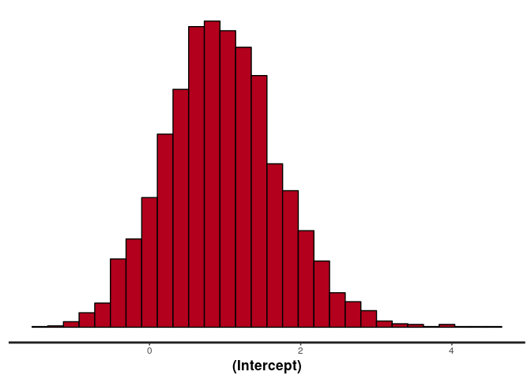<!-- -->
Probability of success


```r
theta <- plogis(extract(fit_bern$stanfit)$alpha)
ggplot() + geom_histogram(aes(theta), bins = 50, fill = 'darkblue', color = 'black')
```

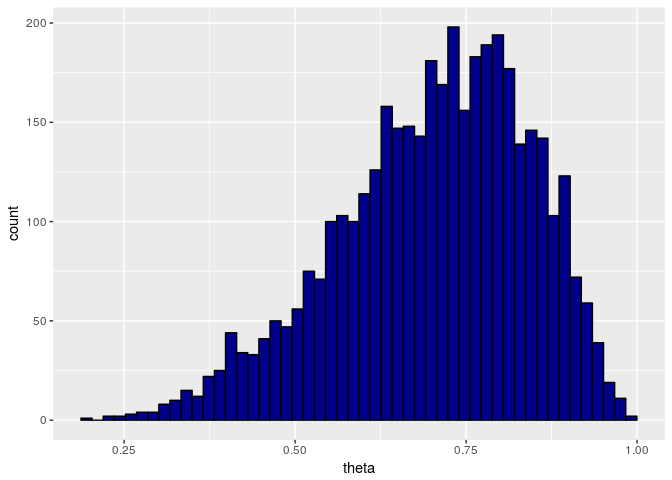<!-- -->

## Binomial model

Instead of sequence of 0's and 1's, we can summarize the data with the number of experiments and the number successes. Binomial model with a roughly uniform prior for the probability of success (rstanarm has restricted way to set priors). The prior is specified in the 'latent space'. The actual probability of success, theta = plogis(alpha), where plogis is the inverse of the logistic function.

Visualize the prior by drawing samples from it

```r
prior_mean <- 0
prior_sd <- 1.5
prior_intercept <- normal(location = prior_mean, scale = prior_sd)
prior_samples <- plogis(rnorm(20000, prior_mean, prior_sd))
ggplot() + geom_histogram(aes(prior_samples), bins = 25, fill = 'darkblue', color = 'black')
```

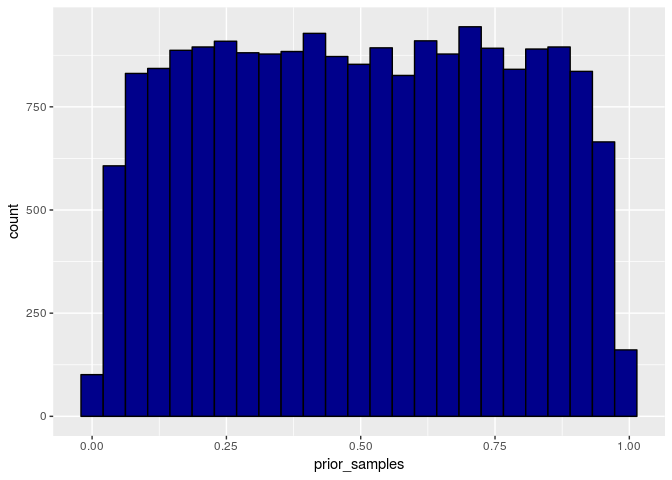<!-- -->

Binomial model (we are not able to replicate the Binomial example in rstan_demo exactly, as stan_glm does not accept just one observation, so the Bernoulli is needed for the same model, and Binomial will be demonstrated first with other data).

```r
d_bin <- data.frame(N = c(5,5), y = c(4,3))
fit_bin <- stan_glm(y/N ~ 1, family = binomial(), data = d_bin,
                     prior_intercept = prior_intercept, weights = N)
```


```r
plogis(coef(fit_bin))
```

```
## (Intercept) 
##    0.679986
```


```r
ggplot() + geom_histogram(aes(x = plogis(extract(fit_bin$stanfit)$alpha)),
                          bins = 50, fill = 'darkblue', color = 'black') +
  labs(x = 'probability of success', y = '') + scale_y_continuous(breaks = NULL)
```

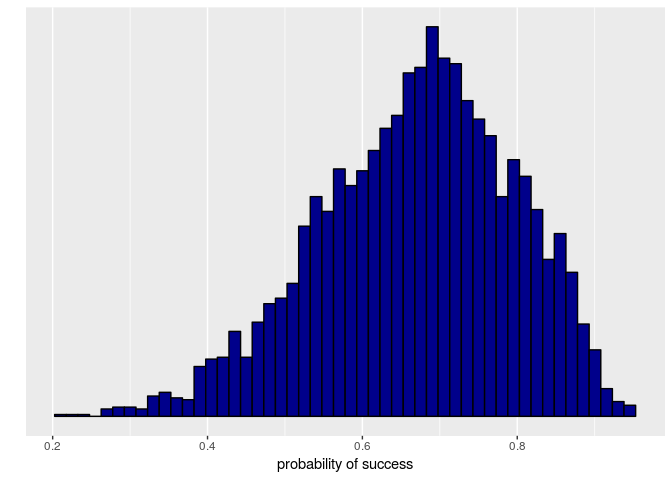<!-- -->

Re-run the model with a new data dataset.

```r
d_bin <- data.frame(N = c(5,5), y = c(4,5))
fit_bin <- update(fit_bin, data = d_bin)
```


```r
plogis(coef(fit_bin))
```

```
## (Intercept) 
##    0.838238
```


```r
ggplot() + geom_histogram(aes(x = plogis(extract(fit_bin$stanfit)$alpha)),
                          bins = 50, fill = 'darkblue', color = 'black') +
  labs(x = 'probability of success', y = '') + scale_y_continuous(breaks = NULL)
```

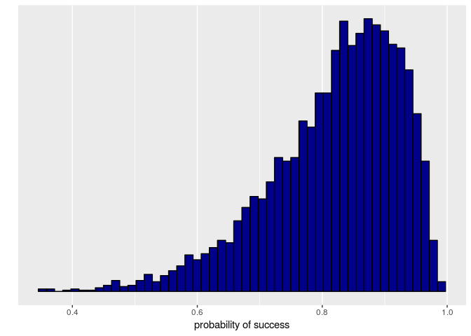<!-- -->

## Comparison of two groups with Binomial 

An experiment was performed to estimate the effect of beta-blockers on mortality of cardiac patients. A group of patients were randomly assigned to treatment and control groups:

- out of 674 patients receiving the control, 39 died
- out of 680 receiving the treatment, 22 died

Data, where grp2 is a dummy variable that captures the differece of
the intercepts in the first and the second group.

```r
d_bin2 <- data.frame(N = c(674, 680), y = c(39,22), grp2 = c(0,1))
```

To analyse whether the treatment is useful, we can use Binomial model for both groups and compute odds-ratio.


```r
fit_bin2 <- stan_glm(y/N ~ grp2, family = binomial(), data = d_bin2,
                     prior_intercept = NULL, prior = NULL, weights = N)
```
Plot odds ratio

```r
samples_bin2 <- extract(fit_bin2$stanfit)
theta1 <- plogis(samples_bin2$alpha)
theta2 <- plogis(samples_bin2$alpha + samples_bin2$beta)
oddsratio <- (theta2/(1-theta2))/(theta1/(1-theta1))
ggplot() + geom_histogram(aes(oddsratio), bins = 50, fill = 'darkblue', color = 'black') +
  labs(y = '') + scale_y_continuous(breaks = NULL)
```

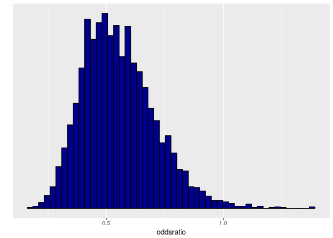<!-- -->

## Linear Gaussian model

The following file has Kilpisjärvi summer month temperatures 1952-2013:

```r
d_kilpis <- read.delim('kilpisjarvi-summer-temp.csv', sep = ';')
d_lin <-data.frame(year = d_kilpis$year,
                   temp = d_kilpis[,5])
```

Plot the data

```r
ggplot() +
  geom_point(aes(year, temp), data = data.frame(d_lin), size = 0.5) +
  labs(y = 'Summer temp. @Kilpisjärvi', x= "Year") +
  guides(linetype = F) +
  theme_bw()
```

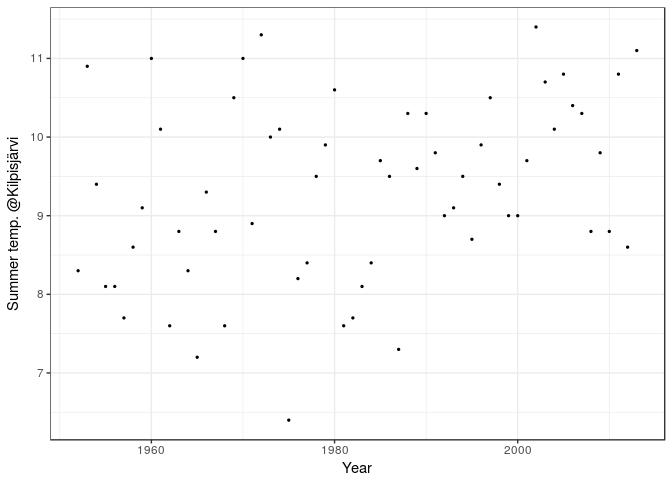<!-- -->

To analyse has there been change in the average summer month temperature we use a linear model with Gaussian model for the unexplained variation. rstanarm uses by default scaled priors.

y ~ x means y depends on the intercept and x

```r
fit_lin <- stan_glm(temp ~ year, data = d_lin, family = gaussian())
```

You can use ShinyStan (```launch_shinystan(fit_lin)```) to look at the divergences, treedepth exceedences, n_eff, Rhats, and joint posterior of alpha and beta. In the corresponding rstan_demo notebook we observed some treedepth exceedences leading to slightly less efficient sampling, but rstanarm has slightly different model and performs better.

Instead of interactive ShinyStan, we can also check the diagnostics as follows

```r
summary(fit_lin)
```

```
## 
## Model Info:
## 
##  function:  stan_glm
##  family:    gaussian [identity]
##  formula:   temp ~ year
##  algorithm: sampling
##  priors:    see help('prior_summary')
##  sample:    4000 (posterior sample size)
##  num obs:   62
## 
## Estimates:
##                 mean   sd     2.5%   25%    50%    75%    97.5%
## (Intercept)    -31.7   15.7  -62.0  -41.8  -31.8  -21.1   -1.2 
## year             0.0    0.0    0.0    0.0    0.0    0.0    0.0 
## sigma            1.1    0.1    0.9    1.0    1.1    1.2    1.4 
## mean_PPD         9.3    0.2    8.9    9.2    9.3    9.5    9.7 
## log-posterior -102.3    1.3 -105.5 -102.9 -102.0 -101.4 -100.9 
## 
## Diagnostics:
##               mcse Rhat n_eff
## (Intercept)   0.3  1.0  3837 
## year          0.0  1.0  3835 
## sigma         0.0  1.0  3258 
## mean_PPD      0.0  1.0  4000 
## log-posterior 0.0  1.0  1256 
## 
## For each parameter, mcse is Monte Carlo standard error, n_eff is a crude measure of effective sample size, and Rhat is the potential scale reduction factor on split chains (at convergence Rhat=1).
```

Plot data and the fit

```r
samples_lin <- rstan::extract(fit_lin$stanfit, permuted = T)
mean(samples_lin$beta>0) # probability that beta > 0
```

```
## [1] 0.99575
```

```r
mu_samples <- tcrossprod(cbind(1, d_lin$year), cbind(samples_lin$alpha,samples_lin$beta))

mu <- apply(mu_samples, 1, quantile, c(0.05, 0.5, 0.95)) %>%
  t() %>% data.frame(x = d_lin$year, .) %>% gather(pct, y, -x)
pfit <- ggplot() +
  geom_point(aes(year, temp), data = data.frame(d_lin), size = 0.5) +
  geom_line(aes(x, y, linetype = pct), data = mu, color = 'red') +
  scale_linetype_manual(values = c(2,1,2)) +
  labs(x = '', y = 'Summer temp. @Kilpisjärvi') +
  guides(linetype = F) +
  theme_bw()
phist <- stan_hist(fit_lin, pars = c('beta','sigma'), bins = 50) + ggtitle('parameters')
grid.arrange(pfit, phist)
```

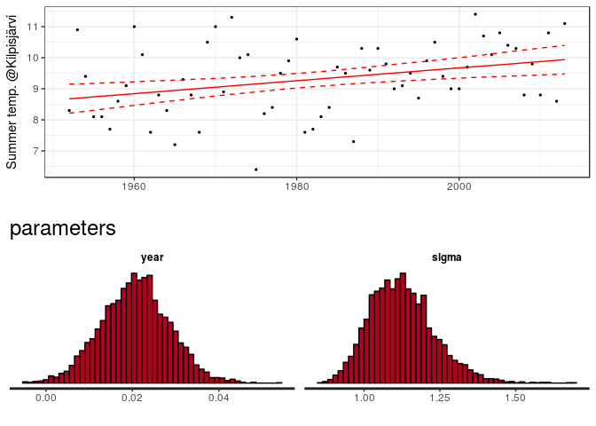<!-- -->

Prediction for year 2016

```r
predict(fit_lin, newdata = data.frame(year = 2016), se.fit = T)
```

```
## $fit
##        1 
## 10.00241 
## 
## $se.fit
##        1 
## 0.304928
```

```r
# or sample from the posterior predictive distribution and
# plot the histogram
ypred <- posterior_predict(fit_lin, newdata = data.frame(year = 2016))
ggplot(data = data.frame(ypred = ypred)) +
  geom_histogram(aes(ypred), bins = 50, fill = 'darkblue', color = 'black') +
  labs(y = '', x = 'avg-temperature prediction for the summer 2016') +
  scale_y_continuous(breaks = NULL)
```

```
## Don't know how to automatically pick scale for object of type ppd/matrix. Defaulting to continuous.
```

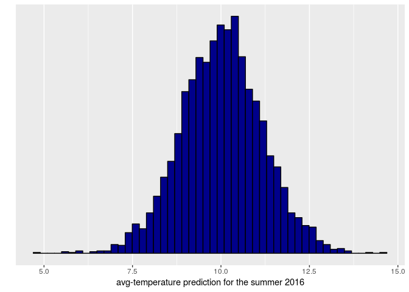<!-- -->

# Linear Student's t model with brms

The temperatures used in the above analyses are averages over three months, which makes it more likely that they are normally distributed, but there can be extreme events in the feather and we can check whether more robust Student's t observation model woul give different results.

Currently, rstanarm does not yet support Student's t likelihood. Below we use brms package, which supports similar model formulas as rstanarm with more options, but doesn't have pre-compiled models (be aware also that the default priors are not necessary sensible).


```r
library(brms)
```

```
## Warning: replacing previous import by 'rstan::cpp_object_initializer' when
## loading 'brms'
```

```
## Loading 'brms' package (version 1.7.0). Useful instructions 
## can be found by typing help('brms'). A more detailed introduction 
## to the package is available through vignette('brms_overview').
```

```
## 
## Attaching package: 'brms'
```

```
## The following objects are masked from 'package:rstanarm':
## 
##     exponential, lasso, ngrps
```

```r
fit_lin_t <- brm(temp ~ year, data = d_lin, family = student())
```

```
## Compiling the C++ model
```

```
## Start sampling
```

brms package generates Stan code which we can extract as follows. By saving this code to a file you can extend the model, beyond the models supported by brms.

```r
stancode(fit_lin_t)
```

```
## // generated with brms 1.7.0
## functions { 
## 
##   /* compute the logm1 link 
##    * Args: 
##    *   p: a positive scalar
##    * Returns: 
##    *   a scalar in (-Inf, Inf)
##    */ 
##    real logm1(real y) { 
##      return log(y - 1);
##    }
##   /* compute the inverse of the logm1 link 
##    * Args: 
##    *   y: a scalar in (-Inf, Inf)
##    * Returns: 
##    *   a positive scalar
##    */ 
##    real expp1(real y) { 
##      return exp(y) + 1;
##    }
## } 
## data { 
##   int<lower=1> N;  // total number of observations 
##   vector[N] Y;  // response variable 
##   int<lower=1> K;  // number of population-level effects 
##   matrix[N, K] X;  // population-level design matrix 
##   int prior_only;  // should the likelihood be ignored? 
## } 
## transformed data { 
##   int Kc; 
##   matrix[N, K - 1] Xc;  // centered version of X 
##   vector[K - 1] means_X;  // column means of X before centering 
##   Kc = K - 1;  // the intercept is removed from the design matrix 
##   for (i in 2:K) { 
##     means_X[i - 1] = mean(X[, i]); 
##     Xc[, i - 1] = X[, i] - means_X[i - 1]; 
##   } 
## } 
## parameters { 
##   vector[Kc] b;  // population-level effects 
##   real temp_Intercept;  // temporary intercept 
##   real<lower=0> sigma;  // residual SD 
##   real<lower=1> nu;  // degrees of freedom or shape 
## } 
## transformed parameters { 
## } 
## model { 
##   vector[N] mu; 
##   mu = Xc * b + temp_Intercept; 
##   // prior specifications 
##   sigma ~ student_t(3, 0, 10); 
##   nu ~ gamma(2, 0.1); 
##   // likelihood contribution 
##   if (!prior_only) { 
##     Y ~ student_t(nu, mu, sigma); 
##   } 
## } 
## generated quantities { 
##   real b_Intercept;  // population-level intercept 
##   b_Intercept = temp_Intercept - dot_product(means_X, b); 
## }
```

# Pareto-smoothed importance-sampling leave-one-out cross-validation (PSIS-LOO)

We can use leave-one-out cross-validation to compare the expected predictive performance.

Let's use LOO to compare whether Student's t model has better predictive performance.

```r
loo1 <- loo(fit_lin)
loo2 <- loo(fit_lin_t)
loo::compare(loo1,loo2)
```

```
## elpd_diff        se 
##      -0.4       0.3
```
There is no practical difference between Gaussian and Student's t models.

---

# Comparison of k groups with hierarchical models

Let's compare the temperatures in three summer months.

```r
d_kilpis <- read.delim('kilpisjarvi-summer-temp.csv', sep = ';')
d_grp <- data.frame(month = rep(6:8, nrow(d_kilpis)),
              temp = c(t(d_kilpis[,2:4])))
```

## Common variance (ANOVA) model

Weakly informative prior for the common mean

```r
prior_intercept <- normal(10, 10)
```
To use no (= uniform) prior, prior_intercept could be set to NULL

y ~ 1 + (1 | x) means y depends on common intercept and group speficific intercepts (grouping determined by x)

```r
fit_grp <- stan_lmer(temp ~ 1 + (1 | month), data = d_grp,
                     prior_intercept = prior_intercept)
```

```
## Warning: There were 2 divergent transitions after warmup. Increasing adapt_delta above 0.95 may help. See
## http://mc-stan.org/misc/warnings.html#divergent-transitions-after-warmup
```

```
## Warning: Examine the pairs() plot to diagnose sampling problems
```

```r
# launch_shinystan(fit_grp)
```

Average temperature and monthly deviations from the mean

```r
stan_hist(fit_grp, bins = 50)
```

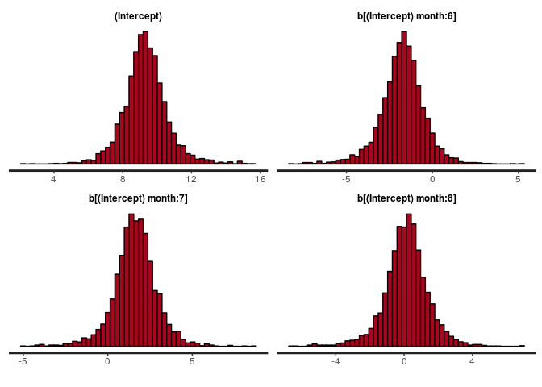<!-- -->

A boxplot like the one in rstan_demo.R can be obtained as follows:

```r
temps <- (as.matrix(fit_grp)[,1] + as.matrix(fit_grp)[, 2:4]) %>%
  as.data.frame() %>% setNames(6:8) %>% gather(month, temp)
qplot(month, temp, data = temps, geom = 'violin')
```

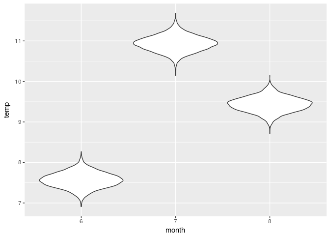<!-- -->

```r
# or a  similar plot:
# stan_plot(fit_grp)
```

Probabilities that June is hotter than July, June is hotter than August
and July is hotter than August:

```r
combn(unique(temps$month), 2, function(months, data) {
  mean(subset(data, month == months[1])$temp > subset(data, month == months[2])$temp)
}, data = temps) %>% setNames(c('6>7', '6>8', '7>8'))
```

```
## 6>7 6>8 7>8 
##   0   0   1
```

<br />

### Appendix: Licenses

* Code &copy; 2017, Aki Vehtari, Markus Paasiniemi, licensed under BSD-3.
* Text &copy; 2017, Aki Vehtari, licensed under CC-BY-NC 4.0.
