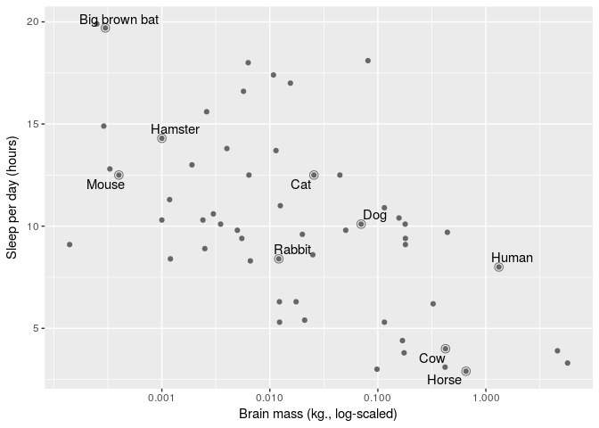
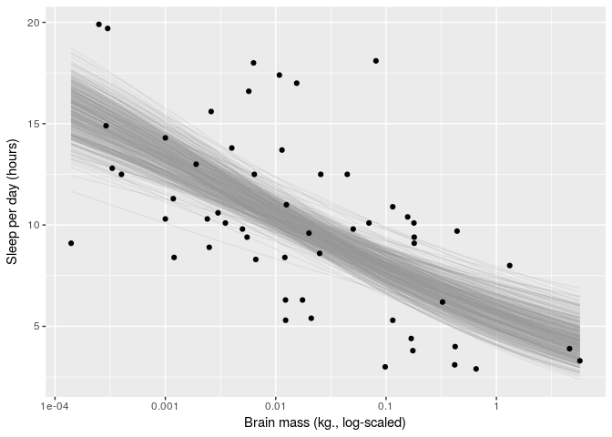

# Sleep

# Does brain mass predict how much mammals sleep in a day?

Original notebook by Tristan Mahr https://tjmahr.github.io/visualizing-uncertainty-rstanarm/.
Tristan's model had the problem that it would predict sleep times over 24h per day. 

Tristan's copyright: 

The MIT License (MIT)

Copyright (c) 2016 TJ Mahr

Permission is hereby granted, free of charge, to any person obtaining a copy
of this software and associated documentation files (the "Software"), to deal
in the Software without restriction, including without limitation the rights
to use, copy, modify, merge, publish, distribute, sublicense, and/or sell
copies of the Software, and to permit persons to whom the Software is
furnished to do so, subject to the following conditions:

The above copyright notice and this permission notice shall be included in all
copies or substantial portions of the Software.

THE SOFTWARE IS PROVIDED "AS IS", WITHOUT WARRANTY OF ANY KIND, EXPRESS OR
IMPLIED, INCLUDING BUT NOT LIMITED TO THE WARRANTIES OF MERCHANTABILITY,
FITNESS FOR A PARTICULAR PURPOSE AND NONINFRINGEMENT. IN NO EVENT SHALL THE
AUTHORS OR COPYRIGHT HOLDERS BE LIABLE FOR ANY CLAIM, DAMAGES OR OTHER
LIABILITY, WHETHER IN AN ACTION OF CONTRACT, TORT OR OTHERWISE, ARISING FROM,
OUT OF OR IN CONNECTION WITH THE SOFTWARE OR THE USE OR OTHER DEALINGS IN THE
SOFTWARE.

Let’s use the mammal sleep dataset from ggplot2. This dataset contains the number of hours spent sleeping per day for 83 different species of mammals along with each species’ brain mass (kg) and body mass (kg), among other measures. Here’s a first look at the data.
Preview sorted by brain/body ratio. The sorting was chosen so that humans show up in the preview.

```r
library(dplyr, warn.conflicts = FALSE)
library(ggplot2)
msleep %>% 
  select(name, sleep_total, brainwt, bodywt, everything()) %>% 
    arrange(desc(brainwt / bodywt))
```

```
## # A tibble: 83 × 11
##                              name sleep_total brainwt bodywt        genus
##                             <chr>       <dbl>   <dbl>  <dbl>        <chr>
## 1  Thirteen-lined ground squirrel        13.8 0.00400  0.101 Spermophilus
## 2                      Owl monkey        17.0 0.01550  0.480        Aotus
## 3       Lesser short-tailed shrew         9.1 0.00014  0.005    Cryptotis
## 4                 Squirrel monkey         9.6 0.02000  0.743      Saimiri
## 5                         Macaque        10.1 0.17900  6.800       Macaca
## 6                Little brown bat        19.9 0.00025  0.010       Myotis
## 7                          Galago         9.8 0.00500  0.200       Galago
## 8                        Mole rat        10.6 0.00300  0.122       Spalax
## 9                      Tree shrew         8.9 0.00250  0.104       Tupaia
## 10                          Human         8.0 1.32000 62.000         Homo
## # ... with 73 more rows, and 6 more variables: vore <chr>, order <chr>,
## #   conservation <chr>, sleep_rem <dbl>, sleep_cycle <dbl>, awake <dbl>
```

Choose animals with known average brain weight, and add some transformed variables.

```r
msleep <- msleep %>% 
  filter(!is.na(brainwt)) %>% 
  mutate(log_brainwt = log10(brainwt), 
         log_bodywt = log10(bodywt), 
         log_sleep_total = log10(sleep_total),
         logit_sleep_ratio = qlogis(sleep_total/24))
```

Make a list of examples and give some familiar species shorter names

```r
ex_mammals <- c("Domestic cat", "Human", "Dog", "Cow", "Rabbit",
                "Big brown bat", "House mouse", "Horse", "Golden hamster")
renaming_rules <- c(
  "Domestic cat" = "Cat", 
  "Golden hamster" = "Hamster", 
  "House mouse" = "Mouse")

ex_points <- msleep %>% 
  filter(name %in% ex_mammals) %>% 
  mutate(name = stringr::str_replace_all(name, renaming_rules))
```

Define these labels only once for all the plots

```r
lab_lines <- list(
  brain_log = "Brain mass (kg., log-scaled)", 
  sleep_raw = "Sleep per day (hours)",
  sleep_log = "Sleep per day (log-hours)"
)
```

Plot sleep times vs. average brain weights

```r
ggplot(msleep) + 
  aes(x = brainwt, y = sleep_total) + 
  geom_point(color = "grey40") +
  # Circles around highlighted points + labels
  geom_point(size = 3, shape = 1, color = "grey40", data = ex_points) +
  ggrepel::geom_text_repel(aes(label = name), data = ex_points) + 
  # Use log scaling on x-axis
  scale_x_log10(breaks = c(.001, .01, .1, 1)) + 
    labs(x = lab_lines$brain_log, y = lab_lines$sleep_raw)
```

<!-- -->

Next we use stan_glm from rstanarm package to make a linear model for logit of the sleep ratio given log of the brain weight (Tristan made the model with untransformed variables).

```r
library(rstanarm)
```

```
## Loading required package: Rcpp
```

```
## Warning: replacing previous import by 'bayesplot::pairs_condition' when
## loading 'rstanarm'
```

```
## Warning: replacing previous import by 'bayesplot::pairs_style_np' when
## loading 'rstanarm'
```

```
## Warning: replacing previous import by 'stats::cov2cor' when loading
## 'rstanarm'
```

```
## rstanarm (Version 2.15.3, packaged: 2017-04-29 06:18:44 UTC)
```

```
## - Do not expect the default priors to remain the same in future rstanarm versions.
```

```
## Thus, R scripts should specify priors explicitly, even if they are just the defaults.
```

```
## - For execution on a local, multicore CPU with excess RAM we recommend calling
```

```
## options(mc.cores = parallel::detectCores())
```

```r
m1 <- stan_glm(
  logit_sleep_ratio ~ log_brainwt, 
  family = gaussian(), 
  data = msleep, 
  prior = normal(0, 3),
  prior_intercept = normal(0, 3))
```

```
## 
## SAMPLING FOR MODEL 'continuous' NOW (CHAIN 1).
## 
## Gradient evaluation took 3.1e-05 seconds
## 1000 transitions using 10 leapfrog steps per transition would take 0.31 seconds.
## Adjust your expectations accordingly!
## 
## 
## Iteration:    1 / 2000 [  0%]  (Warmup)
## Iteration:  200 / 2000 [ 10%]  (Warmup)
## Iteration:  400 / 2000 [ 20%]  (Warmup)
## Iteration:  600 / 2000 [ 30%]  (Warmup)
## Iteration:  800 / 2000 [ 40%]  (Warmup)
## Iteration: 1000 / 2000 [ 50%]  (Warmup)
## Iteration: 1001 / 2000 [ 50%]  (Sampling)
## Iteration: 1200 / 2000 [ 60%]  (Sampling)
## Iteration: 1400 / 2000 [ 70%]  (Sampling)
## Iteration: 1600 / 2000 [ 80%]  (Sampling)
## Iteration: 1800 / 2000 [ 90%]  (Sampling)
## Iteration: 2000 / 2000 [100%]  (Sampling)
## 
##  Elapsed Time: 0.045406 seconds (Warm-up)
##                0.049743 seconds (Sampling)
##                0.095149 seconds (Total)
## 
## 
## SAMPLING FOR MODEL 'continuous' NOW (CHAIN 2).
## 
## Gradient evaluation took 1.5e-05 seconds
## 1000 transitions using 10 leapfrog steps per transition would take 0.15 seconds.
## Adjust your expectations accordingly!
## 
## 
## Iteration:    1 / 2000 [  0%]  (Warmup)
## Iteration:  200 / 2000 [ 10%]  (Warmup)
## Iteration:  400 / 2000 [ 20%]  (Warmup)
## Iteration:  600 / 2000 [ 30%]  (Warmup)
## Iteration:  800 / 2000 [ 40%]  (Warmup)
## Iteration: 1000 / 2000 [ 50%]  (Warmup)
## Iteration: 1001 / 2000 [ 50%]  (Sampling)
## Iteration: 1200 / 2000 [ 60%]  (Sampling)
## Iteration: 1400 / 2000 [ 70%]  (Sampling)
## Iteration: 1600 / 2000 [ 80%]  (Sampling)
## Iteration: 1800 / 2000 [ 90%]  (Sampling)
## Iteration: 2000 / 2000 [100%]  (Sampling)
## 
##  Elapsed Time: 0.048558 seconds (Warm-up)
##                0.051479 seconds (Sampling)
##                0.100037 seconds (Total)
## 
## 
## SAMPLING FOR MODEL 'continuous' NOW (CHAIN 3).
## 
## Gradient evaluation took 1.5e-05 seconds
## 1000 transitions using 10 leapfrog steps per transition would take 0.15 seconds.
## Adjust your expectations accordingly!
## 
## 
## Iteration:    1 / 2000 [  0%]  (Warmup)
## Iteration:  200 / 2000 [ 10%]  (Warmup)
## Iteration:  400 / 2000 [ 20%]  (Warmup)
## Iteration:  600 / 2000 [ 30%]  (Warmup)
## Iteration:  800 / 2000 [ 40%]  (Warmup)
## Iteration: 1000 / 2000 [ 50%]  (Warmup)
## Iteration: 1001 / 2000 [ 50%]  (Sampling)
## Iteration: 1200 / 2000 [ 60%]  (Sampling)
## Iteration: 1400 / 2000 [ 70%]  (Sampling)
## Iteration: 1600 / 2000 [ 80%]  (Sampling)
## Iteration: 1800 / 2000 [ 90%]  (Sampling)
## Iteration: 2000 / 2000 [100%]  (Sampling)
## 
##  Elapsed Time: 0.048309 seconds (Warm-up)
##                0.055423 seconds (Sampling)
##                0.103732 seconds (Total)
## 
## 
## SAMPLING FOR MODEL 'continuous' NOW (CHAIN 4).
## 
## Gradient evaluation took 1.8e-05 seconds
## 1000 transitions using 10 leapfrog steps per transition would take 0.18 seconds.
## Adjust your expectations accordingly!
## 
## 
## Iteration:    1 / 2000 [  0%]  (Warmup)
## Iteration:  200 / 2000 [ 10%]  (Warmup)
## Iteration:  400 / 2000 [ 20%]  (Warmup)
## Iteration:  600 / 2000 [ 30%]  (Warmup)
## Iteration:  800 / 2000 [ 40%]  (Warmup)
## Iteration: 1000 / 2000 [ 50%]  (Warmup)
## Iteration: 1001 / 2000 [ 50%]  (Sampling)
## Iteration: 1200 / 2000 [ 60%]  (Sampling)
## Iteration: 1400 / 2000 [ 70%]  (Sampling)
## Iteration: 1600 / 2000 [ 80%]  (Sampling)
## Iteration: 1800 / 2000 [ 90%]  (Sampling)
## Iteration: 2000 / 2000 [100%]  (Sampling)
## 
##  Elapsed Time: 0.050561 seconds (Warm-up)
##                0.04959 seconds (Sampling)
##                0.100151 seconds (Total)
```

Prepare x values for prediction:

```r
x_rng <- range(msleep$log_brainwt) 
x_steps <- seq(x_rng[1], x_rng[2], length.out = 80)
new_data <- data_frame(
  observation = seq_along(x_steps), 
  log_brainwt = x_steps)
```

Predict expected sleep time at new x values:

```r
preds<-posterior_linpred(m1,newdata=new_data)
preds<-plogis(preds)*24
```

Plot draws of the expected sleep time lines:

```r
library(reshape2)
gg<-data.frame(log_brainwt=new_data$log_brainwt,preds=t(preds[1:400,]))
gg<-melt(gg,id=c("log_brainwt"))
names(gg)<-c("log_brainwt","pp","preds")

# aesthetic controllers
alpha_level <- .15
col_draw <- "grey60"
col_median <-  "#3366FF"

ggplot(msleep) + 
  aes(x = log_brainwt, y = sleep_total) + 
  # Plot a random sample of rows as gray semi-transparent lines
  geom_line(aes(x=log_brainwt, y=preds, group=pp), 
              data = gg, color = col_draw, 
              alpha = alpha_level) + 
  geom_point() + 
  scale_x_continuous(labels = function(x) 10 ^ x) +
  labs(x = lab_lines$brain_log, y = lab_lines$sleep_raw)
```

<!-- -->

Predict distribution of sleep times at new x values:

```r
preds_post <- posterior_predict(m1, newdata = new_data)
preds_post<-plogis(preds_post)*24
```

Plot distribution of sleep times at new x values:

```r
pq<-data.frame(t(apply(t(preds_post), 1, quantile, probs = c(0.025, 0.5, 0.995), na.rm = TRUE)))
names(pq)<-c("lower","median","upper")
pq$log_brainwt<-new_data$log_brainwt

ggplot(msleep) + 
  aes(x = log_brainwt) + 
  geom_ribbon(aes(ymin = lower, ymax = upper), data = pq, 
              alpha = 0.4, fill = "grey60") + 
  geom_line(aes(y = median), data = pq, colour = "#3366FF", size = 1) + 
  geom_point(aes(y = sleep_total)) + 
  scale_x_continuous(labels = function(x) 10 ^ x) +
      labs(x = lab_lines$brain_log, y = lab_lines$sleep_raw)
```

<!-- -->

Here the distribution of the sleep times is restricted to be between 0 and 24 hours.


<br />

### Appendix: Session information


```r
sessionInfo()
```

```
## R version 3.2.3 (2015-12-10)
## Platform: x86_64-pc-linux-gnu (64-bit)
## Running under: Ubuntu 16.04.3 LTS
## 
## locale:
##  [1] LC_CTYPE=en_US.UTF-8       LC_NUMERIC=C              
##  [3] LC_TIME=en_US.utf8         LC_COLLATE=en_US.UTF-8    
##  [5] LC_MONETARY=en_US.UTF-8    LC_MESSAGES=en_US.UTF-8   
##  [7] LC_PAPER=fi_FI.utf8        LC_NAME=C                 
##  [9] LC_ADDRESS=C               LC_TELEPHONE=C            
## [11] LC_MEASUREMENT=en_US.UTF-8 LC_IDENTIFICATION=C       
## 
## attached base packages:
## [1] stats     graphics  grDevices utils     datasets  methods   base     
## 
## other attached packages:
## [1] reshape2_1.4.2  rstanarm_2.15.3 Rcpp_0.12.13    ggplot2_2.2.1  
## [5] dplyr_0.5.0    
## 
## loaded via a namespace (and not attached):
##  [1] rstan_2.15.1         gtools_3.5.0         zoo_1.7-14          
##  [4] shinyjs_0.8          splines_3.2.3        lattice_0.20-34     
##  [7] colorspace_1.3-2     miniUI_0.1.1         htmltools_0.3.6     
## [10] stats4_3.2.3         loo_1.1.0            yaml_2.1.14         
## [13] base64enc_0.1-3      nloptr_1.0.4         DBI_0.6             
## [16] matrixStats_0.52.2   plyr_1.8.4           stringr_1.2.0       
## [19] munsell_0.4.3        gtable_0.2.0         htmlwidgets_0.8     
## [22] codetools_0.2-15     colourpicker_0.3     threejs_0.2.2       
## [25] evaluate_0.10        labeling_0.3         inline_0.3.14       
## [28] knitr_1.16           httpuv_1.3.3         parallel_3.2.3      
## [31] markdown_0.8         bayesplot_1.2.0      rstantools_1.2.0    
## [34] xts_0.9-7            xtable_1.8-2         DT_0.2              
## [37] scales_0.5.0         backports_1.0.5      shinystan_2.3.0     
## [40] StanHeaders_2.15.0-1 jsonlite_1.5         mime_0.5            
## [43] lme4_1.1-13          gridExtra_2.2.1      digest_0.6.12       
## [46] stringi_1.1.2        ggrepel_0.6.5        shiny_1.0.1         
## [49] grid_3.2.3           rprojroot_1.2        tools_3.2.3         
## [52] magrittr_1.5         shinythemes_1.1.1    lazyeval_0.2.0      
## [55] tibble_1.2           MASS_7.3-45          Matrix_1.2-8        
## [58] rsconnect_0.7        dygraphs_1.1.1.3     assertthat_0.1      
## [61] minqa_1.2.4          rmarkdown_1.6        R6_2.2.2            
## [64] nlme_3.1-131
```

<br />

### Appendix: Licenses

* Code & Text &copy; 2016, Tristan Mahr, Aki Vehtari, licensed under MIT
