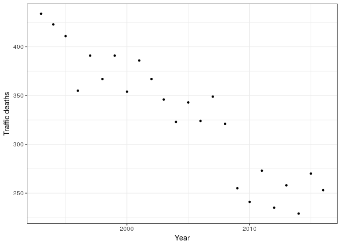
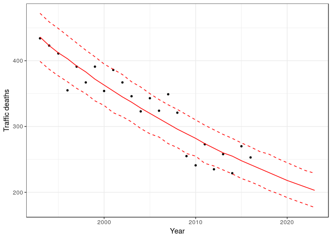
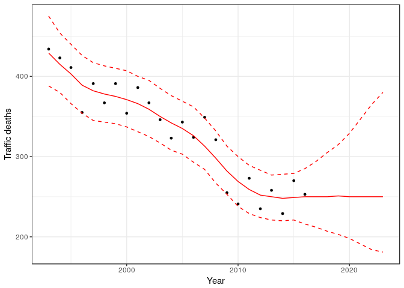
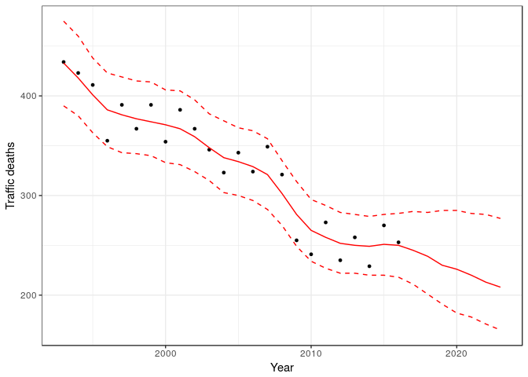

# Bayesian data analysis - traffic deaths in Finland
Aki Vehtari  
`r format(Sys.Date())`  

License: CC-BY

This notebook demonstrates time series analysis for traffic deaths per year in Finland. Currently when the the number of traffic deaths during previous year are reported, the press release claims that the the traffic safety in Finland has improved or worsened depending whether the number is smaller or larger than the year before. Time series analysis can be used to separate random fluctuation from the slowly changing traffic safety. 

Load some libraries:

```r
library(ggplot2)
library(tidyr)
library(gridExtra)
library(rstanarm)
```

```
Loading required package: Rcpp
```

```
Warning: replacing previous import by 'bayesplot::pairs_condition' when
loading 'rstanarm'
```

```
Warning: replacing previous import by 'bayesplot::pairs_style_np' when
loading 'rstanarm'
```

```
Warning: replacing previous import by 'stats::cov2cor' when loading
'rstanarm'
```

```
rstanarm (Version 2.15.3, packaged: 2017-04-29 06:18:44 UTC)
```

```
- Do not expect the default priors to remain the same in future rstanarm versions.
```

```
Thus, R scripts should specify priors explicitly, even if they are just the defaults.
```

```
- For execution on a local, multicore CPU with excess RAM we recommend calling
```

```
options(mc.cores = parallel::detectCores())
```

```r
library(rstan)
```

```
Loading required package: StanHeaders
```

```
rstan (Version 2.15.1, packaged: 2017-04-19 05:03:57 UTC, GitRev: 2e1f913d3ca3)
```

```
For execution on a local, multicore CPU with excess RAM we recommend calling
rstan_options(auto_write = TRUE)
options(mc.cores = parallel::detectCores())
```

```

Attaching package: 'rstan'
```

```
The following object is masked from 'package:tidyr':

    extract
```

```r
library(bayesplot)
```

```
This is bayesplot version 1.2.0
```

```r
library(loo)
```

```
This is loo version 1.1.0
```

```r
rstan_options(auto_write = TRUE)
options(mc.cores = parallel::detectCores())
source("stan_utility.R")
```

Read the data (there would data for earlier years, too, but this is sufficient for the demonstration)

```r
# file preview shows a header row
deaths <- read.csv("trafficdeaths.csv", header = TRUE)
head(deaths)
```

```
##   year deaths
## 1 1993    434
## 2 1994    423
## 3 1995    411
## 4 1996    355
## 5 1997    391
## 6 1998    367
```

First plot just the data.

```r
ggplot() +
  geom_point(aes(year, deaths), data = deaths, size = 1) +
  labs(y = 'Traffic deaths', x= "Year") +
  guides(linetype = F) +
  theme_bw()
```

<!-- -->

The number of deaths is count data, so we use Poisson observation model. First we use log-linear model for the Poisson intensity, which corresponds to assuming constant proportional change in the rate.

```r
fit_lin <- stan_glm(deaths ~ year, deaths, family="poisson", refresh=1000, iter=1000, chains=4, seed=583829)
```

```r
summary(fit_lin)
```

```

Model Info:

 function:  stan_glm
 family:    poisson [log]
 formula:   deaths ~ year
 algorithm: sampling
 priors:    see help('prior_summary')
 sample:    2000 (posterior sample size)
 num obs:   24

Estimates:
                mean   sd     2.5%   25%    50%    75%    97.5%
(Intercept)     56.9    3.3   50.7   54.6   56.9   59.2   63.0 
year             0.0    0.0    0.0    0.0    0.0    0.0    0.0 
mean_PPD       329.2    5.3  318.7  325.8  329.2  332.8  339.7 
log-posterior -117.7    1.0 -120.3 -118.1 -117.4 -117.0 -116.7 

Diagnostics:
              mcse Rhat n_eff
(Intercept)   0.1  1.0  1516 
year          0.0  1.0  1514 
mean_PPD      0.2  1.0  1170 
log-posterior 0.0  1.0   726 

For each parameter, mcse is Monte Carlo standard error, n_eff is a crude measure of effective sample size, and Rhat is the potential scale reduction factor on split chains (at convergence Rhat=1).
```

n_eff's and Rhat's are ok. Let's look at the posterior predictive distribution (median and 5% and 95% intervals).

```r
x_predict=seq(1993,2023)
N_predict=length(x_predict)
y_predict <- posterior_predict(fit_lin, newdata=data.frame(year=x_predict))
mu <- apply(t(y_predict), 1, quantile, c(0.05, 0.5, 0.95)) %>%
  t() %>% data.frame(x = x_predict, .) %>% gather(pct, y, -x)
pfit <- ggplot() +
  geom_point(aes(year, deaths), data = deaths, size = 1) +
  geom_line(aes(x, y, linetype = pct), data = mu, color = 'red') +
  scale_linetype_manual(values = c(2,1,2)) +
  labs(x = 'Year', y = 'Traffic deaths') +
  guides(linetype = F) +
  theme_bw()
(pfit)
```

<!-- -->

Next we test non-linear spline model with stan_gamm4

```r
fit_gam <- stan_gamm4(deaths ~ s(year), data=deaths, family="poisson", refresh=1000, iter=1000, chain=4, seed=583829)
```

```
## Warning: There were 3 divergent transitions after warmup. Increasing adapt_delta above 0.95 may help. See
## http://mc-stan.org/misc/warnings.html#divergent-transitions-after-warmup
```

```
## Warning: Examine the pairs() plot to diagnose sampling problems
```

```r
summary(fit_gam)
```

```
## 
## Model Info:
## 
##  function:  stan_gamm4
##  family:    poisson [log]
##  formula:   deaths ~ s(year)
##  algorithm: sampling
##  priors:    see help('prior_summary')
##  sample:    2000 (posterior sample size)
##  num obs:   24
##  groups:    Xr (8)
## 
## Estimates:
##                             mean   sd     2.5%   25%    50%    75% 
## (Intercept)                  5.8    0.0    5.8    5.8    5.8    5.8
## s(year).1                    0.0    0.1   -0.1    0.0    0.0    0.1
## s(year).2                   -0.3    0.2   -0.8   -0.5   -0.3   -0.2
## s(year).3                    0.0    0.1   -0.1    0.0    0.0    0.0
## s(year).4                    0.1    0.1   -0.1    0.0    0.1    0.2
## s(year).5                    0.1    0.1    0.0    0.0    0.1    0.1
## s(year).6                   -0.1    0.1   -0.3   -0.2   -0.1    0.0
## s(year).7                    0.0    0.0   -0.1    0.0    0.0    0.1
## s(year).8                   -0.3    0.3   -1.0   -0.5   -0.3   -0.1
## s(year).9                   -0.1    0.1   -0.3   -0.2   -0.1   -0.1
## Sigma[Xr:s(year),s(year)]    0.4    0.4    0.0    0.1    0.2    0.5
## mean_PPD                   329.1    5.3  319.0  325.5  329.1  332.7
## log-posterior             -124.1    3.4 -131.9 -126.1 -123.6 -121.6
##                             97.5%
## (Intercept)                  5.8 
## s(year).1                    0.2 
## s(year).2                    0.0 
## s(year).3                    0.1 
## s(year).4                    0.4 
## s(year).5                    0.2 
## s(year).6                    0.1 
## s(year).7                    0.1 
## s(year).8                    0.1 
## s(year).9                    0.1 
## Sigma[Xr:s(year),s(year)]    1.5 
## mean_PPD                   339.5 
## log-posterior             -119.0 
## 
## Diagnostics:
##                           mcse Rhat n_eff
## (Intercept)               0.0  1.0  1878 
## s(year).1                 0.0  1.0  1068 
## s(year).2                 0.0  1.0   802 
## s(year).3                 0.0  1.0  1331 
## s(year).4                 0.0  1.0  1091 
## s(year).5                 0.0  1.0   764 
## s(year).6                 0.0  1.0  1391 
## s(year).7                 0.0  1.0  1353 
## s(year).8                 0.0  1.0   977 
## s(year).9                 0.0  1.0   803 
## Sigma[Xr:s(year),s(year)] 0.0  1.0   568 
## mean_PPD                  0.1  1.0  1718 
## log-posterior             0.2  1.0   236 
## 
## For each parameter, mcse is Monte Carlo standard error, n_eff is a crude measure of effective sample size, and Rhat is the potential scale reduction factor on split chains (at convergence Rhat=1).
```

n_eff is clearly smaller than for the linear model, but Rhat's are ok.

Let's look at the posterior predictive distribution.

```r
x_predict=seq(1993,2023)
N_predict=length(x_predict)
y_predict <- posterior_predict(fit_gam, newdata=data.frame(year=x_predict))
mu <- apply(t(y_predict), 1, quantile, c(0.05, 0.5, 0.95)) %>%
  t() %>% data.frame(x = x_predict, .) %>% gather(pct, y, -x)
pfit <- ggplot() +
  geom_point(aes(year, deaths), data = deaths, size = 1) +
  geom_line(aes(x, y, linetype = pct), data = mu, color = 'red') +
  scale_linetype_manual(values = c(2,1,2)) +
  labs(x = 'Year', y = 'Traffic deaths') +
  guides(linetype = F) +
  theme_bw()
(pfit)
```

<!-- -->

The predictive median is clearly nonlinear. The predictive mean for future years stays at the same level as the most recent observations, but uncertainty increases quickly.

Finally we test Gaussian process centered on linear model. This is not yet available in rstanarm, and has been written directly in Stan language:

```r
writeLines(readLines("poisson_gp.stan"))
```

```
functions {
  vector gp_pred_rng(vector x2,
                     vector f1, vector x1,
                     real alpha, real lscale, real jitter2) {
    // rng for predictive distribution of latent values at test locations
    int N1 = rows(x1);
    int N2 = rows(x2);
    vector[N2] f2;
    {
      matrix[N1, N1] K = cov_exp_quad(to_array_1d(x1), alpha, lscale)
                         + diag_matrix(rep_vector(jitter2, N1));
      matrix[N1, N1] L_K = cholesky_decompose(K);

      vector[N1] L_K_div_f1 = mdivide_left_tri_low(L_K, f1);
      vector[N1] K_div_f1 = mdivide_right_tri_low(L_K_div_f1', L_K)';
      matrix[N1, N2] k_x1_x2 = cov_exp_quad(to_array_1d(x1), to_array_1d(x2), alpha, lscale);
      vector[N2] f2_mu = (k_x1_x2' * K_div_f1);
      matrix[N1, N2] v_pred = mdivide_left_tri_low(L_K, k_x1_x2);
      matrix[N2, N2] cov_f2 = cov_exp_quad(to_array_1d(x2), alpha, lscale) - v_pred' * v_pred + diag_matrix(rep_vector(jitter2, N2));
      f2 = multi_normal_rng(f2_mu, cov_f2);
    }
    return f2;
  }
}

data {
  int<lower=1> N;
  vector[N] x;
  int<lower=0> y[N];
  real<lower=0> Ey;       // expected count
 
  int<lower=1> N_predict;
  vector[N_predict] x_predict;
  
  real<lower=0> alpha0;   // lscale prior parameter
  real<lower=0> beta0;    // lscale prior parameter
}

transformed data { 
  real jitter2 = 1e-6;    // jitter to stabilize covariance matrices
  vector[N] xc;           // centered version of x
  vector[N_predict] xcp;  // centered version of x_predict
  real xmean;
  xmean = mean(x);
  xc = x-xmean;
  xcp = x_predict-xmean;
}
parameters {
  real<lower=0> lscale;
  real<lower=0> alpha;
  real a;
  real b;
  vector[N] z;
}

model {
  vector[N] f;
  matrix[N, N] cov =   cov_exp_quad(to_array_1d(xc), alpha, lscale)
                     + diag_matrix(rep_vector(jitter2, N));
  matrix[N, N] L_cov = cholesky_decompose(cov);
  // non-centered parameterization
  z ~ normal(0,1);
  f  = L_cov*z;
  // priors
  lscale ~ inv_gamma(alpha0, beta0);
  alpha ~ normal(0, .5);
  a ~ normal(0, .1);
  b ~ normal(0, .1);
  // observation model
  y ~ poisson_log(log(Ey) + a + xc*b + f);
}

generated quantities {
  vector[N_predict] mu_predict;
  vector[N_predict] y_predict;
  vector[N] log_lik;
  {
    vector[N] f;
    vector[N_predict] f_predict;
    matrix[N, N] cov = cov_exp_quad(to_array_1d(xc), alpha, lscale)
                       + diag_matrix(rep_vector(jitter2, N));
    matrix[N, N] L_cov = cholesky_decompose(cov);
    f = L_cov*z;
    f_predict = gp_pred_rng(xcp, f, xc, alpha, lscale, jitter2);
    for (n in 1:N_predict)
      mu_predict[n] = exp(log(Ey) + a + xcp[n]*b + f_predict[n]);
    for (n in 1:N_predict)
      y_predict[n] = poisson_log_rng(log(Ey) + a + xcp[n]*b + f_predict[n]);
    for (n in 1:N)
      log_lik[n] = poisson_log_lpmf(y[n] | log(Ey) + a + xc[n]*b + f[n]);
  }
}
```


```r
N<-nrow(deaths)
Ey<-mean(deaths$deaths)
d_data <- list(N=N, x=deaths$year, y=deaths$deaths, Ey=Ey, N_predict=N_predict, x_predict=x_predict, alpha0=2, beta0=4)
fit_gp <- stan(file='poisson_gp.stan', data=d_data, refresh=1000, iter=1000,
                     chains=4, seed=583829, init=0, control=list(adapt_delta=0.99))
```

```
## Warning: There were 1 divergent transitions after warmup. Increasing adapt_delta above 0.99 may help. See
## http://mc-stan.org/misc/warnings.html#divergent-transitions-after-warmup
```

```
## Warning: Examine the pairs() plot to diagnose sampling problems
```

```r
check_treedepth(fit_gp)
```

```
## [1] "0 of 2000 iterations saturated the maximum tree depth of 10 (0%)"
```

```r
check_energy(fit_gp)
check_div(fit_gp)
```

```
## [1] "1 of 2000 iterations ended with a divergence (0.05%)"
## [1] "Try running with larger adapt_delta to remove the divergences"
```


```r
gp_params <- rstan::extract(fit_gp)
mu <- apply(t(gp_params$y_predict), 1, quantile, c(0.05, 0.5, 0.95)) %>%
  t() %>% data.frame(x = x_predict, .) %>% gather(pct, y, -x)
pfit <- ggplot() +
   geom_point(aes(year, deaths), data = deaths, size = 1) +
  geom_line(aes(x, y, linetype = pct), data = mu, color = 'red') +
  scale_linetype_manual(values = c(2,1,2)) +
  labs(x = 'Year', y = 'Traffic deaths') +
  guides(linetype = F) +
  theme_bw()
(pfit)
```

<!-- -->

Finally PSIS-LOO estimates. 


```r
(loo_lin<-loo(fit_lin))
```

```
## Computed from 2000 by 24 log-likelihood matrix
## 
##          Estimate   SE
## elpd_loo   -115.1  5.4
## p_loo         3.2  0.8
## looic       230.2 10.8
## 
## All Pareto k estimates are good (k < 0.5)
## See help('pareto-k-diagnostic') for details.
```

```r
(loo_gam<-loo(fit_gam))
```

```
## Computed from 2000 by 24 log-likelihood matrix
## 
##          Estimate  SE
## elpd_loo   -111.9 3.4
## p_loo         7.5 1.3
## looic       223.8 6.7
## 
## Pareto k diagnostic values:
##                          Count  Pct 
## (-Inf, 0.5]   (good)     19    79.2%
##  (0.5, 0.7]   (ok)        5    20.8%
##    (0.7, 1]   (bad)       0     0.0%
##    (1, Inf)   (very bad)  0     0.0%
## 
## All Pareto k estimates are ok (k < 0.7)
## See help('pareto-k-diagnostic') for details.
```

```r
compare(loo_lin,loo_gam)
```

```
## elpd_diff        se 
##       3.2       2.9
```

```r
(loo_gp<-loo(gp_params$log_lik))
```

```
## Warning: Some Pareto k diagnostic values are too high. See help('pareto-k-
## diagnostic') for details.
```

```
## Computed from 2000 by 24 log-likelihood matrix
## 
##          Estimate  SE
## elpd_loo   -111.9 2.8
## p_loo         9.0 1.4
## looic       223.9 5.7
## 
## Pareto k diagnostic values:
##                          Count  Pct 
## (-Inf, 0.5]   (good)     14    58.3%
##  (0.5, 0.7]   (ok)        9    37.5%
##    (0.7, 1]   (bad)       1     4.2%
##    (1, Inf)   (very bad)  0     0.0%
## See help('pareto-k-diagnostic') for details.
```

```r
compare(loo_lin,loo_gp)
```

```
## elpd_diff        se 
##       3.1       3.2
```

There are no practical differences in predictive performance, which is partially due to small number of observations. Based on the posterior predictive distributions there are clear differences in the future predictions.
